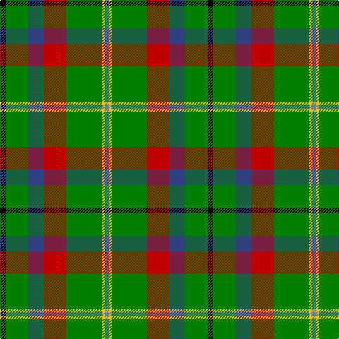

This page is one **sett** — a single exact thread-count. It belongs to the [tartan](/tartans/k4g16db11r16g25ly2t3/)
(the same proportion at any scale), whose colour order is pattern [BYGRBGK](/stripes/bygrbgk/).

Sourced from weddslist.  It is a [7 stripe tartan](/stripes/stripes7/).

Original link http://www.weddslist.com/cgi-bin/tartans/pg.pl?source=sts

## Thread count
K/8 G32 B22 R32 G50 Y4 Ba/6

## Palette

Palette: <strong>Ingles Buchan</strong> <small style="color:#888">(1 of 6 colours)</small>
<table><thead><tr><th>Colour</th><th>Threads</th><th>Shade</th><th>Base</th><th>OKLCh</th></tr></thead><tbody><tr><td>K/</td><td style="text-align:right;font-variant-numeric:tabular-nums">8</td><td><code style="background-color:#000000;">#000000</code> <small style="color:#888">#000000</small></td><td>K <code style="background-color:#000000;">#000000</code></td><td><small style="color:#888">oklch(0.0% 0.000 0.0)</small></td></tr><tr><td>G</td><td style="text-align:right;font-variant-numeric:tabular-nums">32</td><td><code style="background-color:#008000;">#008000</code> <small style="color:#888">#008000</small></td><td>G <code style="background-color:#006100;">#006100</code></td><td><small style="color:#888">oklch(52.0% 0.177 142.5)</small></td></tr><tr><td>B</td><td style="text-align:right;font-variant-numeric:tabular-nums">22</td><td><code style="background-color:#304080;">#304080</code> <small style="color:#888">#304080</small></td><td>B <code style="background-color:#2A418A;">#2A418A</code></td><td><small style="color:#888">oklch(39.4% 0.109 270.2)</small></td></tr><tr><td>R</td><td style="text-align:right;font-variant-numeric:tabular-nums">32</td><td><code style="background-color:#C00000;">#C00000</code> <small style="color:#888">#C00000</small></td><td>R <code style="background-color:#CC0000;">#CC0000</code></td><td><small style="color:#888">oklch(50.7% 0.208 29.2)</small></td></tr><tr><td>G</td><td style="text-align:right;font-variant-numeric:tabular-nums">50</td><td><code style="background-color:#008000;">#008000</code> <small style="color:#888">#008000</small></td><td>G <code style="background-color:#006100;">#006100</code></td><td><small style="color:#888">oklch(52.0% 0.177 142.5)</small></td></tr><tr><td>Y</td><td style="text-align:right;font-variant-numeric:tabular-nums">4</td><td><code style="background-color:#F0C000;">#F0C000</code> <small style="color:#888">#F0C000</small></td><td>Y <code style="background-color:#F2BF00;">#F2BF00</code></td><td><small style="color:#888">oklch(82.7% 0.169 90.5)</small></td></tr><tr><td>Ba/</td><td style="text-align:right;font-variant-numeric:tabular-nums">6</td><td><code style="background-color:#5480B0;">#5480B0</code> <small style="color:#888">#5480B0</small></td><td>B <code style="background-color:#2A418A;">#2A418A</code></td><td><small style="color:#888">oklch(58.8% 0.089 251.5)</small></td></tr></tbody></table>

# Sample pattern

## Nearest tartans

The nearest existing variants by ΔTartan distance, with this tartan at the top so the swatches line up against it.

ΔTartan

Tartan

Sett

—

<a href="/ttd/edit/#slug=k4g16db11r16g25ly2t3~x2">Mayo</a> <a class="nn-out" href="/setts/s7/k4g16db11r16g25ly2t3~x2/" title="open its dictionary page">↗</a>

1.18

<a href="/ttd/edit/#slug=loi30w4loi20g20k20lo3k6~x2">St Andrews Bay</a> <a class="nn-out" href="/setts/s7/loi30w4loi20g20k20lo3k6~x2/" title="open its dictionary page">↗</a>

1.23

<a href="/ttd/edit/#slug=g11w11k3ly3dg36lo7~x2">Driver (Name)</a> <a class="nn-out" href="/setts/s6/g11w11k3ly3dg36lo7~x2/" title="open its dictionary page">↗</a>

1.24

<a href="/ttd/edit/#slug=g25r4db25r13g25ly2t6~x2">Rotary</a> <a class="nn-out" href="/setts/s7/g25r4db25r13g25ly2t6~x2/" title="open its dictionary page">↗</a>

1.39

<a href="/ttd/edit/#slug=g11w11k3ly3dg36r7~x2">Driver, RC</a> <a class="nn-out" href="/setts/s6/g11w11k3ly3dg36r7~x2/" title="open its dictionary page">↗</a>

1.39

<a href="/ttd/edit/#slug=g8k2g13r4g12db22g5ly3~x2">Taylor</a> <a class="nn-out" href="/setts/s8/g8k2g13r4g12db22g5ly3~x2/" title="open its dictionary page">↗</a>

1.44

<a href="/ttd/edit/#slug=r6b2g20k3db8gi2b4~x2">Royal British Legion, The</a> <a class="nn-out" href="/setts/s7/r6b2g20k3db8gi2b4~x2/" title="open its dictionary page">↗</a>

1.45

<a href="/ttd/edit/#slug=r6g4do14w4do7g30lo4~x2">Newfoundland</a> <a class="nn-out" href="/setts/s7/r6g4do14w4do7g30lo4~x2/" title="open its dictionary page">↗</a>

1.45

<a href="/ttd/edit/#slug=k17g48ly4r10db12g4">Asheville Firefighters, The</a> <a class="nn-out" href="/setts/s6/k17g48ly4r10db12g4/" title="open its dictionary page">↗</a>

1.45

<a href="/ttd/edit/#slug=w3r3k4r6g22r4k18g24ly3~x2">Brown, George</a> <a class="nn-out" href="/setts/s9/w3r3k4r6g22r4k18g24ly3~x2/" title="open its dictionary page">↗</a>

1.45

<a href="/ttd/edit/#slug=k4g16db11r16g25ly2gi3~x2">Mayo Irish County Tartan Tartan Number: 2270. Earliest known date: 1994 One of a series of Irish District tartans designed by Polly Wittering of the House of Edgar, with colours reminiscent of the Country with soft warm colours dominating. See products available Copyright © Blair Urquhart, Comrie, 2015</a> <a class="nn-out" href="/setts/s7/k4g16db11r16g25ly2gi3~x2/" title="open its dictionary page">↗</a>

## Neighbour map

Every grey dot is one of 14359 variants placed by the first two principal components of the ΔTartan feature space (44% of its variance). Red is this tartan; blue dots are its nearest — click one to open its page.

<svg viewBox="0 0 640 380" role="img" style="max-width:100%;height:auto;border:1px solid #e0e0e0;border-radius:4px;display:block" xmlns="http://www.w3.org/2000/svg"><image href="/nn/cloud.v1.png" width="640" height="380"/><a href="/setts/s7/loi30w4loi20g20k20lo3k6~x2/"><circle cx="198.6" cy="198.6" r="4" fill="#3465a4"><title>St Andrews Bay</title></circle></a><a href="/setts/s6/g11w11k3ly3dg36lo7~x2/"><circle cx="201.4" cy="155.6" r="4" fill="#3465a4"><title>Driver (Name)</title></circle></a><a href="/setts/s7/g25r4db25r13g25ly2t6~x2/"><circle cx="242.5" cy="205.6" r="4" fill="#3465a4"><title>Rotary</title></circle></a><a href="/setts/s6/g11w11k3ly3dg36r7~x2/"><circle cx="193.8" cy="150.9" r="4" fill="#3465a4"><title>Driver, RC</title></circle></a><a href="/setts/s8/g8k2g13r4g12db22g5ly3~x2/"><circle cx="265.6" cy="200.2" r="4" fill="#3465a4"><title>Taylor</title></circle></a><a href="/setts/s7/r6b2g20k3db8gi2b4~x2/"><circle cx="168.2" cy="165.0" r="4" fill="#3465a4"><title>Royal British Legion, The</title></circle></a><a href="/setts/s7/r6g4do14w4do7g30lo4~x2/"><circle cx="232.5" cy="197.8" r="4" fill="#3465a4"><title>Newfoundland</title></circle></a><a href="/setts/s6/k17g48ly4r10db12g4/"><circle cx="278.3" cy="190.3" r="4" fill="#3465a4"><title>Asheville Firefighters, The</title></circle></a><a href="/setts/s9/w3r3k4r6g22r4k18g24ly3~x2/"><circle cx="229.9" cy="182.7" r="4" fill="#3465a4"><title>Brown, George</title></circle></a><a href="/setts/s7/k4g16db11r16g25ly2gi3~x2/"><circle cx="257.0" cy="194.2" r="4" fill="#3465a4"><title>Mayo Irish County Tartan Tartan Number: 2270. Earliest known date: 1994 One of a series of Irish District tartans designed by Polly Wittering of the House of Edgar, with colours reminiscent of the Country with soft warm colours dominating. See products available Copyright © Blair Urquhart, Comrie, 2015</title></circle></a><circle cx="222.4" cy="176.2" r="5" fill="#c00000"/></svg>

ID: /setts/s7/k4g16db11r16g25ly2t3~x2/
