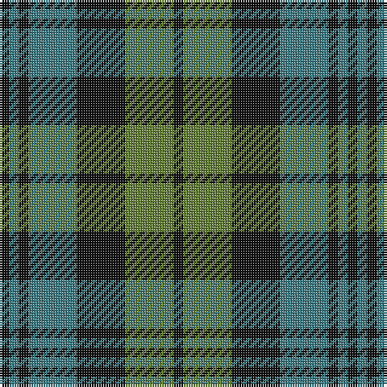

In pattern [KGKGKGK](/patterns/kgkgkgk/).

This was sourced from tartans-authority.  It is a [7 stripes tartan](/stripes/stripes7/).

Original link http://www.tartansauthority.com/tartan-ferret/display/1039/

## Thread count
K/4 G4 K4 G20 K20 Ga20 K/4

## Palette
Each colour and its ΔE from the base-6 reference it is a variant of.

| Colour | Shade | Base | ΔE (OKLab) |
|---|---|---|---|
| G | <code style="background-color:#407C84;">#407C84</code> `#407C84` | G <code style="background-color:#006400;">#006400</code> | 0.18 |
| Ga | <code style="background-color:#648038;">#648038</code> `#648038` | G <code style="background-color:#006400;">#006400</code> | 0.14 |
| K | <code style="background-color:#101010;">#101010</code> `#101010` | K <code style="background-color:#000000;">#000000</code> | 0.17 |

# Sample pattern

ID: /setts/s7/k4g20k20ga20k4ga4k4-g648038-ga407c84-k101010/
