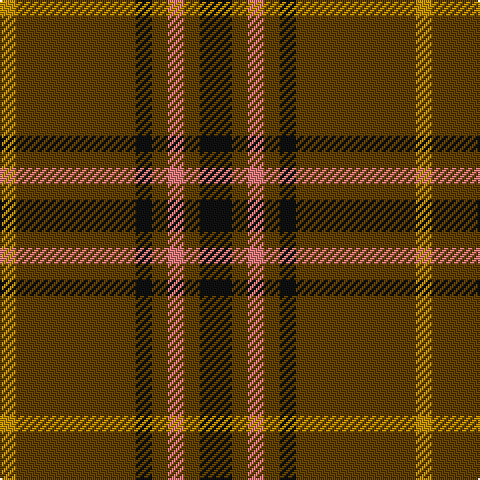

In pattern [KGRGKGY](/patterns/kgrgkgy/).

This was sourced from tartans-authority.  It is a [7 stripes tartan](/stripes/stripes7/).

Original link http://www.tartansauthority.com/tartan-ferret/display/2167/

## Thread count
DY/8 T60 K8 T8 LR8 T8 K/16

## Palette
Each colour and its ΔE from the base-6 reference it is a variant of.

| Colour | Shade | Base | ΔE (OKLab) |
|---|---|---|---|
| DY | <code style="background-color:#BC8C00;">#BC8C00</code> `#BC8C00` | Y <code style="background-color:#F2BF00;">#F2BF00</code> | 0.16 |
| K | <code style="background-color:#101010;">#101010</code> `#101010` | K <code style="background-color:#000000;">#000000</code> | 0.17 |
| LR | <code style="background-color:#E87878;">#E87878</code> `#E87878` | R <code style="background-color:#CC0000;">#CC0000</code> | 0.19 |
| T | <code style="background-color:#604000;">#604000</code> `#604000` | G <code style="background-color:#006100;">#006100</code> | 0.14 |

# Sample pattern

## Nearest tartans

The nearest existing variants by ΔTartan distance.

1. [Kirk (Name)](/setts/s7/r4g21r4k7r34y3r4x2~g006818-k101010-ra00000-yd09800/) — ΔT 1.34
1. [Welsh National #2](/setts/s12/k4g2r2g2k2g15y2g15k2g2r2g2x4~g604000-k101010-re87878-ybc8c00/) — ΔT 1.53
1. [Waverley Care Aids Trust](/setts/s10/r8g2r2k1r1g2r1k1r2g2x10~g006818-k101010-r880000/) — ΔT 1.58
1. [Glen Trool](/setts/s5/g37r9g3ra9r3x2~g003000-r806050-rac00000/) — ΔT 1.59
1. [Land's End Camel](/setts/s9/y24b2y3g6y3b2ga15y20b4x2~b441800-g604000-ga003820-ya08858/) — ΔT 1.59
1. [Scott Autumn (Fashion)](/setts/s7/g16y3g14r16g2r2g3x2~g004c00-r8c0000-yc89800/) — ΔT 1.63
1. [Ulster](/setts/s10/r28k2r28k2r2k2b29k2ra2k2x2~b401000-k000000-r806050-rac00000/) — ΔT 1.71
1. [Comyn](/setts/s8/k1r9g2r2g4y1g4r1x2~g11450d-k000000-raa0000-yaaaaaa/) — ΔT 1.72
1. [Comyn](/setts/s8/k1r9g2r2g4y1g4r1~g11450d-k000000-raa0000-yaaaaaa/) — ΔT 1.72
1. [Land's End (Unnamed Camel)](/setts/s9/r24b2r3ra6r3b2g15r20b4x2~b401000-g003000-r906030-ra806050/) — ΔT 1.72

## Neighbour map

Every grey dot is one of 15726 variants placed by the first two principal components of the ΔTartan feature space (44% of its variance). Red is this tartan; blue dots are its nearest — click one to open its page.

<svg viewBox="0 0 640 380" role="img" style="max-width:100%;height:auto;border:1px solid #e0e0e0;border-radius:4px;display:block" xmlns="http://www.w3.org/2000/svg"><image href="/nn/cloud.v1.png" width="640" height="380"/><a href="/setts/s7/r4g21r4k7r34y3r4x2~g006818-k101010-ra00000-yd09800/"><circle cx="376.2" cy="194.6" r="4" fill="#3465a4"><title>Kirk (Name)</title></circle></a><a href="/setts/s12/k4g2r2g2k2g15y2g15k2g2r2g2x4~g604000-k101010-re87878-ybc8c00/"><circle cx="455.7" cy="197.1" r="4" fill="#3465a4"><title>Welsh National #2</title></circle></a><a href="/setts/s10/r8g2r2k1r1g2r1k1r2g2x10~g006818-k101010-r880000/"><circle cx="416.6" cy="228.4" r="4" fill="#3465a4"><title>Waverley Care Aids Trust</title></circle></a><a href="/setts/s5/g37r9g3ra9r3x2~g003000-r806050-rac00000/"><circle cx="440.3" cy="237.9" r="4" fill="#3465a4"><title>Glen Trool</title></circle></a><a href="/setts/s9/y24b2y3g6y3b2ga15y20b4x2~b441800-g604000-ga003820-ya08858/"><circle cx="364.2" cy="189.0" r="4" fill="#3465a4"><title>Land's End Camel</title></circle></a><a href="/setts/s7/g16y3g14r16g2r2g3x2~g004c00-r8c0000-yc89800/"><circle cx="405.6" cy="260.0" r="4" fill="#3465a4"><title>Scott Autumn (Fashion)</title></circle></a><a href="/setts/s10/r28k2r28k2r2k2b29k2ra2k2x2~b401000-k000000-r806050-rac00000/"><circle cx="368.2" cy="157.1" r="4" fill="#3465a4"><title>Ulster</title></circle></a><a href="/setts/s8/k1r9g2r2g4y1g4r1x2~g11450d-k000000-raa0000-yaaaaaa/"><circle cx="304.7" cy="206.6" r="4" fill="#3465a4"><title>Comyn</title></circle></a><a href="/setts/s8/k1r9g2r2g4y1g4r1~g11450d-k000000-raa0000-yaaaaaa/"><circle cx="304.7" cy="206.6" r="4" fill="#3465a4"><title>Comyn</title></circle></a><a href="/setts/s9/r24b2r3ra6r3b2g15r20b4x2~b401000-g003000-r906030-ra806050/"><circle cx="410.2" cy="207.6" r="4" fill="#3465a4"><title>Land's End (Unnamed Camel)</title></circle></a><circle cx="397.2" cy="214.0" r="5" fill="#c00000"/></svg>

ID: /setts/s7/k4g2r2g2k2g15y2x4~g604000-k101010-re87878-ybc8c00/
