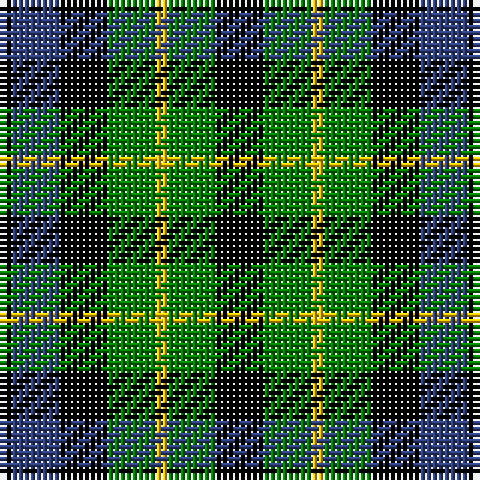

In pattern [KBKGYGK](/patterns/kbkgygk/).

This was sourced from weddslist.  It is a [7 stripes tartan](/stripes/stripes7/).

Original link http://www.weddslist.com/cgi-bin/tartans/pg.pl?source=sts

## Thread count
K/2 B8 K8 G8 Y2 G8 K/8

## Palette
Each colour and its ΔE from the base-6 reference it is a variant of.

| Colour | Shade | Base | ΔE (OKLab) |
|---|---|---|---|
| B | <code style="background-color:#304080;">#304080</code> `#304080` | B <code style="background-color:#2A418A;">#2A418A</code> | 0.02 |
| G | <code style="background-color:#008000;">#008000</code> `#008000` | G <code style="background-color:#006100;">#006100</code> | 0.10 |
| K | <code style="background-color:#000000;">#000000</code> `#000000` | K <code style="background-color:#000000;">#000000</code> | 0.00 |
| Y | <code style="background-color:#F0C000;">#F0C000</code> `#F0C000` | Y <code style="background-color:#F2BF00;">#F2BF00</code> | 0.00 |

# Sample pattern

## Nearest tartans

The nearest existing variants by ΔTartan distance.

1. [Unnamed, No 39](/setts/s7/k4g4k1g4k4b4y1x2~b304080-g008000-k000000-yf0c000/) — ΔT 0.00
1. [Graham of Montrose](/setts/s7/k4g4w1g4k4b4k1x4~b304080-g008000-k000000-we0e0e0/) — ΔT 0.17
1. [Campbell of Breadalbane](/setts/s7/k9g9y2g9k9b9k3x2~b304080-g008000-k000000-yf0c000/) — ΔT 0.24
1. [Campbell of Breadalbane (Clan)](/setts/s7/k9g9y2g9k9b9k3x2~b2c2c80-g006818-k000000-ydcbc00/) — ΔT 0.64
1. [MacIntyre](/setts/s7/k12g12k2g12k12b12ba3x2~b304080-ba5480b0-g008000-k000000/) — ΔT 0.70
1. [MacCallum](/setts/s7/k6g6r1g6k6b6k1x2~b304080-g008000-k000000-rc00000/) — ΔT 0.74
1. [Unnamed, No 63](/setts/s7/k3g4k1g4k3b4k1x2~b304080-g008000-k000000/) — ΔT 0.91
1. [Unnamed, No 30](/setts/s9/k1b3k3g3r1g3k3g1r1x2~b304080-g008000-k000000-rc00000/) — ΔT 0.92
1. [Wilson's, No 97](/setts/s7/k11g12k2g12k12b12w3x2~b800080-g008000-k000000-we0e0e0/) — ΔT 0.93
1. [Abercrombie, (Wilson's No 64)](/setts/s7/k6g6y1g6k6b6k1x4~b800080-g008000-k000000-yf0c000/) — ΔT 0.94

## Neighbour map

Every grey dot is one of 15726 variants placed by the first two principal components of the ΔTartan feature space (44% of its variance). Red is this tartan; blue dots are its nearest — click one to open its page.

<svg viewBox="0 0 640 380" role="img" style="max-width:100%;height:auto;border:1px solid #e0e0e0;border-radius:4px;display:block" xmlns="http://www.w3.org/2000/svg"><image href="/nn/cloud.v1.png" width="640" height="380"/><a href="/setts/s7/k4g4k1g4k4b4y1x2~b304080-g008000-k000000-yf0c000/"><circle cx="107.0" cy="278.6" r="4" fill="#3465a4"><title>Unnamed, No 39</title></circle></a><a href="/setts/s7/k4g4w1g4k4b4k1x4~b304080-g008000-k000000-we0e0e0/"><circle cx="105.4" cy="278.1" r="4" fill="#3465a4"><title>Graham of Montrose</title></circle></a><a href="/setts/s7/k9g9y2g9k9b9k3x2~b304080-g008000-k000000-yf0c000/"><circle cx="115.1" cy="277.9" r="4" fill="#3465a4"><title>Campbell of Breadalbane</title></circle></a><a href="/setts/s7/k9g9y2g9k9b9k3x2~b2c2c80-g006818-k000000-ydcbc00/"><circle cx="125.2" cy="282.2" r="4" fill="#3465a4"><title>Campbell of Breadalbane (Clan)</title></circle></a><a href="/setts/s7/k12g12k2g12k12b12ba3x2~b304080-ba5480b0-g008000-k000000/"><circle cx="126.6" cy="262.7" r="4" fill="#3465a4"><title>MacIntyre</title></circle></a><a href="/setts/s7/k6g6r1g6k6b6k1x2~b304080-g008000-k000000-rc00000/"><circle cx="137.5" cy="258.7" r="4" fill="#3465a4"><title>MacCallum</title></circle></a><a href="/setts/s7/k3g4k1g4k3b4k1x2~b304080-g008000-k000000/"><circle cx="136.3" cy="298.3" r="4" fill="#3465a4"><title>Unnamed, No 63</title></circle></a><a href="/setts/s9/k1b3k3g3r1g3k3g1r1x2~b304080-g008000-k000000-rc00000/"><circle cx="79.2" cy="269.9" r="4" fill="#3465a4"><title>Unnamed, No 30</title></circle></a><a href="/setts/s7/k11g12k2g12k12b12w3x2~b800080-g008000-k000000-we0e0e0/"><circle cx="118.0" cy="254.6" r="4" fill="#3465a4"><title>Wilson's, No 97</title></circle></a><a href="/setts/s7/k6g6y1g6k6b6k1x4~b800080-g008000-k000000-yf0c000/"><circle cx="134.2" cy="252.7" r="4" fill="#3465a4"><title>Abercrombie, (Wilson's No 64)</title></circle></a><circle cx="107.0" cy="278.6" r="5" fill="#c00000"/></svg>

ID: /setts/s7/k4g4y1g4k4b4k1x2~b304080-g008000-k000000-yf0c000/
