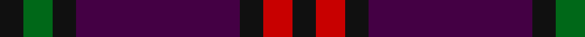

In pattern [KGKBKRK](/patterns/kgkbkrk/).

This was sourced from register-of-tartans.  It is a [7 stripes tartan](/stripes/stripes7/).

Original link https://www.tartanregister.gov.uk/tartanDetails.aspx?ref=2991

## Attestations

This cloth appears in 2 source records; the oldest owns this page.

- 01/01/1819 — Montgomrie/Montgomery of Eglinton (register-of-tartans, [record](https://www.tartanregister.gov.uk/tartanDetails.aspx?ref=2991))
- 1819 (1707?) — Montgomery - 1819 (Clan) (tartans-authority, [record](http://www.tartansauthority.com/tartan-ferret/display/1082/))

## Thread count
K/8 G10 K8 DP56 K8 R10 K/8

## Palette
Each colour and its ΔE from the base-6 reference it is a variant of.

| Colour | Shade | Base | ΔE (OKLab) |
|---|---|---|---|
| DP | <code style="background-color:#440044;">#440044</code> `#440044` | B <code style="background-color:#2A418A;">#2A418A</code> | 0.18 |
| G | <code style="background-color:#006818;">#006818</code> `#006818` | G <code style="background-color:#006100;">#006100</code> | 0.02 |
| K | <code style="background-color:#101010;">#101010</code> `#101010` | K <code style="background-color:#000000;">#000000</code> | 0.17 |
| R | <code style="background-color:#C80000;">#C80000</code> `#C80000` | R <code style="background-color:#CC0000;">#CC0000</code> | 0.01 |

# Sample pattern

## Nearest tartans

The nearest existing variants by ΔTartan distance.

1. [Wilson's No.007 Or Eglinton](/setts/s12/g5k4b28k4r5k4r5k4b28k4g5k4~b440044-g006818-k101010-rc80000~x2/) — ΔT 1.17
1. [Komissarov, Dmitry (Personal)](/setts/s7/b30ba30g4ba4g4ba5r6~b640044-ba000048-g808080-r880000~x2/) — ΔT 1.25
1. [MacArthur-Fox Dress Personal Tartan Tartan Number: 459. Earliest known date: 1986 This is the older of the two MacArthur setts, which links the clan with the Campbells. See products available Copyright © Blair Urquhart, Comrie, 2015](/setts/s6/b2r16ba3r3ba13ra2~b5c8ca8-ba2c2c80-r880000-rac80000~x4/) — ΔT 1.34
1. [Montgomerie of Eglinton Family Tartan Tartan Number: 1082. Earliest known date: 1893 D W Stewart, author of Old and Rare Scottish Tartans (1893), was of the opinion that this sett could be traced back to 1707 when it was adopted by the Montgomeries Earls of Eglinton. See Eglinton District. See products available Copyright © Blair Urquhart, Comrie, 2015](/setts/s7/k4g5k4b28k4r5k4~b2c2c80-g006818-k101010-rc80000~x2/) — ΔT 1.43
1. [MacArthur-Fox, dress](/setts/s6/b2r16ba3r3ba13ra2~b5480b0-ba304080-r800000-rac00000~x4/) — ΔT 1.49
1. [Haut Name Tartan Tartan Number: 10389. Earliest known date: 1st March 2011 Designed for the Haut family living in Liff by Dundee to celebrate their German and Irish roots and the Scottish identity of their children. See products available Copyright © Blair Urquhart, Comrie, 2015](/setts/s6/b46ba15k12bb8g8b8~b440044-ba6c2090-bb884480-g289c18-k101010~x2/) — ΔT 1.51
1. [Eglington](/setts/s6/b2r2b17ra17rb2ra2~b1c1c1c-rec34c4-ra880000-rba07c58~x4/) — ΔT 1.51
1. [Robert Gordon University](/setts/s6/k4r2k12b12k1y2~b202060-k101010-r880000-yd09800~x2/) — ΔT 1.56
1. [Eglinton](/setts/s7/k1g1k1b7k1r1k1~b1c0070-g006818-k101010-rc80000~x8/) — ΔT 1.59
1. [Laurel Cadre, The](/setts/s5/b12r8k64b75r8~b43146f-k101010-rdc0000/) — ΔT 1.61

## Neighbour map

Every grey dot is one of 15726 variants placed by the first two principal components of the ΔTartan feature space (44% of its variance). Red is this tartan; blue dots are its nearest — click one to open its page.

<svg viewBox="0 0 640 380" role="img" style="max-width:100%;height:auto;border:1px solid #e0e0e0;border-radius:4px;display:block" xmlns="http://www.w3.org/2000/svg"><image href="/nn/cloud.v1.png" width="640" height="380"/><a href="/setts/s12/g5k4b28k4r5k4r5k4b28k4g5k4~b440044-g006818-k101010-rc80000~x2/"><circle cx="336.8" cy="199.6" r="4" fill="#3465a4"><title>Wilson's No.007 Or Eglinton</title></circle></a><a href="/setts/s7/b30ba30g4ba4g4ba5r6~b640044-ba000048-g808080-r880000~x2/"><circle cx="290.0" cy="222.1" r="4" fill="#3465a4"><title>Komissarov, Dmitry (Personal)</title></circle></a><a href="/setts/s6/b2r16ba3r3ba13ra2~b5c8ca8-ba2c2c80-r880000-rac80000~x4/"><circle cx="330.2" cy="231.3" r="4" fill="#3465a4"><title>MacArthur-Fox Dress Personal Tartan Tartan Number: 459. Earliest known date: 1986 This is the older of the two MacArthur setts, which links the clan with the Campbells. See products available Copyright © Blair Urquhart, Comrie, 2015</title></circle></a><a href="/setts/s7/k4g5k4b28k4r5k4~b2c2c80-g006818-k101010-rc80000~x2/"><circle cx="306.7" cy="219.6" r="4" fill="#3465a4"><title>Montgomerie of Eglinton Family Tartan Tartan Number: 1082. Earliest known date: 1893 D W Stewart, author of Old and Rare Scottish Tartans (1893), was of the opinion that this sett could be traced back to 1707 when it was adopted by the Montgomeries Earls of Eglinton. See Eglinton District. See products available Copyright © Blair Urquhart, Comrie, 2015</title></circle></a><a href="/setts/s6/b2r16ba3r3ba13ra2~b5480b0-ba304080-r800000-rac00000~x4/"><circle cx="347.4" cy="239.4" r="4" fill="#3465a4"><title>MacArthur-Fox, dress</title></circle></a><a href="/setts/s6/b46ba15k12bb8g8b8~b440044-ba6c2090-bb884480-g289c18-k101010~x2/"><circle cx="293.6" cy="232.0" r="4" fill="#3465a4"><title>Haut Name Tartan Tartan Number: 10389. Earliest known date: 1st March 2011 Designed for the Haut family living in Liff by Dundee to celebrate their German and Irish roots and the Scottish identity of their children. See products available Copyright © Blair Urquhart, Comrie, 2015</title></circle></a><a href="/setts/s6/b2r2b17ra17rb2ra2~b1c1c1c-rec34c4-ra880000-rba07c58~x4/"><circle cx="323.1" cy="217.6" r="4" fill="#3465a4"><title>Eglington</title></circle></a><a href="/setts/s6/k4r2k12b12k1y2~b202060-k101010-r880000-yd09800~x2/"><circle cx="336.5" cy="232.6" r="4" fill="#3465a4"><title>Robert Gordon University</title></circle></a><a href="/setts/s7/k1g1k1b7k1r1k1~b1c0070-g006818-k101010-rc80000~x8/"><circle cx="331.2" cy="222.7" r="4" fill="#3465a4"><title>Eglinton</title></circle></a><a href="/setts/s5/b12r8k64b75r8~b43146f-k101010-rdc0000/"><circle cx="365.8" cy="256.4" r="4" fill="#3465a4"><title>Laurel Cadre, The</title></circle></a><circle cx="331.3" cy="222.7" r="5" fill="#c00000"/></svg>

ID: /setts/s7/k4g5k4b28k4r5k4~b440044-g006818-k101010-rc80000~x2/
