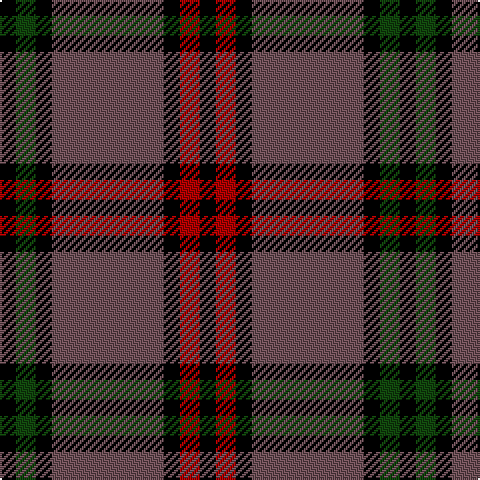

In pattern [KGKBKRK](/patterns/kgkbkrk/).

This was sourced from weddslist.  It is a [7 stripes tartan](/stripes/stripes7/).

Original link http://www.weddslist.com/cgi-bin/tartans/pg.pl?source=tinsel

## Thread count
K/8 DG10 K8 N56 K8 DR10 K/8

## Palette
Each colour and its ΔE from the base-6 reference it is a variant of.

| Colour | Shade | Base | ΔE (OKLab) |
|---|---|---|---|
| DG | <code style="background-color:#11450D;">#11450D</code> `#11450D` | G <code style="background-color:#006100;">#006100</code> | 0.09 |
| DR | <code style="background-color:#AA0000;">#AA0000</code> `#AA0000` | R <code style="background-color:#CC0000;">#CC0000</code> | 0.07 |
| K | <code style="background-color:#000000;">#000000</code> `#000000` | K <code style="background-color:#000000;">#000000</code> | 0.00 |
| N | <code style="background-color:#6E5058;">#6E5058</code> `#6E5058` | B <code style="background-color:#2A418A;">#2A418A</code> | 0.15 |

# Sample pattern

## Nearest tartans

The nearest existing variants by ΔTartan distance.

1. [Montgomery](/setts/s7/k4g5k4b28k4r5k4~b6e5058-g11450d-k000000-raa0000/) — ΔT 0.00
1. [Denny Hunting](/setts/s6/k4g5k2g5r17b2~b00008c-g004c00-k000000-r8c0000~x2/) — ΔT 1.18
1. [Montgomerie of Eglinton](/setts/s7/k4g5k4b28k4r5k4~b304080-g008000-k000000-rc00000~x2/) — ΔT 1.23
1. [Dunbog Primary (School)](/setts/s6/r12b3g5b16y2g2~b000048-g447438-rc80000-ye8c000~x2/) — ΔT 1.27
1. [Chinzei Keiai Senior High School](/setts/s9/b3r3k16b2k2b16k3b2w2~b5c5c5c-k101010-r888888-wc0c0c0~x2/) — ΔT 1.30
1. [Ardmore (Fashion)](/setts/s8/k21r2k8w2r16b6k2b8~b5c5c5c-k101010-ra07c58-we0e0e0~x2/) — ΔT 1.34
1. [Daks (Blue Loden)](/setts/s8/y3b7ba2r2ba14b2ba2y3~b5c8ca8-ba441800-ra00048-ya08858~x2/) — ΔT 1.34
1. [Daks, Blue Loden](/setts/s8/r5b13ba4ra4ba27b3ba4r5~b5480b0-ba401000-r906030-ra900030/) — ΔT 1.38
1. [Strummer, Joe (Commemorative)](/setts/s7/k3g3y6k12y1r2g2~g604000-k101010-r888888-ybc8c00~x4/) — ΔT 1.40
1. [Drambuie Dress](/setts/s6/w6g36k48r4k5y6~g604000-k101010-rc80000-we0e0e0-ye8c000/) — ΔT 1.41

## Neighbour map

Every grey dot is one of 15726 variants placed by the first two principal components of the ΔTartan feature space (44% of its variance). Red is this tartan; blue dots are its nearest — click one to open its page.

<svg viewBox="0 0 640 380" role="img" style="max-width:100%;height:auto;border:1px solid #e0e0e0;border-radius:4px;display:block" xmlns="http://www.w3.org/2000/svg"><image href="/nn/cloud.v1.png" width="640" height="380"/><a href="/setts/s7/k4g5k4b28k4r5k4~b6e5058-g11450d-k000000-raa0000/"><circle cx="270.9" cy="200.4" r="4" fill="#3465a4"><title>Montgomery</title></circle></a><a href="/setts/s6/k4g5k2g5r17b2~b00008c-g004c00-k000000-r8c0000~x2/"><circle cx="265.0" cy="216.4" r="4" fill="#3465a4"><title>Denny Hunting</title></circle></a><a href="/setts/s7/k4g5k4b28k4r5k4~b304080-g008000-k000000-rc00000~x2/"><circle cx="260.5" cy="203.1" r="4" fill="#3465a4"><title>Montgomerie of Eglinton</title></circle></a><a href="/setts/s6/r12b3g5b16y2g2~b000048-g447438-rc80000-ye8c000~x2/"><circle cx="221.4" cy="212.4" r="4" fill="#3465a4"><title>Dunbog Primary (School)</title></circle></a><a href="/setts/s9/b3r3k16b2k2b16k3b2w2~b5c5c5c-k101010-r888888-wc0c0c0~x2/"><circle cx="278.7" cy="196.6" r="4" fill="#3465a4"><title>Chinzei Keiai Senior High School</title></circle></a><a href="/setts/s8/k21r2k8w2r16b6k2b8~b5c5c5c-k101010-ra07c58-we0e0e0~x2/"><circle cx="237.1" cy="198.1" r="4" fill="#3465a4"><title>Ardmore (Fashion)</title></circle></a><a href="/setts/s8/y3b7ba2r2ba14b2ba2y3~b5c8ca8-ba441800-ra00048-ya08858~x2/"><circle cx="265.5" cy="206.3" r="4" fill="#3465a4"><title>Daks (Blue Loden)</title></circle></a><a href="/setts/s8/r5b13ba4ra4ba27b3ba4r5~b5480b0-ba401000-r906030-ra900030/"><circle cx="306.3" cy="201.1" r="4" fill="#3465a4"><title>Daks, Blue Loden</title></circle></a><a href="/setts/s7/k3g3y6k12y1r2g2~g604000-k101010-r888888-ybc8c00~x4/"><circle cx="262.6" cy="195.2" r="4" fill="#3465a4"><title>Strummer, Joe (Commemorative)</title></circle></a><a href="/setts/s6/w6g36k48r4k5y6~g604000-k101010-rc80000-we0e0e0-ye8c000/"><circle cx="264.7" cy="175.2" r="4" fill="#3465a4"><title>Drambuie Dress</title></circle></a><circle cx="270.9" cy="200.4" r="5" fill="#c00000"/></svg>

ID: /setts/s7/k4g5k4b28k4r5k4~b6e5058-g11450d-k000000-raa0000~x2/
