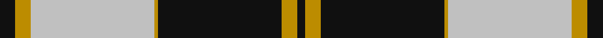
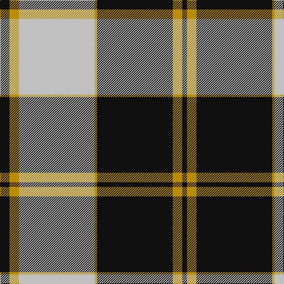

In pattern [KYKYWYK](/stripes/kykywyk/).

This was sourced from register-of-tartans.  It is a [7 stripe tartan](/stripes/stripes7/).

Original link https://www.tartanregister.gov.uk/tartanDetails.aspx?ref=1411

## Attestations

This cloth appears in 2 source records; the oldest owns this page.

- 01/01/1984 — Gleneagles Gold (Dalgleish) (register-of-tartans, [record](https://www.tartanregister.gov.uk/tartanDetails.aspx?ref=1411))
- 1984 — Gleneagles Gold (Corporate) (tartans-authority, [record](http://www.tartansauthority.com/tartan-ferret/display/1269/))

## Register references

External register numbers recorded for this tartan.

- Scottish Register of Tartans: [1411](https://www.tartanregister.gov.uk/tartanDetails.aspx?ref=1411)
- Scottish Tartans Authority (ITI): 1269
- Scottish Tartans World Register: 1269

## Thread count
K/16 DY16 N128 DY4 K128 DY16 K/8

## Palette
Each colour and the base-6 reference it is a variant of.

| Colour | Shade | Base |
|---|---|---|
| DY | <code style="background-color:#BC8C00;">#BC8C00</code> `oklch(66.8% 0.137 84.1)` <small>#BC8C00</small> | Y <code style="background-color:#F2BF00;">#F2BF00</code> |
| K | <code style="background-color:#101010;">#101010</code> `oklch(17.3% 0.000 89.9)` <small>#101010</small> | K <code style="background-color:#000000;">#000000</code> |
| N | <code style="background-color:#C0C0C0;">#C0C0C0</code> `oklch(80.8% 0.000 89.9)` <small>#C0C0C0</small> | W <code style="background-color:#F7F7F7;">#F7F7F7</code> |

# Sample pattern

## Nearest tartans

The nearest existing variants by ΔTartan distance.

1. [Gleneagles](/setts/s7/k4o4w35o1k36o4k2~x2/) — ΔT 0.57
1. [Gleneagles, Hotel](/setts/s7/k4y4w35y1k36y4k2~x2/) — ΔT 0.67
1. [Swansea City AFC](/setts/s9/k2n2w4n6w27n15k42n2w2/) — ΔT 1.10
1. [Highland Park High School (Texas)](/setts/s9/db19w1db6w1db2w2lo2w1lo18~x4/) — ΔT 1.11
1. [Gretna Football Club (Corporate)](/setts/s7/w36k8w36k95w4k4r6/) — ΔT 1.14
1. [Lebrun](/setts/s10/w40k11o8w2o8k6w2k16w1k16~x2/) — ΔT 1.18
1. [Highland Park High School (Texas)](/setts/s9/db19w1db6w1db2w2ly2w1ly18~x4/) — ΔT 1.19
1. [Richecourt, Baron of (Personal)](/setts/s7/w4k30r1k1r3w12ly3~x2/) — ΔT 1.22
1. [Nowell/Noel 1951 (Name)](/setts/s8/lr3k24lr6k8w4k8lr35k2~x2/) — ΔT 1.24
1. [MacPherson Dress](/setts/s7/lb3r1lb30k20lb3k9ly1/) — ΔT 1.25

## Neighbour map

Every grey dot is one of 14299 variants placed by the first two principal components of the ΔTartan feature space (44% of its variance). Red is this tartan; blue dots are its nearest — click one to open its page.

<svg viewBox="0 0 640 380" role="img" style="max-width:100%;height:auto;border:1px solid #e0e0e0;border-radius:4px;display:block" xmlns="http://www.w3.org/2000/svg"><image href="/nn/cloud.v1.png" width="640" height="380"/><a href="/setts/s7/k4o4w35o1k36o4k2~x2/"><circle cx="312.7" cy="124.9" r="4" fill="#3465a4"><title>Gleneagles</title></circle></a><a href="/setts/s7/k4y4w35y1k36y4k2~x2/"><circle cx="315.1" cy="128.3" r="4" fill="#3465a4"><title>Gleneagles, Hotel</title></circle></a><a href="/setts/s9/k2n2w4n6w27n15k42n2w2/"><circle cx="255.4" cy="136.5" r="4" fill="#3465a4"><title>Swansea City AFC</title></circle></a><a href="/setts/s9/db19w1db6w1db2w2lo2w1lo18~x4/"><circle cx="315.8" cy="139.8" r="4" fill="#3465a4"><title>Highland Park High School (Texas)</title></circle></a><a href="/setts/s7/w36k8w36k95w4k4r6/"><circle cx="346.4" cy="144.0" r="4" fill="#3465a4"><title>Gretna Football Club (Corporate)</title></circle></a><a href="/setts/s10/w40k11o8w2o8k6w2k16w1k16~x2/"><circle cx="275.6" cy="114.7" r="4" fill="#3465a4"><title>Lebrun</title></circle></a><a href="/setts/s9/db19w1db6w1db2w2ly2w1ly18~x4/"><circle cx="306.4" cy="136.1" r="4" fill="#3465a4"><title>Highland Park High School (Texas)</title></circle></a><a href="/setts/s7/w4k30r1k1r3w12ly3~x2/"><circle cx="329.8" cy="112.6" r="4" fill="#3465a4"><title>Richecourt, Baron of (Personal)</title></circle></a><a href="/setts/s8/lr3k24lr6k8w4k8lr35k2~x2/"><circle cx="305.1" cy="169.2" r="4" fill="#3465a4"><title>Nowell/Noel 1951 (Name)</title></circle></a><a href="/setts/s7/lb3r1lb30k20lb3k9ly1/"><circle cx="322.7" cy="125.3" r="4" fill="#3465a4"><title>MacPherson Dress</title></circle></a><circle cx="313.8" cy="135.2" r="5" fill="#c00000"/></svg>

ID: /setts/s7/k4lo4lb32lo1k32lo4k2~x4/
