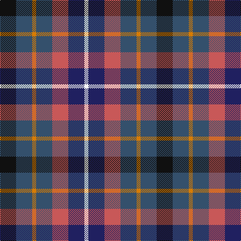

**Bands:** [KBYBRBW](/stripes/kbybrbw/) · **Stripes:** [K N LO N R DB W](/stripes/stripes7/) K N LO N R DB W

This was sourced from house-of-tartan.  It is a [7 band tartan](/bands/bands7/).

Original link http://www.house-of-tartan.scotland.net/house/TartanViewjs.asp?colr=Def&tnam=6711

## Thread count
K/32 B32 O8 B32 DO32 DB32 W/8

## Palette
Each colour and its ΔE from the base-6 reference it is a variant of.

| Colour | Shade | Base | ΔE (OKLab) |
|---|---|---|---|
| B | <code style="background-color:#34506C;">#34506C</code> `#34506C` | B <code style="background-color:#2A418A;">#2A418A</code> | 0.08 |
| DB | <code style="background-color:#202060;">#202060</code> `#202060` | B <code style="background-color:#2A418A;">#2A418A</code> | 0.11 |
| DO | <code style="background-color:#C85858;">#C85858</code> `#C85858` | R <code style="background-color:#CC0000;">#CC0000</code> | 0.10 |
| K | <code style="background-color:#101010;">#101010</code> `#101010` | K <code style="background-color:#000000;">#000000</code> | 0.17 |
| N | <code style="background-color:#406054;">#406054</code> `#406054` | G <code style="background-color:#006100;">#006100</code> | 0.11 |
| O | <code style="background-color:#D87C00;">#D87C00</code> `#D87C00` | Y <code style="background-color:#F2BF00;">#F2BF00</code> | 0.17 |
| R | <code style="background-color:#C80000;">#C80000</code> `#C80000` | R <code style="background-color:#CC0000;">#CC0000</code> | 0.01 |
| W | <code style="background-color:#F8F8F8;">#F8F8F8</code> `#F8F8F8` | W <code style="background-color:#F7F7F7;">#F7F7F7</code> | 0.00 |

# Sample pattern

## Nearest tartans

The nearest existing variants by ΔTartan distance.

1. [Devon Companion](/setts/s7/o5db4ly1db4k4dy4w1~x4/) — ΔT 0.57
1. [Devon Companion District Tartan Tartan Number: 1283. Earliest known date: 1984 The Devon Original and Devon Companion owe their origin to the success of the Cornish St Piran sett, which was woven by Coldharbour Mill in the early 1980's. The accreditation certificate was presented to the Mayor of Barnstaple in 1991. In a poem describing the tartan, Miss M. Miles says, "So, in the mind, Devon's beauty is retrieved By contemplating Devon's tartan's weave." See products available Copyright © Blair Urquhart, Comrie, 2015](/setts/s7/o5db4ly1db4k4dr4w1~x4/) — ΔT 0.60
1. [Gandy of Myrton (Name)](/setts/s6/r14w5dt20k10t10dt10~x2/) — ΔT 1.21
1. [DunBroch](/setts/s11/db4t8k2t5lb2t5dg8dr7dg2dr7dg3~x2/) — ΔT 1.26
1. [Sustainability (Fashion)](/setts/s8/db20k3g18r12t4r12db15ly4~x2/) — ΔT 1.28
1. [Isle of Gigha (District)](/setts/s7/lo2db4k1db4m4lo4db1~x8/) — ΔT 1.28
1. [Fox-Eves Wedding](/setts/s6/r9dt6db13dt21y18w4~x2/) — ΔT 1.29
1. [Devon, Companion](/setts/s7/y5db4ly1db4k4o4w1~x4/) — ΔT 1.30
1. [New York City](/setts/s7/b2db3k1db3o3g4r1~x8/) — ΔT 1.38
1. [Scotia Trade Tartan Tartan Number: 89. Earliest known date: 1968 Originally designed by James Allan of East Kilbride and woven by him in 1850. The sett was reconstructed by David Easton, Galashiels, as a National tartan for Scotland. It did not catch on and the tartan is rarely seen today. See products available Copyright © Blair Urquhart, Comrie, 2015](/setts/s8/g3dp7t11db3dy8w2db3t3~x2/) — ΔT 1.41

## Neighbour map

Every grey dot is one of 14313 variants placed by the first two principal components of the ΔTartan feature space (44% of its variance). Red is this tartan; blue dots are its nearest — click one to open its page.

<svg viewBox="0 0 640 380" role="img" style="max-width:100%;height:auto;border:1px solid #e0e0e0;border-radius:4px;display:block" xmlns="http://www.w3.org/2000/svg"><image href="/nn/cloud.v1.png" width="640" height="380"/><a href="/setts/s7/o5db4ly1db4k4dy4w1~x4/"><circle cx="52.9" cy="230.1" r="4" fill="#3465a4"><title>Devon Companion</title></circle></a><a href="/setts/s7/o5db4ly1db4k4dr4w1~x4/"><circle cx="55.0" cy="231.7" r="4" fill="#3465a4"><title>Devon Companion District Tartan Tartan Number: 1283. Earliest known date: 1984 The Devon Original and Devon Companion owe their origin to the success of the Cornish St Piran sett, which was woven by Coldharbour Mill in the early 1980's. The accreditation certificate was presented to the Mayor of Barnstaple in 1991. In a poem describing the tartan, Miss M. Miles says, &quot;So, in the mind, Devon's beauty is retrieved By contemplating Devon's tartan's weave.&quot; See products available Copyright © Blair Urquhart, Comrie, 2015</title></circle></a><a href="/setts/s6/r14w5dt20k10t10dt10~x2/"><circle cx="103.9" cy="267.0" r="4" fill="#3465a4"><title>Gandy of Myrton (Name)</title></circle></a><a href="/setts/s11/db4t8k2t5lb2t5dg8dr7dg2dr7dg3~x2/"><circle cx="55.5" cy="222.1" r="4" fill="#3465a4"><title>DunBroch</title></circle></a><a href="/setts/s8/db20k3g18r12t4r12db15ly4~x2/"><circle cx="121.4" cy="202.9" r="4" fill="#3465a4"><title>Sustainability (Fashion)</title></circle></a><a href="/setts/s7/lo2db4k1db4m4lo4db1~x8/"><circle cx="115.3" cy="249.7" r="4" fill="#3465a4"><title>Isle of Gigha (District)</title></circle></a><a href="/setts/s6/r9dt6db13dt21y18w4~x2/"><circle cx="122.8" cy="254.3" r="4" fill="#3465a4"><title>Fox-Eves Wedding</title></circle></a><a href="/setts/s7/y5db4ly1db4k4o4w1~x4/"><circle cx="37.6" cy="226.6" r="4" fill="#3465a4"><title>Devon, Companion</title></circle></a><a href="/setts/s7/b2db3k1db3o3g4r1~x8/"><circle cx="76.2" cy="263.5" r="4" fill="#3465a4"><title>New York City</title></circle></a><a href="/setts/s8/g3dp7t11db3dy8w2db3t3~x2/"><circle cx="86.2" cy="211.0" r="4" fill="#3465a4"><title>Scotia Trade Tartan Tartan Number: 89. Earliest known date: 1968 Originally designed by James Allan of East Kilbride and woven by him in 1850. The sett was reconstructed by David Easton, Galashiels, as a National tartan for Scotland. It did not catch on and the tartan is rarely seen today. See products available Copyright © Blair Urquhart, Comrie, 2015</title></circle></a><circle cx="58.9" cy="244.8" r="5" fill="#c00000"/></svg>

ID: /setts/s7/k4n4lo1n4r4db4w1~x8/
