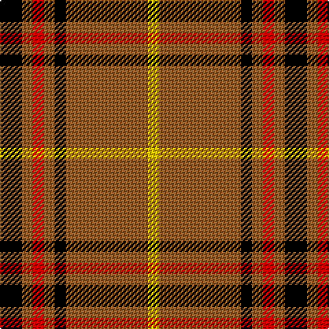

In pattern [KRRRKRY](/stripes/krrrkry/).

This was sourced from weddslist.  It is a [7 stripe tartan](/stripes/stripes7/).

Original link http://www.weddslist.com/cgi-bin/tartans/pg.pl?source=sts

## Thread count
K/16 LT8 R8 LT8 K8 LT60 Y/8

## Palette
Each colour and the base-6 reference it is a variant of.

| Colour | Shade | Base |
|---|---|---|
| K | <code style="background-color:#000000;">#000000</code> `oklch(0.0% 0.000 0.0)` <small>#000000</small> | K <code style="background-color:#000000;">#000000</code> |
| LT | <code style="background-color:#906030;">#906030</code> `oklch(53.1% 0.089 63.7)` <small>#906030</small> | R <code style="background-color:#CC0000;">#CC0000</code> |
| R | <code style="background-color:#C00000;">#C00000</code> `oklch(50.7% 0.208 29.2)` <small>#C00000</small> | R <code style="background-color:#CC0000;">#CC0000</code> |
| Y | <code style="background-color:#F0C000;">#F0C000</code> `oklch(82.7% 0.169 90.5)` <small>#F0C000</small> | Y <code style="background-color:#F2BF00;">#F2BF00</code> |

# Sample pattern

## Nearest tartans

The nearest existing variants by ΔTartan distance.

1. [Volkswagen Orange Trim](/setts/s6/g3lo3k10lo26k3lo3~x2/) — ΔT 1.40
1. [Volkswagen Orange Trim (Fashion)](/setts/s6/lo26k10lo3g3lo3k3~x6/) — ΔT 1.40
1. [Loch Tummel](/setts/s5/dy38w9dy3k9w3~x2/) — ΔT 1.50
1. [Princess Margaret Rose](/setts/s6/dg32r12dg6r6k2w3~x2/) — ΔT 1.55
1. [Richmond de Ellel (Personal)](/setts/s7/k5lo25k10r3k10lo25w5~x2/) — ΔT 1.58
1. [Woodberry Forest School (Corporate)](/setts/s10/r6k3w3k3w3k34r6g5r6k5~x2/) — ΔT 1.63
1. [St Patrick's Krewe](/setts/s8/dg50r5dg8w10dg8db8dg8lo21~x2/) — ΔT 1.64
1. [Braemar, or Blair Atholl](/setts/s10/o1w2k5o3k1o5k1o11k1o1~x4/) — ΔT 1.66
1. [Morrison, Ancient](/setts/s10/r6g4r24k4r6k4r12g12w3g6/) — ΔT 1.66
1. [Morrison LC](/setts/s9/dg9lb4dg15r17k5r7k5r32dg5/) — ΔT 1.67

## Neighbour map

Every grey dot is one of 14299 variants placed by the first two principal components of the ΔTartan feature space (44% of its variance). Red is this tartan; blue dots are its nearest — click one to open its page.

<svg viewBox="0 0 640 380" role="img" style="max-width:100%;height:auto;border:1px solid #e0e0e0;border-radius:4px;display:block" xmlns="http://www.w3.org/2000/svg"><image href="/nn/cloud.v1.png" width="640" height="380"/><a href="/setts/s6/g3lo3k10lo26k3lo3~x2/"><circle cx="386.6" cy="195.4" r="4" fill="#3465a4"><title>Volkswagen Orange Trim</title></circle></a><a href="/setts/s6/lo26k10lo3g3lo3k3~x6/"><circle cx="386.6" cy="195.4" r="4" fill="#3465a4"><title>Volkswagen Orange Trim (Fashion)</title></circle></a><a href="/setts/s5/dy38w9dy3k9w3~x2/"><circle cx="382.7" cy="192.8" r="4" fill="#3465a4"><title>Loch Tummel</title></circle></a><a href="/setts/s6/dg32r12dg6r6k2w3~x2/"><circle cx="372.9" cy="180.7" r="4" fill="#3465a4"><title>Princess Margaret Rose</title></circle></a><a href="/setts/s7/k5lo25k10r3k10lo25w5~x2/"><circle cx="288.4" cy="204.1" r="4" fill="#3465a4"><title>Richmond de Ellel (Personal)</title></circle></a><a href="/setts/s10/r6k3w3k3w3k34r6g5r6k5~x2/"><circle cx="325.5" cy="150.1" r="4" fill="#3465a4"><title>Woodberry Forest School (Corporate)</title></circle></a><a href="/setts/s8/dg50r5dg8w10dg8db8dg8lo21~x2/"><circle cx="294.4" cy="164.9" r="4" fill="#3465a4"><title>St Patrick's Krewe</title></circle></a><a href="/setts/s10/o1w2k5o3k1o5k1o11k1o1~x4/"><circle cx="270.3" cy="159.4" r="4" fill="#3465a4"><title>Braemar, or Blair Atholl</title></circle></a><a href="/setts/s10/r6g4r24k4r6k4r12g12w3g6/"><circle cx="288.0" cy="185.1" r="4" fill="#3465a4"><title>Morrison, Ancient</title></circle></a><a href="/setts/s9/dg9lb4dg15r17k5r7k5r32dg5/"><circle cx="281.5" cy="188.7" r="4" fill="#3465a4"><title>Morrison LC</title></circle></a><circle cx="345.3" cy="182.1" r="5" fill="#c00000"/></svg>

ID: /setts/s7/k4o2r2o2k2o15ly2~x4/
