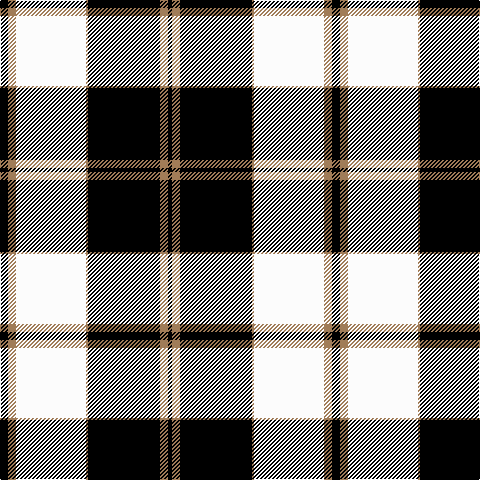

This page is one **sett** — a single exact thread-count. It belongs to the [tartan](/tartans/k4o4w35o1k36o4k2/)
(the same proportion at any scale), whose colour order is pattern [KRKRWRK](/stripes/krkrwrk/).

Sourced from register-of-tartans.  It is a [7 stripe tartan](/stripes/stripes7/).

Original link https://www.tartanregister.gov.uk/tartanDetails.aspx?ref=1410

2 attestations — the source records this cloth was collapsed from (oldest owns this page)

<ul>
<li>01/01/1987 — Gleneagles (register-of-tartans, <a href="https://www.tartanregister.gov.uk/tartanDetails.aspx?ref=1410">record</a>)</li>
<li>1987 — Gleneagles (Fashion) (tartans-authority, <a href="http://www.tartansauthority.com/tartan-ferret/display/5030/">record</a>)</li>
</ul>

## Register references

External register numbers recorded for this tartan.

- Scottish Register of Tartans: [1410](https://www.tartanregister.gov.uk/tartanDetails.aspx?ref=1410)
- Scottish Tartans Authority (ITI): 5030

## Thread count
K/8 LT8 W70 LT2 K72 LT8 K/4

## Palette

Palette: <strong>Tartan Register</strong>
<table><thead><tr><th>Colour</th><th>Threads</th><th>Shade</th><th>Base</th><th>OKLCh</th></tr></thead><tbody><tr><td>K/</td><td style="text-align:right;font-variant-numeric:tabular-nums">8</td><td><code style="background-color:#000000;">#000000</code> <small style="color:#888">#000000</small></td><td>K <code style="background-color:#000000;">#000000</code></td><td><small style="color:#888">oklch(0.0% 0.000 0.0)</small></td></tr><tr><td>LT</td><td style="text-align:right;font-variant-numeric:tabular-nums">8</td><td><code style="background-color:#A07C58;">#A07C58</code> <small style="color:#888">#A07C58</small></td><td>R <code style="background-color:#CC0000;">#CC0000</code></td><td><small style="color:#888">oklch(61.2% 0.067 66.0)</small></td></tr><tr><td>W</td><td style="text-align:right;font-variant-numeric:tabular-nums">70</td><td><code style="background-color:#FCFCFC;">#FCFCFC</code> <small style="color:#888">#FCFCFC</small></td><td>W <code style="background-color:#F7F7F7;">#F7F7F7</code></td><td><small style="color:#888">oklch(99.1% 0.000 89.9)</small></td></tr><tr><td>LT</td><td style="text-align:right;font-variant-numeric:tabular-nums">2</td><td><code style="background-color:#A07C58;">#A07C58</code> <small style="color:#888">#A07C58</small></td><td>R <code style="background-color:#CC0000;">#CC0000</code></td><td><small style="color:#888">oklch(61.2% 0.067 66.0)</small></td></tr><tr><td>K</td><td style="text-align:right;font-variant-numeric:tabular-nums">72</td><td><code style="background-color:#000000;">#000000</code> <small style="color:#888">#000000</small></td><td>K <code style="background-color:#000000;">#000000</code></td><td><small style="color:#888">oklch(0.0% 0.000 0.0)</small></td></tr><tr><td>LT</td><td style="text-align:right;font-variant-numeric:tabular-nums">8</td><td><code style="background-color:#A07C58;">#A07C58</code> <small style="color:#888">#A07C58</small></td><td>R <code style="background-color:#CC0000;">#CC0000</code></td><td><small style="color:#888">oklch(61.2% 0.067 66.0)</small></td></tr><tr><td>K/</td><td style="text-align:right;font-variant-numeric:tabular-nums">4</td><td><code style="background-color:#000000;">#000000</code> <small style="color:#888">#000000</small></td><td>K <code style="background-color:#000000;">#000000</code></td><td><small style="color:#888">oklch(0.0% 0.000 0.0)</small></td></tr></tbody></table>

# Sample pattern

## Nearest tartans

The nearest existing variants by ΔTartan distance, with this tartan at the top so the swatches line up against it.

ΔTartan

Tartan

Sett

—

<a href="/ttd/edit/#slug=k4o4w35o1k36o4k2~x2">Gleneagles</a> <a class="nn-out" href="/setts/s7/k4o4w35o1k36o4k2~x2/" title="open its dictionary page">↗</a>

0.35

<a href="/ttd/edit/#slug=k4y4w35y1k36y4k2~x2">Gleneagles, Hotel</a> <a class="nn-out" href="/setts/s7/k4y4w35y1k36y4k2~x2/" title="open its dictionary page">↗</a>

0.57

<a href="/ttd/edit/#slug=k4lo4lb32lo1k32lo4k2~x4">Gleneagles Gold (Dalgleish)</a> <a class="nn-out" href="/setts/s7/k4lo4lb32lo1k32lo4k2~x4/" title="open its dictionary page">↗</a>

1.16

<a href="/ttd/edit/#slug=lb3r1lb30k20lb3k9ly1">MacPherson Dress</a> <a class="nn-out" href="/setts/s7/lb3r1lb30k20lb3k9ly1/" title="open its dictionary page">↗</a>

1.18

<a href="/ttd/edit/#slug=w36k8w36k95w4k4r6">Gretna Football Club (Corporate)</a> <a class="nn-out" href="/setts/s7/w36k8w36k95w4k4r6/" title="open its dictionary page">↗</a>

1.18

<a href="/ttd/edit/#slug=w4k30r1k1r3w12ly3~x2">Richecourt, Baron of (Personal)</a> <a class="nn-out" href="/setts/s7/w4k30r1k1r3w12ly3~x2/" title="open its dictionary page">↗</a>

1.26

<a href="/ttd/edit/#slug=lr3r1lr30k20lr3k9ly1~x2">MacPherson Dress</a> <a class="nn-out" href="/setts/s7/lr3r1lr30k20lr3k9ly1~x2/" title="open its dictionary page">↗</a>

1.26

<a href="/ttd/edit/#slug=lr3r1lr30k20lr3k9ly1">MacPherson Dress</a> <a class="nn-out" href="/setts/s7/lr3r1lr30k20lr3k9ly1/" title="open its dictionary page">↗</a>

1.30

<a href="/ttd/edit/#slug=k2n2w4n6w27n15k42n2w2">Swansea City AFC</a> <a class="nn-out" href="/setts/s9/k2n2w4n6w27n15k42n2w2/" title="open its dictionary page">↗</a>

1.31

<a href="/ttd/edit/#slug=r2lb3r1lb9k4lb13k33lb1k4r1~x2">Myles, Lee (Name)</a> <a class="nn-out" href="/setts/s10/r2lb3r1lb9k4lb13k33lb1k4r1~x2/" title="open its dictionary page">↗</a>

1.32

<a href="/ttd/edit/#slug=w40k11o8w2o8k6w2k16w1k16~x2">Lebrun</a> <a class="nn-out" href="/setts/s10/w40k11o8w2o8k6w2k16w1k16~x2/" title="open its dictionary page">↗</a>

## Neighbour map

Every grey dot is one of 14299 variants placed by the first two principal components of the ΔTartan feature space (44% of its variance). Red is this tartan; blue dots are its nearest — click one to open its page.

<svg viewBox="0 0 640 380" role="img" style="max-width:100%;height:auto;border:1px solid #e0e0e0;border-radius:4px;display:block" xmlns="http://www.w3.org/2000/svg"><image href="/nn/cloud.v1.png" width="640" height="380"/><a href="/setts/s7/k4y4w35y1k36y4k2~x2/"><circle cx="315.1" cy="128.3" r="4" fill="#3465a4"><title>Gleneagles, Hotel</title></circle></a><a href="/setts/s7/k4lo4lb32lo1k32lo4k2~x4/"><circle cx="313.8" cy="135.2" r="4" fill="#3465a4"><title>Gleneagles Gold (Dalgleish)</title></circle></a><a href="/setts/s7/lb3r1lb30k20lb3k9ly1/"><circle cx="322.7" cy="125.3" r="4" fill="#3465a4"><title>MacPherson Dress</title></circle></a><a href="/setts/s7/w36k8w36k95w4k4r6/"><circle cx="346.4" cy="144.0" r="4" fill="#3465a4"><title>Gretna Football Club (Corporate)</title></circle></a><a href="/setts/s7/w4k30r1k1r3w12ly3~x2/"><circle cx="329.8" cy="112.6" r="4" fill="#3465a4"><title>Richecourt, Baron of (Personal)</title></circle></a><a href="/setts/s7/lr3r1lr30k20lr3k9ly1~x2/"><circle cx="329.3" cy="131.5" r="4" fill="#3465a4"><title>MacPherson Dress</title></circle></a><a href="/setts/s7/lr3r1lr30k20lr3k9ly1/"><circle cx="329.3" cy="131.5" r="4" fill="#3465a4"><title>MacPherson Dress</title></circle></a><a href="/setts/s9/k2n2w4n6w27n15k42n2w2/"><circle cx="255.4" cy="136.5" r="4" fill="#3465a4"><title>Swansea City AFC</title></circle></a><a href="/setts/s10/r2lb3r1lb9k4lb13k33lb1k4r1~x2/"><circle cx="373.8" cy="116.0" r="4" fill="#3465a4"><title>Myles, Lee (Name)</title></circle></a><a href="/setts/s10/w40k11o8w2o8k6w2k16w1k16~x2/"><circle cx="275.6" cy="114.7" r="4" fill="#3465a4"><title>Lebrun</title></circle></a><circle cx="312.7" cy="124.9" r="5" fill="#c00000"/></svg>

ID: /setts/s7/k4o4w35o1k36o4k2~x2/
