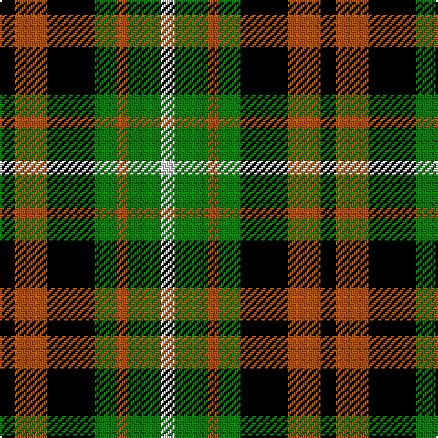

This page is one **sett** — a single exact thread-count. It belongs to the [tartan](/tartans/k4o9k13g6o3g9w4/)
(the same proportion at any scale), whose colour order is pattern [KRKGRGW](/stripes/krkgrgw/).

Sourced from weddslist.  It is a [7 stripe tartan](/stripes/stripes7/).

Original link http://www.weddslist.com/cgi-bin/tartans/pg.pl?source=sts

## Thread count
K/8 DO18 K26 G12 DO6 G18 LN/8

## Palette

Palette: <strong>Tartan Register</strong> <small style="color:#888">(2 of 4 colours)</small>
<table><thead><tr><th>Colour</th><th>Threads</th><th>Shade</th><th>Base</th><th>OKLCh</th></tr></thead><tbody><tr><td>K/</td><td style="text-align:right;font-variant-numeric:tabular-nums">8</td><td><code style="background-color:#000000;">#000000</code> <small style="color:#888">#000000</small></td><td>K <code style="background-color:#000000;">#000000</code></td><td><small style="color:#888">oklch(0.0% 0.000 0.0)</small></td></tr><tr><td>DO</td><td style="text-align:right;font-variant-numeric:tabular-nums">18</td><td><code style="background-color:#B05000;">#B05000</code> <small style="color:#888">#B05000</small></td><td>R <code style="background-color:#CC0000;">#CC0000</code></td><td><small style="color:#888">oklch(54.4% 0.145 49.4)</small></td></tr><tr><td>K</td><td style="text-align:right;font-variant-numeric:tabular-nums">26</td><td><code style="background-color:#000000;">#000000</code> <small style="color:#888">#000000</small></td><td>K <code style="background-color:#000000;">#000000</code></td><td><small style="color:#888">oklch(0.0% 0.000 0.0)</small></td></tr><tr><td>G</td><td style="text-align:right;font-variant-numeric:tabular-nums">12</td><td><code style="background-color:#008000;">#008000</code> <small style="color:#888">#008000</small></td><td>G <code style="background-color:#006100;">#006100</code></td><td><small style="color:#888">oklch(52.0% 0.177 142.5)</small></td></tr><tr><td>DO</td><td style="text-align:right;font-variant-numeric:tabular-nums">6</td><td><code style="background-color:#B05000;">#B05000</code> <small style="color:#888">#B05000</small></td><td>R <code style="background-color:#CC0000;">#CC0000</code></td><td><small style="color:#888">oklch(54.4% 0.145 49.4)</small></td></tr><tr><td>G</td><td style="text-align:right;font-variant-numeric:tabular-nums">18</td><td><code style="background-color:#008000;">#008000</code> <small style="color:#888">#008000</small></td><td>G <code style="background-color:#006100;">#006100</code></td><td><small style="color:#888">oklch(52.0% 0.177 142.5)</small></td></tr><tr><td>LN/</td><td style="text-align:right;font-variant-numeric:tabular-nums">8</td><td><code style="background-color:#E0E0E0;">#E0E0E0</code> <small style="color:#888">#E0E0E0</small></td><td>W <code style="background-color:#F7F7F7;">#F7F7F7</code></td><td><small style="color:#888">oklch(90.7% 0.000 89.9)</small></td></tr></tbody></table>

# Sample pattern

## Nearest tartans

The nearest existing variants by ΔTartan distance, with this tartan at the top so the swatches line up against it.

ΔTartan

Tartan

Sett

—

<a href="/ttd/edit/#slug=k4o9k13g6o3g9w4~x2">Ramsay, Red</a> <a class="nn-out" href="/setts/s7/k4o9k13g6o3g9w4~x2/" title="open its dictionary page">↗</a>

0.77

<a href="/ttd/edit/#slug=k4lo9k13g6lo3g9w4~x2">Ramsay (Orange)</a> <a class="nn-out" href="/setts/s7/k4lo9k13g6lo3g9w4~x2/" title="open its dictionary page">↗</a>

0.80

<a href="/ttd/edit/#slug=ly8g16k6g6k6g6k16r21k5">Martin</a> <a class="nn-out" href="/setts/s9/ly8g16k6g6k6g6k16r21k5/" title="open its dictionary page">↗</a>

0.98

<a href="/ttd/edit/#slug=g24k4g24k24t7r24t7~x2">Unidentified, Pinafore</a> <a class="nn-out" href="/setts/s7/g24k4g24k24t7r24t7~x2/" title="open its dictionary page">↗</a>

1.12

<a href="/ttd/edit/#slug=lb8k4lb8k2lb3k8dg8r2dg8k4~x2">Ferguson Dress variation</a> <a class="nn-out" href="/setts/s10/lb8k4lb8k2lb3k8dg8r2dg8k4~x2/" title="open its dictionary page">↗</a>

1.18

<a href="/ttd/edit/#slug=k11g12k2g12k12p12w3~x2">Wilson's, No 97</a> <a class="nn-out" href="/setts/s7/k11g12k2g12k12p12w3~x2/" title="open its dictionary page">↗</a>

1.20

<a href="/ttd/edit/#slug=k1db3k3g3r1g3k3g1r1~x2">Unnamed, No 30</a> <a class="nn-out" href="/setts/s9/k1db3k3g3r1g3k3g1r1~x2/" title="open its dictionary page">↗</a>

1.20

<a href="/ttd/edit/#slug=k2g7t1k6r4g2~x4">Walker, James</a> <a class="nn-out" href="/setts/s6/k2g7t1k6r4g2~x4/" title="open its dictionary page">↗</a>

1.22

<a href="/ttd/edit/#slug=y6r1k6r1g6~x6">Timespan, (MacKay)</a> <a class="nn-out" href="/setts/s5/y6r1k6r1g6~x6/" title="open its dictionary page">↗</a>

1.24

<a href="/ttd/edit/#slug=k6g6ly1g6k6p6k1~x4">Abercrombie, (Wilson's No 64)</a> <a class="nn-out" href="/setts/s7/k6g6ly1g6k6p6k1~x4/" title="open its dictionary page">↗</a>

1.29

<a href="/ttd/edit/#slug=k6g6w1g6k6p6k1~x4">Wilson's, No 64 or Abercrombie</a> <a class="nn-out" href="/setts/s7/k6g6w1g6k6p6k1~x4/" title="open its dictionary page">↗</a>

## Neighbour map

Every grey dot is one of 14299 variants placed by the first two principal components of the ΔTartan feature space (44% of its variance). Red is this tartan; blue dots are its nearest — click one to open its page.

<svg viewBox="0 0 640 380" role="img" style="max-width:100%;height:auto;border:1px solid #e0e0e0;border-radius:4px;display:block" xmlns="http://www.w3.org/2000/svg"><image href="/nn/cloud.v1.png" width="640" height="380"/><a href="/setts/s7/k4lo9k13g6lo3g9w4~x2/"><circle cx="95.1" cy="254.7" r="4" fill="#3465a4"><title>Ramsay (Orange)</title></circle></a><a href="/setts/s9/ly8g16k6g6k6g6k16r21k5/"><circle cx="97.8" cy="238.1" r="4" fill="#3465a4"><title>Martin</title></circle></a><a href="/setts/s7/g24k4g24k24t7r24t7~x2/"><circle cx="137.1" cy="241.7" r="4" fill="#3465a4"><title>Unidentified, Pinafore</title></circle></a><a href="/setts/s10/lb8k4lb8k2lb3k8dg8r2dg8k4~x2/"><circle cx="68.1" cy="240.6" r="4" fill="#3465a4"><title>Ferguson Dress variation</title></circle></a><a href="/setts/s7/k11g12k2g12k12p12w3~x2/"><circle cx="121.5" cy="252.4" r="4" fill="#3465a4"><title>Wilson's, No 97</title></circle></a><a href="/setts/s9/k1db3k3g3r1g3k3g1r1~x2/"><circle cx="82.9" cy="269.2" r="4" fill="#3465a4"><title>Unnamed, No 30</title></circle></a><a href="/setts/s6/k2g7t1k6r4g2~x4/"><circle cx="158.0" cy="236.6" r="4" fill="#3465a4"><title>Walker, James</title></circle></a><a href="/setts/s5/y6r1k6r1g6~x6/"><circle cx="101.8" cy="245.0" r="4" fill="#3465a4"><title>Timespan, (MacKay)</title></circle></a><a href="/setts/s7/k6g6ly1g6k6p6k1~x4/"><circle cx="137.6" cy="250.4" r="4" fill="#3465a4"><title>Abercrombie, (Wilson's No 64)</title></circle></a><a href="/setts/s7/k6g6w1g6k6p6k1~x4/"><circle cx="136.6" cy="250.1" r="4" fill="#3465a4"><title>Wilson's, No 64 or Abercrombie</title></circle></a><circle cx="84.1" cy="252.7" r="5" fill="#c00000"/></svg>

ID: /setts/s7/k4o9k13g6o3g9w4~x2/
