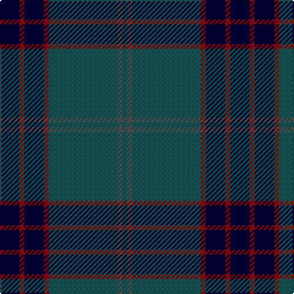

In pattern [GBGRKRK](/stripes/gbgrkrk/).

This was sourced from register-of-tartans.  It is a [7 stripe tartan](/stripes/stripes7/).

Original link https://www.tartanregister.gov.uk/tartanDetails.aspx?ref=3340

## Attestations

This cloth appears in 2 source records; the oldest owns this page.

- 01/01/1995 — Pinehurst Resort (register-of-tartans, [record](https://www.tartanregister.gov.uk/tartanDetails.aspx?ref=3340))
- 1995? — Pinehurst Resort (Corporate) (tartans-authority, [record](http://www.tartansauthority.com/tartan-ferret/display/4173/))

## Register references

External register numbers recorded for this tartan.

- Scottish Register of Tartans: [3340](https://www.tartanregister.gov.uk/tartanDetails.aspx?ref=3340)
- Scottish Tartans Authority (ITI): 4173

## Thread count
DB/16 DR4 DB16 DR4 G56 N4 G/4

## Palette
Each colour and the base-6 reference it is a variant of.

| Colour | Shade | Base |
|---|---|---|
| DB | <code style="background-color:#000034;">#000034</code> `oklch(14.7% 0.102 264.1)` <small>#000034</small> | K <code style="background-color:#000000;">#000000</code> |
| DR | <code style="background-color:#8C0000;">#8C0000</code> `oklch(40.2% 0.165 29.2)` <small>#8C0000</small> | R <code style="background-color:#CC0000;">#CC0000</code> |
| G | <code style="background-color:#0C5454;">#0C5454</code> `oklch(40.6% 0.065 194.9)` <small>#0C5454</small> | G <code style="background-color:#006100;">#006100</code> |
| N | <code style="background-color:#505050;">#505050</code> `oklch(43.1% 0.000 89.9)` <small>#505050</small> | B <code style="background-color:#2A418A;">#2A418A</code> |

# Sample pattern

## Nearest tartans

The nearest existing variants by ΔTartan distance, with this tartan at the top so the swatches line up against it.

ΔTartan

Tartan

Sett

—

<a href="/ttd/edit/#slug=k4r1k4r1dg14n1dg1~x4">Pinehurst Resort</a> <a class="nn-out" href="/setts/s7/k4r1k4r1dg14n1dg1~x4/" title="open its dictionary page">↗</a>

0.95

<a href="/ttd/edit/#slug=db16w1db1w1db8dg16r1db2~x2">Roxburgh</a> <a class="nn-out" href="/setts/s8/db16w1db1w1db8dg16r1db2~x2/" title="open its dictionary page">↗</a>

1.07

<a href="/ttd/edit/#slug=r4dt4k2dt31k10ly3dt5k11dt6k3~x2">MacArthur Fox Green (Personal)</a> <a class="nn-out" href="/setts/s10/r4dt4k2dt31k10ly3dt5k11dt6k3~x2/" title="open its dictionary page">↗</a>

1.11

<a href="/ttd/edit/#slug=k10db4k34dt2k2dt30w3~x2">Patriot, The (Fashion)</a> <a class="nn-out" href="/setts/s7/k10db4k34dt2k2dt30w3~x2/" title="open its dictionary page">↗</a>

1.12

<a href="/ttd/edit/#slug=dr2db4g12db3dr6t2db24dr2db2g2~x2">Wicklow</a> <a class="nn-out" href="/setts/s10/dr2db4g12db3dr6t2db24dr2db2g2~x2/" title="open its dictionary page">↗</a>

1.19

<a href="/ttd/edit/#slug=db12k1db1k1db1k3g6k1~x2">Black Watch (Miniature) Regimental Tartan Tartan Number: 2200. Earliest known date: pre 2003 This is a miniture version of the regular Black Watch sett. See products available Copyright © Blair Urquhart, Comrie, 2015</a> <a class="nn-out" href="/setts/s8/db12k1db1k1db1k3g6k1~x2/" title="open its dictionary page">↗</a>

1.19

<a href="/ttd/edit/#slug=k2dg7db2dg7db16r1~x6">Hutton</a> <a class="nn-out" href="/setts/s6/k2dg7db2dg7db16r1~x6/" title="open its dictionary page">↗</a>

1.23

<a href="/ttd/edit/#slug=dg3k3db2k16db2k2db24lb2~x2">Auckland (Fashion)</a> <a class="nn-out" href="/setts/s8/dg3k3db2k16db2k2db24lb2~x2/" title="open its dictionary page">↗</a>

1.23

<a href="/ttd/edit/#slug=dt23k2dt2k2dt2k28r2k4n2~x2">Trotter (Personal)</a> <a class="nn-out" href="/setts/s9/dt23k2dt2k2dt2k28r2k4n2~x2/" title="open its dictionary page">↗</a>

1.26

<a href="/ttd/edit/#slug=db6t3db3t15dg7db7dg5db17dg46dg4">Jones (Welsh Name)</a> <a class="nn-out" href="/setts/s10/db6t3db3t15dg7db7dg5db17dg46dg4/" title="open its dictionary page">↗</a>

1.28

<a href="/ttd/edit/#slug=k32b2k6b2k13n30w2~x2">Mountain Rescue Association Honor Guard</a> <a class="nn-out" href="/setts/s7/k32b2k6b2k13n30w2~x2/" title="open its dictionary page">↗</a>

## Neighbour map

Every grey dot is one of 14299 variants placed by the first two principal components of the ΔTartan feature space (44% of its variance). Red is this tartan; blue dots are its nearest — click one to open its page.

<svg viewBox="0 0 640 380" role="img" style="max-width:100%;height:auto;border:1px solid #e0e0e0;border-radius:4px;display:block" xmlns="http://www.w3.org/2000/svg"><image href="/nn/cloud.v1.png" width="640" height="380"/><a href="/setts/s8/db16w1db1w1db8dg16r1db2~x2/"><circle cx="399.0" cy="197.5" r="4" fill="#3465a4"><title>Roxburgh</title></circle></a><a href="/setts/s10/r4dt4k2dt31k10ly3dt5k11dt6k3~x2/"><circle cx="375.9" cy="189.9" r="4" fill="#3465a4"><title>MacArthur Fox Green (Personal)</title></circle></a><a href="/setts/s7/k10db4k34dt2k2dt30w3~x2/"><circle cx="388.7" cy="210.9" r="4" fill="#3465a4"><title>Patriot, The (Fashion)</title></circle></a><a href="/setts/s10/dr2db4g12db3dr6t2db24dr2db2g2~x2/"><circle cx="348.4" cy="189.2" r="4" fill="#3465a4"><title>Wicklow</title></circle></a><a href="/setts/s8/db12k1db1k1db1k3g6k1~x2/"><circle cx="385.9" cy="231.2" r="4" fill="#3465a4"><title>Black Watch (Miniature) Regimental Tartan Tartan Number: 2200. Earliest known date: pre 2003 This is a miniture version of the regular Black Watch sett. See products available Copyright © Blair Urquhart, Comrie, 2015</title></circle></a><a href="/setts/s6/k2dg7db2dg7db16r1~x6/"><circle cx="360.6" cy="234.7" r="4" fill="#3465a4"><title>Hutton</title></circle></a><a href="/setts/s8/dg3k3db2k16db2k2db24lb2~x2/"><circle cx="362.1" cy="205.0" r="4" fill="#3465a4"><title>Auckland (Fashion)</title></circle></a><a href="/setts/s9/dt23k2dt2k2dt2k28r2k4n2~x2/"><circle cx="404.6" cy="198.9" r="4" fill="#3465a4"><title>Trotter (Personal)</title></circle></a><a href="/setts/s10/db6t3db3t15dg7db7dg5db17dg46dg4/"><circle cx="349.4" cy="198.1" r="4" fill="#3465a4"><title>Jones (Welsh Name)</title></circle></a><a href="/setts/s7/k32b2k6b2k13n30w2~x2/"><circle cx="377.2" cy="202.6" r="4" fill="#3465a4"><title>Mountain Rescue Association Honor Guard</title></circle></a><circle cx="393.3" cy="207.2" r="5" fill="#c00000"/></svg>

ID: /setts/s7/k4r1k4r1dg14n1dg1~x4/
