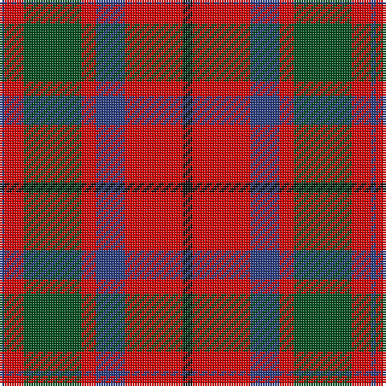

In pattern [BRGRBRK](/patterns/brgrbrk/).

This was sourced from register-of-tartans.  It is a [7 stripes tartan](/stripes/stripes7/).

Original link https://www.tartanregister.gov.uk/tartanDetails.aspx?ref=2296

## Thread count
B/2 R8 G24 R6 B12 R24 K/4

## Palette
Each colour and its ΔE from the base-6 reference it is a variant of.

| Colour | Shade | Base | ΔE (OKLab) |
|---|---|---|---|
| B | <code style="background-color:#2C4084;">#2C4084</code> `#2C4084` | B <code style="background-color:#2A418A;">#2A418A</code> | 0.01 |
| G | <code style="background-color:#005020;">#005020</code> `#005020` | G <code style="background-color:#006100;">#006100</code> | 0.07 |
| K | <code style="background-color:#101010;">#101010</code> `#101010` | K <code style="background-color:#000000;">#000000</code> | 0.17 |
| R | <code style="background-color:#DC0000;">#DC0000</code> `#DC0000` | R <code style="background-color:#CC0000;">#CC0000</code> | 0.03 |

# Sample pattern

## Nearest tartans

The nearest existing variants by ΔTartan distance.

1. [MacQuarrie #6](/setts/s7/r12g32r8b24r32ba2r4-b2c4084-ba3c82af-g005020-rdc0000/) — ΔT 0.54
1. [MacBean, MacElvain](/setts/s7/k4r24b12r6g24r8b2-b304080-g008000-k000000-rc00000/) — ΔT 0.62
1. [MacDuff #4](/setts/s7/r8k4r48k12b12g32r6-b2c4084-g005020-k101010-rdc0000/) — ΔT 0.66
1. [Geddes](/setts/s7/b4r20g60r12b36r40w4-b440044-g006818-rc80000-we0e0e0/) — ΔT 0.67
1. [Montrose Clan Tartan Tartan Number: 350. Earliest known date: 1819 Canadian fancy. Presented by Mrs K Sinclair See products available Copyright © Blair Urquhart, Comrie, 2015](/setts/s9/b2k2r24g24k12b10r24k2b2-b2c2c80-g006818-k101010-rc80000/) — ΔT 0.75
1. [MacQuarrie LO](/setts/s7/r12g32r8b24r32w2r4-b000064-g004c00-rc80000-wd0d0d0/) — ΔT 0.77
1. [James of Glencarr (Personal)](/setts/s8/b16r16g34w6r70b20g30w6-b2c2c80-g003820-rc80000-we0e0e0/) — ΔT 0.77
1. [MacQuarrie 2](/setts/s7/r12g32r8b24r32ba2r4-b304080-ba5480b0-g008000-rc00000/) — ΔT 0.78
1. [Carrick (Strathmore) District Tartan Tartan Number: 3216. Earliest known date: c.1999 Sales help Princess Diana Memorial Trust See products available Copyright © Blair Urquhart, Comrie, 2015](/setts/s7/r56b24r6g40ba4g4r14-b202060-ba5c8ca8-g003820-rc80000/) — ΔT 0.81
1. [Convention of the Baronage (Corp)](/setts/s9/g12r36b4g36r4g4r36ba36r4-b2888c4-ba2c2c80-g006818-rc80000/) — ΔT 0.82

## Neighbour map

Every grey dot is one of 15726 variants placed by the first two principal components of the ΔTartan feature space (44% of its variance). Red is this tartan; blue dots are its nearest — click one to open its page.

<svg viewBox="0 0 640 380" role="img" style="max-width:100%;height:auto;border:1px solid #e0e0e0;border-radius:4px;display:block" xmlns="http://www.w3.org/2000/svg"><image href="/nn/cloud.v1.png" width="640" height="380"/><a href="/setts/s7/r12g32r8b24r32ba2r4-b2c4084-ba3c82af-g005020-rdc0000/"><circle cx="284.8" cy="190.0" r="4" fill="#3465a4"><title>MacQuarrie #6</title></circle></a><a href="/setts/s7/k4r24b12r6g24r8b2-b304080-g008000-k000000-rc00000/"><circle cx="249.6" cy="196.8" r="4" fill="#3465a4"><title>MacBean, MacElvain</title></circle></a><a href="/setts/s7/r8k4r48k12b12g32r6-b2c4084-g005020-k101010-rdc0000/"><circle cx="278.6" cy="183.4" r="4" fill="#3465a4"><title>MacDuff #4</title></circle></a><a href="/setts/s7/b4r20g60r12b36r40w4-b440044-g006818-rc80000-we0e0e0/"><circle cx="242.4" cy="187.0" r="4" fill="#3465a4"><title>Geddes</title></circle></a><a href="/setts/s9/b2k2r24g24k12b10r24k2b2-b2c2c80-g006818-k101010-rc80000/"><circle cx="247.7" cy="177.5" r="4" fill="#3465a4"><title>Montrose Clan Tartan Tartan Number: 350. Earliest known date: 1819 Canadian fancy. Presented by Mrs K Sinclair See products available Copyright © Blair Urquhart, Comrie, 2015</title></circle></a><a href="/setts/s7/r12g32r8b24r32w2r4-b000064-g004c00-rc80000-wd0d0d0/"><circle cx="267.5" cy="186.6" r="4" fill="#3465a4"><title>MacQuarrie LO</title></circle></a><a href="/setts/s8/b16r16g34w6r70b20g30w6-b2c2c80-g003820-rc80000-we0e0e0/"><circle cx="226.7" cy="185.2" r="4" fill="#3465a4"><title>James of Glencarr (Personal)</title></circle></a><a href="/setts/s7/r12g32r8b24r32ba2r4-b304080-ba5480b0-g008000-rc00000/"><circle cx="288.0" cy="194.1" r="4" fill="#3465a4"><title>MacQuarrie 2</title></circle></a><a href="/setts/s7/r56b24r6g40ba4g4r14-b202060-ba5c8ca8-g003820-rc80000/"><circle cx="308.2" cy="184.6" r="4" fill="#3465a4"><title>Carrick (Strathmore) District Tartan Tartan Number: 3216. Earliest known date: c.1999 Sales help Princess Diana Memorial Trust See products available Copyright © Blair Urquhart, Comrie, 2015</title></circle></a><a href="/setts/s9/g12r36b4g36r4g4r36ba36r4-b2888c4-ba2c2c80-g006818-rc80000/"><circle cx="250.8" cy="196.2" r="4" fill="#3465a4"><title>Convention of the Baronage (Corp)</title></circle></a><circle cx="259.5" cy="198.0" r="5" fill="#c00000"/></svg>

ID: /setts/s7/k4r24b12r6g24r8b2-b2c4084-g005020-k101010-rdc0000/
