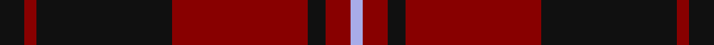

In pattern [KRKRKRW](/stripes/krkrkrw/).

This was sourced from register-of-tartans.  It is a [7 stripe tartan](/stripes/stripes7/).

Original link https://www.tartanregister.gov.uk/tartanDetails.aspx?ref=5223

## Attestations

This cloth appears in 2 source records; the oldest owns this page.

- 01/01/1860 — Menzies of Culdares (register-of-tartans, [record](https://www.tartanregister.gov.uk/tartanDetails.aspx?ref=5223))
- 1860 — Menzies of Culdares (Artefact) (tartans-authority, [record](http://www.tartansauthority.com/tartan-ferret/display/3467/))

## Register references

External register numbers recorded for this tartan.

- Scottish Register of Tartans: [5223](https://www.tartanregister.gov.uk/tartanDetails.aspx?ref=5223)
- Scottish Tartans Authority (ITI): 3467

## Thread count
K/8 DR4 K44 DR44 K6 DR8 LP/4

## Palette
Each colour and its ΔE from the base-6 reference it is a variant of.

| Colour | Shade | Base | ΔE (OKLab) |
|---|---|---|---|
| DR | <code style="background-color:#880000;">#880000</code> `#880000` | R <code style="background-color:#CC0000;">#CC0000</code> | 0.15 |
| K | <code style="background-color:#101010;">#101010</code> `#101010` | K <code style="background-color:#000000;">#000000</code> | 0.17 |
| LP | <code style="background-color:#A8ACE8;">#A8ACE8</code> `#A8ACE8` | W <code style="background-color:#F7F7F7;">#F7F7F7</code> | 0.23 |

# Sample pattern

## Nearest tartans

The nearest existing variants by ΔTartan distance.

1. [Dunbar (District)](/setts/s6/k8r49k8lb3k20lo3~x2/) — ΔT 1.29
1. [Gallmore (Fashion)](/setts/s9/o3k14r3k14t3r32k2r6k2~x2/) — ΔT 1.29
1. [Eglington](/setts/s6/dt2m2dt17r17o2r2~x4/) — ΔT 1.29
1. [Cameron Black & Red (Dress)](/setts/s6/k2r12k2r12k33r2~x2/) — ΔT 1.42
1. [Perthshire Tourist Board (Corporate)](/setts/s6/dp26r6g16dp8g3r2~x2/) — ΔT 1.45
1. [Hungerford RFC](/setts/s6/k50dt3ly3r50~x2/) — ΔT 1.47
1. [Breckon (Name)](/setts/s9/k3o1k14r14o1r1o1r1k2~x4/) — ΔT 1.56
1. [MacDonald of Sleat](/setts/s5/dg16r5dg2r18k2/) — ΔT 1.59
1. [Rajput](/setts/s6/db6r39db10r10db21ly5~x2/) — ΔT 1.60
1. [Hungerford RFC (Corporate)](/setts/s4/k50dt3ly3r50~x2/) — ΔT 1.62

## Neighbour map

Every grey dot is one of 14299 variants placed by the first two principal components of the ΔTartan feature space (44% of its variance). Red is this tartan; blue dots are its nearest — click one to open its page.

<svg viewBox="0 0 640 380" role="img" style="max-width:100%;height:auto;border:1px solid #e0e0e0;border-radius:4px;display:block" xmlns="http://www.w3.org/2000/svg"><image href="/nn/cloud.v1.png" width="640" height="380"/><a href="/setts/s6/k8r49k8lb3k20lo3~x2/"><circle cx="371.7" cy="182.9" r="4" fill="#3465a4"><title>Dunbar (District)</title></circle></a><a href="/setts/s9/o3k14r3k14t3r32k2r6k2~x2/"><circle cx="357.6" cy="168.3" r="4" fill="#3465a4"><title>Gallmore (Fashion)</title></circle></a><a href="/setts/s6/dt2m2dt17r17o2r2~x4/"><circle cx="323.8" cy="219.4" r="4" fill="#3465a4"><title>Eglington</title></circle></a><a href="/setts/s6/k2r12k2r12k33r2~x2/"><circle cx="454.6" cy="224.8" r="4" fill="#3465a4"><title>Cameron Black &amp; Red (Dress)</title></circle></a><a href="/setts/s6/dp26r6g16dp8g3r2~x2/"><circle cx="378.9" cy="239.5" r="4" fill="#3465a4"><title>Perthshire Tourist Board (Corporate)</title></circle></a><a href="/setts/s6/k50dt3ly3r50~x2/"><circle cx="328.8" cy="175.0" r="4" fill="#3465a4"><title>Hungerford RFC</title></circle></a><a href="/setts/s9/k3o1k14r14o1r1o1r1k2~x4/"><circle cx="356.6" cy="178.9" r="4" fill="#3465a4"><title>Breckon (Name)</title></circle></a><a href="/setts/s5/dg16r5dg2r18k2/"><circle cx="363.1" cy="249.6" r="4" fill="#3465a4"><title>MacDonald of Sleat</title></circle></a><a href="/setts/s6/db6r39db10r10db21ly5~x2/"><circle cx="349.0" cy="247.3" r="4" fill="#3465a4"><title>Rajput</title></circle></a><a href="/setts/s4/k50dt3ly3r50~x2/"><circle cx="355.9" cy="221.0" r="4" fill="#3465a4"><title>Hungerford RFC (Corporate)</title></circle></a><circle cx="371.1" cy="218.2" r="5" fill="#c00000"/></svg>

ID: /setts/s7/k4r2k22r22k3r4lb2~x2/
