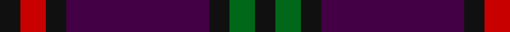
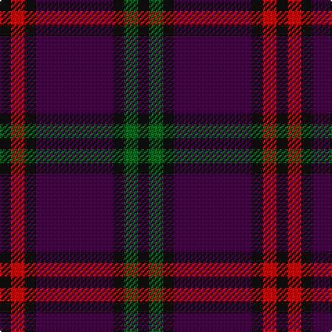

In pattern [KGKBKRK](/stripes/kgkbkrk/).

This was sourced from register-of-tartans.  It is a [7 stripe tartan](/stripes/stripes7/).

Original link https://www.tartanregister.gov.uk/tartanDetails.aspx?ref=2991

## Also known as

This cloth is also recorded under:

- Montgomrie/Montgomery of Eglinton

## Attestations

This cloth appears in 2 source records; the oldest owns this page.

- 01/01/1819 — Montgomrie/Montgomery of Eglinton (register-of-tartans, [record](https://www.tartanregister.gov.uk/tartanDetails.aspx?ref=2991))
- 1819 (1707?) — Montgomery - 1819 (Clan) (tartans-authority, [record](http://www.tartansauthority.com/tartan-ferret/display/1082/))

## Register references

External register numbers recorded for this tartan.

- Scottish Register of Tartans: [2991](https://www.tartanregister.gov.uk/tartanDetails.aspx?ref=2991)
- Scottish Tartans Authority (ITI): 1082
- Scottish Tartans World Register: 1082

## Thread count
K/8 R10 K8 DP56 K8 G10 K/8

## Palette
Each colour and its ΔE from the base-6 reference it is a variant of.

| Colour | Shade | Base | ΔE (OKLab) |
|---|---|---|---|
| DP | <code style="background-color:#440044;">#440044</code> `#440044` | B <code style="background-color:#2A418A;">#2A418A</code> | 0.18 |
| G | <code style="background-color:#006818;">#006818</code> `#006818` | G <code style="background-color:#006100;">#006100</code> | 0.02 |
| K | <code style="background-color:#101010;">#101010</code> `#101010` | K <code style="background-color:#000000;">#000000</code> | 0.17 |
| R | <code style="background-color:#C80000;">#C80000</code> `#C80000` | R <code style="background-color:#CC0000;">#CC0000</code> | 0.01 |

# Sample pattern

## Nearest tartans

The nearest existing variants by ΔTartan distance.

1. [Wilson's No.007 Or Eglinton](/setts/s12/g5k4dp28k4r5k4r5k4dp28k4g5k4~x2/) — ΔT 1.17
1. [Komissarov, Dmitry (Personal)](/setts/s7/dp30db30y4db4y4db5r6~x2/) — ΔT 1.25
1. [MacArthur-Fox, dress](/setts/s6/r2db13r3db3r16t2~x4/) — ΔT 1.49
1. [Haut Name Tartan Tartan Number: 10389. Earliest known date: 1st March 2011 Designed for the Haut family living in Liff by Dundee to celebrate their German and Irish roots and the Scottish identity of their children. See products available Copyright © Blair Urquhart, Comrie, 2015](/setts/s6/dp46dp15k12p8g8dp8~x2/) — ΔT 1.51
1. [Eglington](/setts/s6/dt2m2dt17r17o2r2~x4/) — ΔT 1.51
1. [Robert Gordon University](/setts/s6/k4r2k12db12k1lo2~x2/) — ΔT 1.56
1. [Eglinton](/setts/s7/k1r1k1db7k1g1k1~x8/) — ΔT 1.60
1. [Laurel Cadre, The](/setts/s5/dp12r8k64dp75r8/) — ΔT 1.61
1. [Gavin](/setts/s7/dr26w2dr3dt15dt26dr2dt3~x2/) — ΔT 1.65
1. [Lawlis/Lawless](/setts/s9/db10dg1db1dg1db1dg2r12dg1r2~x4/) — ΔT 1.67

## Neighbour map

Every grey dot is one of 14299 variants placed by the first two principal components of the ΔTartan feature space (44% of its variance). Red is this tartan; blue dots are its nearest — click one to open its page.

<svg viewBox="0 0 640 380" role="img" style="max-width:100%;height:auto;border:1px solid #e0e0e0;border-radius:4px;display:block" xmlns="http://www.w3.org/2000/svg"><image href="/nn/cloud.v1.png" width="640" height="380"/><a href="/setts/s12/g5k4dp28k4r5k4r5k4dp28k4g5k4~x2/"><circle cx="338.1" cy="204.1" r="4" fill="#3465a4"><title>Wilson's No.007 Or Eglinton</title></circle></a><a href="/setts/s7/dp30db30y4db4y4db5r6~x2/"><circle cx="292.3" cy="225.9" r="4" fill="#3465a4"><title>Komissarov, Dmitry (Personal)</title></circle></a><a href="/setts/s6/r2db13r3db3r16t2~x4/"><circle cx="348.0" cy="244.8" r="4" fill="#3465a4"><title>MacArthur-Fox, dress</title></circle></a><a href="/setts/s6/dp46dp15k12p8g8dp8~x2/"><circle cx="294.9" cy="236.2" r="4" fill="#3465a4"><title>Haut Name Tartan Tartan Number: 10389. Earliest known date: 1st March 2011 Designed for the Haut family living in Liff by Dundee to celebrate their German and Irish roots and the Scottish identity of their children. See products available Copyright © Blair Urquhart, Comrie, 2015</title></circle></a><a href="/setts/s6/dt2m2dt17r17o2r2~x4/"><circle cx="323.8" cy="219.4" r="4" fill="#3465a4"><title>Eglington</title></circle></a><a href="/setts/s6/k4r2k12db12k1lo2~x2/"><circle cx="338.7" cy="237.6" r="4" fill="#3465a4"><title>Robert Gordon University</title></circle></a><a href="/setts/s7/k1r1k1db7k1g1k1~x8/"><circle cx="334.0" cy="227.4" r="4" fill="#3465a4"><title>Eglinton</title></circle></a><a href="/setts/s5/dp12r8k64dp75r8/"><circle cx="367.5" cy="258.9" r="4" fill="#3465a4"><title>Laurel Cadre, The</title></circle></a><a href="/setts/s7/dr26w2dr3dt15dt26dr2dt3~x2/"><circle cx="412.0" cy="228.9" r="4" fill="#3465a4"><title>Gavin</title></circle></a><a href="/setts/s9/db10dg1db1dg1db1dg2r12dg1r2~x4/"><circle cx="370.5" cy="213.7" r="4" fill="#3465a4"><title>Lawlis/Lawless</title></circle></a><circle cx="332.7" cy="227.4" r="5" fill="#c00000"/></svg>

ID: /setts/s7/k4r5k4dp28k4g5k4~x2/
