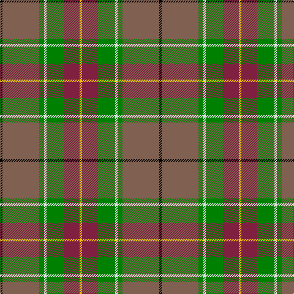

In pattern [KRGWGRY](/patterns/krgwgry/).

This was sourced from weddslist.  It is a [7 stripes tartan](/stripes/stripes7/).

Original link http://www.weddslist.com/cgi-bin/tartans/pg.pl?source=sts

## Thread count
K/4 LT60 G8 LN4 G28 DR26 Y/4

## Palette
Each colour and its ΔE from the base-6 reference it is a variant of.

| Colour | Shade | Base | ΔE (OKLab) |
|---|---|---|---|
| DR | <code style="background-color:#802040;">#802040</code> `#802040` | R <code style="background-color:#CC0000;">#CC0000</code> | 0.17 |
| G | <code style="background-color:#008000;">#008000</code> `#008000` | G <code style="background-color:#006100;">#006100</code> | 0.10 |
| K | <code style="background-color:#000000;">#000000</code> `#000000` | K <code style="background-color:#000000;">#000000</code> | 0.00 |
| LN | <code style="background-color:#E0E0E0;">#E0E0E0</code> `#E0E0E0` | W <code style="background-color:#F7F7F7;">#F7F7F7</code> | 0.07 |
| LT | <code style="background-color:#806050;">#806050</code> `#806050` | R <code style="background-color:#CC0000;">#CC0000</code> | 0.17 |
| Y | <code style="background-color:#F0C000;">#F0C000</code> `#F0C000` | Y <code style="background-color:#F2BF00;">#F2BF00</code> | 0.00 |

# Sample pattern

## Nearest tartans

The nearest existing variants by ΔTartan distance.

1. [State Seal of New Mexico (Fashion)](/setts/s8/w10r98w6g48ra10y8ga60w8-g003820-ga604000-r888888-ra880000-we8ccb8-ybc8c00/) — ΔT 0.91
1. [California Highway Patrol (Corporate](/setts/s8/k6g6ga56y6ga6y56b6ya4-b2c2c80-g5c6428-ga604000-k101010-ya08858-yae8c000/) — ΔT 0.95
1. [Snelgrove Htg (Name)](/setts/s7/k6r24g16y4ga72g20b4-b2888c4-g642000-ga006818-k101010-rc80000-ybc8c00/) — ΔT 0.99
1. [Allman-Jones (Personal)](/setts/s7/r6w4ra14b50k16ra30g4-b5c5c5c-g003820-k101010-rc80000-ra888888-wfcfcfc/) — ΔT 1.15
1. [Pubcrawlers, The](/setts/s7/w6r8g4r44b10ra32y6-b1e1e1e-g1b3b1d-r846247-ra680d0d-wdfdfdf-ydfaf00/) — ΔT 1.15
1. [COG USA, THE](/setts/s6/y36g72b36r4w4ba4-b5f749c-ba373875-g1e492b-rca2625-wf9f5ef-ye0a126/) — ΔT 1.17
1. [Allman-Jones (Personal)](/setts/s7/r6w4g14b50k16g30ga4-b505050-g808080-ga003820-k101010-r960028-wf8f4d0/) — ΔT 1.17
1. [Barbour Dress](/setts/s7/r8b4r42ba22w4ra40rb6-b4c3428-ba141e46-rb07430-ra888888-rbc8002c-wf8f8f8/) — ΔT 1.18
1. [Gallagher Irish Fashion Tartan Tartan Number: 4053. Earliest known date: 2001 February See products available Copyright © Blair Urquhart, Comrie, 2015](/setts/s9/b8g82y8ga8y8ga18r36y8w8-b202060-g005448-ga008c54-rdc6854-we0e0e0-ya08858/) — ΔT 1.21
1. [Hutcheson (Name)](/setts/s6/b16g8r60ga60y6ga8-b003c64-g789484-ga00643c-rcc4438-ydc943c/) — ΔT 1.24

## Neighbour map

Every grey dot is one of 15726 variants placed by the first two principal components of the ΔTartan feature space (44% of its variance). Red is this tartan; blue dots are its nearest — click one to open its page.

<svg viewBox="0 0 640 380" role="img" style="max-width:100%;height:auto;border:1px solid #e0e0e0;border-radius:4px;display:block" xmlns="http://www.w3.org/2000/svg"><image href="/nn/cloud.v1.png" width="640" height="380"/><a href="/setts/s8/w10r98w6g48ra10y8ga60w8-g003820-ga604000-r888888-ra880000-we8ccb8-ybc8c00/"><circle cx="192.8" cy="132.8" r="4" fill="#3465a4"><title>State Seal of New Mexico (Fashion)</title></circle></a><a href="/setts/s8/k6g6ga56y6ga6y56b6ya4-b2c2c80-g5c6428-ga604000-k101010-ya08858-yae8c000/"><circle cx="273.8" cy="141.8" r="4" fill="#3465a4"><title>California Highway Patrol (Corporate</title></circle></a><a href="/setts/s7/k6r24g16y4ga72g20b4-b2888c4-g642000-ga006818-k101010-rc80000-ybc8c00/"><circle cx="284.0" cy="149.3" r="4" fill="#3465a4"><title>Snelgrove Htg (Name)</title></circle></a><a href="/setts/s7/r6w4ra14b50k16ra30g4-b5c5c5c-g003820-k101010-rc80000-ra888888-wfcfcfc/"><circle cx="202.4" cy="164.7" r="4" fill="#3465a4"><title>Allman-Jones (Personal)</title></circle></a><a href="/setts/s7/w6r8g4r44b10ra32y6-b1e1e1e-g1b3b1d-r846247-ra680d0d-wdfdfdf-ydfaf00/"><circle cx="235.7" cy="162.3" r="4" fill="#3465a4"><title>Pubcrawlers, The</title></circle></a><a href="/setts/s6/y36g72b36r4w4ba4-b5f749c-ba373875-g1e492b-rca2625-wf9f5ef-ye0a126/"><circle cx="227.9" cy="145.6" r="4" fill="#3465a4"><title>COG USA, THE</title></circle></a><a href="/setts/s7/r6w4g14b50k16g30ga4-b505050-g808080-ga003820-k101010-r960028-wf8f4d0/"><circle cx="210.2" cy="169.8" r="4" fill="#3465a4"><title>Allman-Jones (Personal)</title></circle></a><a href="/setts/s7/r8b4r42ba22w4ra40rb6-b4c3428-ba141e46-rb07430-ra888888-rbc8002c-wf8f8f8/"><circle cx="186.9" cy="165.1" r="4" fill="#3465a4"><title>Barbour Dress</title></circle></a><a href="/setts/s9/b8g82y8ga8y8ga18r36y8w8-b202060-g005448-ga008c54-rdc6854-we0e0e0-ya08858/"><circle cx="205.1" cy="143.1" r="4" fill="#3465a4"><title>Gallagher Irish Fashion Tartan Tartan Number: 4053. Earliest known date: 2001 February See products available Copyright © Blair Urquhart, Comrie, 2015</title></circle></a><a href="/setts/s6/b16g8r60ga60y6ga8-b003c64-g789484-ga00643c-rcc4438-ydc943c/"><circle cx="253.8" cy="196.6" r="4" fill="#3465a4"><title>Hutcheson (Name)</title></circle></a><circle cx="240.9" cy="151.4" r="5" fill="#c00000"/></svg>

ID: /setts/s7/k4r60g8w4g28ra26y4-g008000-k000000-r806050-ra802040-we0e0e0-yf0c000/
