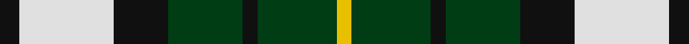

In pattern [KWKGKGY](/stripes/kwkgkgy/).

This was sourced from register-of-tartans.  It is a [7 stripe tartan](/stripes/stripes7/).

Original link https://www.tartanregister.gov.uk/tartanDetails.aspx?ref=5996

## Register references

External register numbers recorded for this tartan.

- Scottish Register of Tartans: [5996](https://www.tartanregister.gov.uk/tartanDetails.aspx?ref=5996)
- Scottish Tartans World Register: 3287

## Thread count
K/8 LN38 K22 DG30 K6 DG32 Y/6

## Palette
Each colour and its ΔE from the base-6 reference it is a variant of.

| Colour | Shade | Base | ΔE (OKLab) |
|---|---|---|---|
| DG | <code style="background-color:#003C14;">#003C14</code> `#003C14` | G <code style="background-color:#006100;">#006100</code> | 0.13 |
| K | <code style="background-color:#101010;">#101010</code> `#101010` | K <code style="background-color:#000000;">#000000</code> | 0.17 |
| LN | <code style="background-color:#E0E0E0;">#E0E0E0</code> `#E0E0E0` | W <code style="background-color:#F7F7F7;">#F7F7F7</code> | 0.07 |
| Y | <code style="background-color:#E8C000;">#E8C000</code> `#E8C000` | Y <code style="background-color:#F2BF00;">#F2BF00</code> | 0.02 |

# Sample pattern

## Nearest tartans

The nearest existing variants by ΔTartan distance.

1. [MacKay, Dress (Corporate)](/setts/s6/k4g14k14g2w14b3~x2/) — ΔT 0.85
1. [Unnamed (Hip Flask)](/setts/s8/dg14o5dg14w5k2o5k2w9~x4/) — ΔT 0.86
1. [Lawsons' Whisky](/setts/s7/k9w38k22g31k5g31ly5/) — ΔT 0.87
1. [Unidentified, Pinafore](/setts/s7/g24k4g24k24t7r24t7~x2/) — ΔT 0.95
1. [Wellington, or Waterloo](/setts/s6/t3g6k6t4r1t1~x2/) — ΔT 0.95
1. [Melville](/setts/s6/k4w2g13k13t12k2~x2/) — ΔT 1.02
1. [MacKay](/setts/s6/g1db5g1k5g6ly1~x2/) — ΔT 1.10
1. [Cape Breton](/setts/s7/ly5k5g17k6y24k6ly3~x2/) — ΔT 1.11
1. [Loch Leven, Check](/setts/s6/k2g13k11t4w9k2~x2/) — ΔT 1.12
1. [Wellington, or Waterloo](/setts/s6/t3g12k14t11r3t3~x2/) — ΔT 1.12

## Neighbour map

Every grey dot is one of 14299 variants placed by the first two principal components of the ΔTartan feature space (44% of its variance). Red is this tartan; blue dots are its nearest — click one to open its page.

<svg viewBox="0 0 640 380" role="img" style="max-width:100%;height:auto;border:1px solid #e0e0e0;border-radius:4px;display:block" xmlns="http://www.w3.org/2000/svg"><image href="/nn/cloud.v1.png" width="640" height="380"/><a href="/setts/s6/k4g14k14g2w14b3~x2/"><circle cx="120.4" cy="222.5" r="4" fill="#3465a4"><title>MacKay, Dress (Corporate)</title></circle></a><a href="/setts/s8/dg14o5dg14w5k2o5k2w9~x4/"><circle cx="189.2" cy="211.9" r="4" fill="#3465a4"><title>Unnamed (Hip Flask)</title></circle></a><a href="/setts/s7/k9w38k22g31k5g31ly5/"><circle cx="151.6" cy="211.8" r="4" fill="#3465a4"><title>Lawsons' Whisky</title></circle></a><a href="/setts/s7/g24k4g24k24t7r24t7~x2/"><circle cx="137.1" cy="241.7" r="4" fill="#3465a4"><title>Unidentified, Pinafore</title></circle></a><a href="/setts/s6/t3g6k6t4r1t1~x2/"><circle cx="128.6" cy="243.8" r="4" fill="#3465a4"><title>Wellington, or Waterloo</title></circle></a><a href="/setts/s6/k4w2g13k13t12k2~x2/"><circle cx="166.6" cy="238.0" r="4" fill="#3465a4"><title>Melville</title></circle></a><a href="/setts/s6/g1db5g1k5g6ly1~x2/"><circle cx="157.1" cy="237.7" r="4" fill="#3465a4"><title>MacKay</title></circle></a><a href="/setts/s7/ly5k5g17k6y24k6ly3~x2/"><circle cx="132.8" cy="200.0" r="4" fill="#3465a4"><title>Cape Breton</title></circle></a><a href="/setts/s6/k2g13k11t4w9k2~x2/"><circle cx="113.1" cy="227.8" r="4" fill="#3465a4"><title>Loch Leven, Check</title></circle></a><a href="/setts/s6/t3g12k14t11r3t3~x2/"><circle cx="115.7" cy="248.1" r="4" fill="#3465a4"><title>Wellington, or Waterloo</title></circle></a><circle cx="148.6" cy="224.2" r="5" fill="#c00000"/></svg>

ID: /setts/s7/k4w19k11dg15k3dg16ly3~x2/
