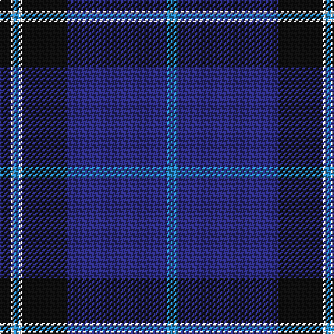

This page is one **sett** — a single exact thread-count. It belongs to the [tartan](/tartans/k4w1t2w1k16db36t4/)
(the same proportion at any scale), whose colour order is pattern [BBKWBWK](/stripes/bbkwbwk/).

Sourced from register-of-tartans.  It is a [7 stripe tartan](/stripes/stripes7/).

Original link https://www.tartanregister.gov.uk/tartanDetails.aspx?ref=3098

## Register references

External register numbers recorded for this tartan.

- Scottish Register of Tartans: [3098](https://www.tartanregister.gov.uk/tartanDetails.aspx?ref=3098)
- Scottish Tartans Authority (ITI): 6219
- Scottish Tartans World Register: 2894

## Thread count
K/8 W2 B4 W2 K32 DB72 B/8

## Palette

Palette: <strong>Tartan Register</strong>
<table><thead><tr><th>Colour</th><th>Threads</th><th>Shade</th><th>Base</th><th>OKLCh</th></tr></thead><tbody><tr><td>K/</td><td style="text-align:right;font-variant-numeric:tabular-nums">8</td><td><code style="background-color:#101010;">#101010</code> <small style="color:#888">#101010</small></td><td>K <code style="background-color:#000000;">#000000</code></td><td><small style="color:#888">oklch(17.3% 0.000 89.9)</small></td></tr><tr><td>W</td><td style="text-align:right;font-variant-numeric:tabular-nums">2</td><td><code style="background-color:#FCFCFC;">#FCFCFC</code> <small style="color:#888">#FCFCFC</small></td><td>W <code style="background-color:#F7F7F7;">#F7F7F7</code></td><td><small style="color:#888">oklch(99.1% 0.000 89.9)</small></td></tr><tr><td>B</td><td style="text-align:right;font-variant-numeric:tabular-nums">4</td><td><code style="background-color:#2888C4;">#2888C4</code> <small style="color:#888">#2888C4</small></td><td>B <code style="background-color:#2A418A;">#2A418A</code></td><td><small style="color:#888">oklch(60.1% 0.125 241.5)</small></td></tr><tr><td>W</td><td style="text-align:right;font-variant-numeric:tabular-nums">2</td><td><code style="background-color:#FCFCFC;">#FCFCFC</code> <small style="color:#888">#FCFCFC</small></td><td>W <code style="background-color:#F7F7F7;">#F7F7F7</code></td><td><small style="color:#888">oklch(99.1% 0.000 89.9)</small></td></tr><tr><td>K</td><td style="text-align:right;font-variant-numeric:tabular-nums">32</td><td><code style="background-color:#101010;">#101010</code> <small style="color:#888">#101010</small></td><td>K <code style="background-color:#000000;">#000000</code></td><td><small style="color:#888">oklch(17.3% 0.000 89.9)</small></td></tr><tr><td>DB</td><td style="text-align:right;font-variant-numeric:tabular-nums">72</td><td><code style="background-color:#2C2C80;">#2C2C80</code> <small style="color:#888">#2C2C80</small></td><td>B <code style="background-color:#2A418A;">#2A418A</code></td><td><small style="color:#888">oklch(35.0% 0.138 276.6)</small></td></tr><tr><td>B/</td><td style="text-align:right;font-variant-numeric:tabular-nums">8</td><td><code style="background-color:#2888C4;">#2888C4</code> <small style="color:#888">#2888C4</small></td><td>B <code style="background-color:#2A418A;">#2A418A</code></td><td><small style="color:#888">oklch(60.1% 0.125 241.5)</small></td></tr></tbody></table>

# Sample pattern

## Nearest tartans

The nearest existing variants by ΔTartan distance, with this tartan at the top so the swatches line up against it.

ΔTartan

Tartan

Sett

—

<a href="/ttd/edit/#slug=k4w1t2w1k16db36t4~x2">NHS Grampian</a> <a class="nn-out" href="/setts/s7/k4w1t2w1k16db36t4~x2/" title="open its dictionary page">↗</a>

0.67

<a href="/ttd/edit/#slug=k4w1dp5w1k20db37w4db4~x2">Finnie (Personal)</a> <a class="nn-out" href="/setts/s8/k4w1dp5w1k20db37w4db4~x2/" title="open its dictionary page">↗</a>

0.97

<a href="/ttd/edit/#slug=db36k8g3r3g6k1lo2~x2">MacLaurin of Broich (Clan)</a> <a class="nn-out" href="/setts/s7/db36k8g3r3g6k1lo2~x2/" title="open its dictionary page">↗</a>

1.01

<a href="/ttd/edit/#slug=k8ly2dp6ly2k36db84w7">Grahame Laurie Band (Corporate)</a> <a class="nn-out" href="/setts/s7/k8ly2dp6ly2k36db84w7/" title="open its dictionary page">↗</a>

1.03

<a href="/ttd/edit/#slug=db48k32r1k8r3w3~x2">Koot Wedding (Personal)</a> <a class="nn-out" href="/setts/s6/db48k32r1k8r3w3~x2/" title="open its dictionary page">↗</a>

1.10

<a href="/ttd/edit/#slug=k3r1k30w1db28r1db1w3~x2">Dunlop</a> <a class="nn-out" href="/setts/s8/k3r1k30w1db28r1db1w3~x2/" title="open its dictionary page">↗</a>

1.25

<a href="/ttd/edit/#slug=db52k12dp18ly1dp1ly4~x2">British Energy</a> <a class="nn-out" href="/setts/s6/db52k12dp18ly1dp1ly4~x2/" title="open its dictionary page">↗</a>

1.26

<a href="/ttd/edit/#slug=lb3k6lbi2k6db2k2db32k2n1~x2">Nocken (Personal)</a> <a class="nn-out" href="/setts/s9/lb3k6lbi2k6db2k2db32k2n1~x2/" title="open its dictionary page">↗</a>

1.29

<a href="/ttd/edit/#slug=g1db1k1db30k30w2db5ly1~x2">Binder Wedding (Personal)</a> <a class="nn-out" href="/setts/s8/g1db1k1db30k30w2db5ly1~x2/" title="open its dictionary page">↗</a>

1.31

<a href="/ttd/edit/#slug=db62k22w3k2w2k3r1~x2">Tyneside Blue, North Tyneside Pipe Band</a> <a class="nn-out" href="/setts/s7/db62k22w3k2w2k3r1~x2/" title="open its dictionary page">↗</a>

1.31

<a href="/ttd/edit/#slug=dbi6w2g2w3dbi24r1db35r2~x2">Raith Rovers F.C.</a> <a class="nn-out" href="/setts/s8/dbi6w2g2w3dbi24r1db35r2~x2/" title="open its dictionary page">↗</a>

## Neighbour map

Every grey dot is one of 14359 variants placed by the first two principal components of the ΔTartan feature space (44% of its variance). Red is this tartan; blue dots are its nearest — click one to open its page.

<svg viewBox="0 0 640 380" role="img" style="max-width:100%;height:auto;border:1px solid #e0e0e0;border-radius:4px;display:block" xmlns="http://www.w3.org/2000/svg"><image href="/nn/cloud.v1.png" width="640" height="380"/><a href="/setts/s8/k4w1dp5w1k20db37w4db4~x2/"><circle cx="364.9" cy="136.2" r="4" fill="#3465a4"><title>Finnie (Personal)</title></circle></a><a href="/setts/s7/db36k8g3r3g6k1lo2~x2/"><circle cx="399.5" cy="132.9" r="4" fill="#3465a4"><title>MacLaurin of Broich (Clan)</title></circle></a><a href="/setts/s7/k8ly2dp6ly2k36db84w7/"><circle cx="386.6" cy="118.5" r="4" fill="#3465a4"><title>Grahame Laurie Band (Corporate)</title></circle></a><a href="/setts/s6/db48k32r1k8r3w3~x2/"><circle cx="390.0" cy="156.2" r="4" fill="#3465a4"><title>Koot Wedding (Personal)</title></circle></a><a href="/setts/s8/k3r1k30w1db28r1db1w3~x2/"><circle cx="359.1" cy="139.7" r="4" fill="#3465a4"><title>Dunlop</title></circle></a><a href="/setts/s6/db52k12dp18ly1dp1ly4~x2/"><circle cx="427.1" cy="151.6" r="4" fill="#3465a4"><title>British Energy</title></circle></a><a href="/setts/s9/lb3k6lbi2k6db2k2db32k2n1~x2/"><circle cx="406.6" cy="120.6" r="4" fill="#3465a4"><title>Nocken (Personal)</title></circle></a><a href="/setts/s8/g1db1k1db30k30w2db5ly1~x2/"><circle cx="358.0" cy="127.7" r="4" fill="#3465a4"><title>Binder Wedding (Personal)</title></circle></a><a href="/setts/s7/db62k22w3k2w2k3r1~x2/"><circle cx="476.3" cy="126.9" r="4" fill="#3465a4"><title>Tyneside Blue, North Tyneside Pipe Band</title></circle></a><a href="/setts/s8/dbi6w2g2w3dbi24r1db35r2~x2/"><circle cx="314.7" cy="122.6" r="4" fill="#3465a4"><title>Raith Rovers F.C.</title></circle></a><circle cx="395.1" cy="147.9" r="5" fill="#c00000"/></svg>

ID: /setts/s7/k4w1t2w1k16db36t4~x2/
