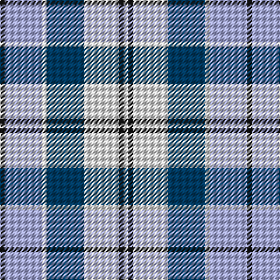

In pattern [KWWBWKW](/patterns/kwwbwkw/).

This was sourced from house-of-tartan.  It is a [7 stripes tartan](/stripes/stripes7/).

Original link http://www.house-of-tartan.scotland.net/house/TartanViewjs.asp?colr=Def&tnam=1072

## Thread count
K/4 LP32 LN4 DB32 LN30 K4 LN/4

## Palette
Each colour and its ΔE from the base-6 reference it is a variant of.

| Colour | Shade | Base | ΔE (OKLab) |
|---|---|---|---|
| DB | <code style="background-color:#003C64;">#003C64</code> `#003C64` | B <code style="background-color:#2C4084;">#2C4084</code> | 0.07 |
| K | <code style="background-color:#101010;">#101010</code> `#101010` | K <code style="background-color:#000000;">#000000</code> | 0.17 |
| LN | <code style="background-color:#E0E0E0;">#E0E0E0</code> `#E0E0E0` | W <code style="background-color:#F4F4F0;">#F4F4F0</code> | 0.06 |
| LP | <code style="background-color:#A8ACE8;">#A8ACE8</code> `#A8ACE8` | W <code style="background-color:#F4F4F0;">#F4F4F0</code> | 0.22 |

# Sample pattern

## Nearest tartans

The nearest existing variants by ΔTartan distance.

1. [Culloden Blue Dress Fancy Tartan Tartan Number: 1792. Earliest known date: 1980 One of a number of dress tartans produced by Hugh Macpherson, a kiltmaker in Edinburgh, intended for dancing and other informal occassions. The 'dress' version of clan tartan is usually created by substituting white for one of the 'ground' colours. See products available Copyright © Blair Urquhart, Comrie, 2015](/setts/s8/y16b8ba46w6b44w50b6w12-b2c2c80-ba5c8ca8-we0e0e0-ye8c000/) — ΔT 0.49
1. [Culloden, Blue Dress (Dance)](/setts/s8/y16b8ba46w6b44w50b6w12-b2c2c80-ba5c8ca8-wfcfcfc-ye8c000/) — ΔT 0.57
1. [Culloden, Blue dress](/setts/s8/y16b8ba46w6b44w50b6w12-b304080-ba5480b0-we0e0e0-yf0c000/) — ΔT 0.63
1. [Strathclyde 1975 (District)](/setts/s7/k4w32wa4b32wa30k4wa4-b1c0070-k101010-wa8ace8-waf8f8f8/) — ΔT 0.73
1. [Cercle de Fermières de Saint-Élie d'Orford](/setts/s7/r12w6b48r6y42w6r12-b1464f4-rff0000-wffec8b-y00c957/) — ΔT 0.91
1. [Conquergood (Name)](/setts/s8/k8b4w22b10r10w4k2b4-b2888c4-k101010-r888888-we0e0e0/) — ΔT 0.94
1. [Earl of St. Andrews Dress](/setts/s7/w40b28ba28w8bb4bc4ba14-b003478-ba3c3c64-bb000064-bc6478b0-wf8f8f8/) — ΔT 1.20
1. [Earl of St. Andrews Dress (Dance)](/setts/s7/w40b28ba28w8bb4bc4ba14-b2c2c80-ba1870a4-bb003c64-bc5c8ca8-we0e0e0/) — ΔT 1.23
1. [Arran - 1989 (Fashion)](/setts/s8/b48k4b4k4b4ba32w36r8-b5c8ca8-ba202060-k101010-r888888-wfcfcfc/) — ΔT 1.25
1. [Over Mountain](/setts/s7/r4w2b16w16g16w2g2-b1c0070-g8c7038-r880000-wa8ace8/) — ΔT 1.25

## Neighbour map

Every grey dot is one of 15726 variants placed by the first two principal components of the ΔTartan feature space (44% of its variance). Red is this tartan; blue dots are its nearest — click one to open its page.

<svg viewBox="0 0 640 380" role="img" style="max-width:100%;height:auto;border:1px solid #e0e0e0;border-radius:4px;display:block" xmlns="http://www.w3.org/2000/svg"><image href="/nn/cloud.v1.png" width="640" height="380"/><a href="/setts/s8/y16b8ba46w6b44w50b6w12-b2c2c80-ba5c8ca8-we0e0e0-ye8c000/"><circle cx="138.7" cy="186.4" r="4" fill="#3465a4"><title>Culloden Blue Dress Fancy Tartan Tartan Number: 1792. Earliest known date: 1980 One of a number of dress tartans produced by Hugh Macpherson, a kiltmaker in Edinburgh, intended for dancing and other informal occassions. The 'dress' version of clan tartan is usually created by substituting white for one of the 'ground' colours. See products available Copyright © Blair Urquhart, Comrie, 2015</title></circle></a><a href="/setts/s8/y16b8ba46w6b44w50b6w12-b2c2c80-ba5c8ca8-wfcfcfc-ye8c000/"><circle cx="127.9" cy="180.5" r="4" fill="#3465a4"><title>Culloden, Blue Dress (Dance)</title></circle></a><a href="/setts/s8/y16b8ba46w6b44w50b6w12-b304080-ba5480b0-we0e0e0-yf0c000/"><circle cx="144.8" cy="189.0" r="4" fill="#3465a4"><title>Culloden, Blue dress</title></circle></a><a href="/setts/s7/k4w32wa4b32wa30k4wa4-b1c0070-k101010-wa8ace8-waf8f8f8/"><circle cx="125.4" cy="178.1" r="4" fill="#3465a4"><title>Strathclyde 1975 (District)</title></circle></a><a href="/setts/s7/r12w6b48r6y42w6r12-b1464f4-rff0000-wffec8b-y00c957/"><circle cx="148.0" cy="183.5" r="4" fill="#3465a4"><title>Cercle de Fermières de Saint-Élie d'Orford</title></circle></a><a href="/setts/s8/k8b4w22b10r10w4k2b4-b2888c4-k101010-r888888-we0e0e0/"><circle cx="156.9" cy="178.9" r="4" fill="#3465a4"><title>Conquergood (Name)</title></circle></a><a href="/setts/s7/w40b28ba28w8bb4bc4ba14-b003478-ba3c3c64-bb000064-bc6478b0-wf8f8f8/"><circle cx="125.8" cy="173.0" r="4" fill="#3465a4"><title>Earl of St. Andrews Dress</title></circle></a><a href="/setts/s7/w40b28ba28w8bb4bc4ba14-b2c2c80-ba1870a4-bb003c64-bc5c8ca8-we0e0e0/"><circle cx="140.3" cy="181.1" r="4" fill="#3465a4"><title>Earl of St. Andrews Dress (Dance)</title></circle></a><a href="/setts/s8/b48k4b4k4b4ba32w36r8-b5c8ca8-ba202060-k101010-r888888-wfcfcfc/"><circle cx="151.9" cy="142.8" r="4" fill="#3465a4"><title>Arran - 1989 (Fashion)</title></circle></a><a href="/setts/s7/r4w2b16w16g16w2g2-b1c0070-g8c7038-r880000-wa8ace8/"><circle cx="156.0" cy="198.1" r="4" fill="#3465a4"><title>Over Mountain</title></circle></a><circle cx="136.3" cy="184.6" r="5" fill="#c00000"/></svg>

ID: /setts/s7/k4w32wa4b32wa30k4wa4-b003c64-k101010-wa8ace8-wae0e0e0/
