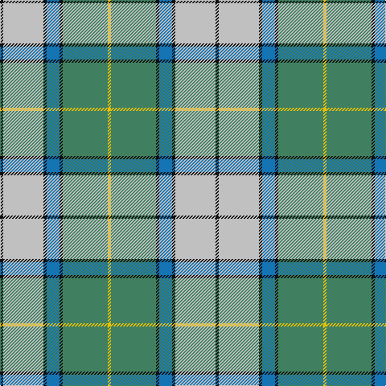

In pattern [KWKBKGY](/patterns/kwkbkgy/).

This was sourced from register-of-tartans.  It is a [7 stripes tartan](/stripes/stripes7/).

Original link https://www.tartanregister.gov.uk/tartanDetails.aspx?ref=5383

## Attestations

This cloth appears in 2 source records; the oldest owns this page.

- 01/01/2004 — Presley of Lonmay (register-of-tartans, [record](https://www.tartanregister.gov.uk/tartanDetails.aspx?ref=5383))
- pre 2004 — Presley of Lonmay (Fashion) (tartans-authority, [record](http://www.tartansauthority.com/tartan-ferret/display/6224/))

## Thread count
K/4 N50 K4 B16 K4 G56 Y/4

## Palette
Each colour and its ΔE from the base-6 reference it is a variant of.

| Colour | Shade | Base | ΔE (OKLab) |
|---|---|---|---|
| B | <code style="background-color:#1474B4;">#1474B4</code> `#1474B4` | B <code style="background-color:#2C4084;">#2C4084</code> | 0.15 |
| G | <code style="background-color:#408060;">#408060</code> `#408060` | G <code style="background-color:#006400;">#006400</code> | 0.13 |
| K | <code style="background-color:#101010;">#101010</code> `#101010` | K <code style="background-color:#000000;">#000000</code> | 0.17 |
| N | <code style="background-color:#C0C0C0;">#C0C0C0</code> `#C0C0C0` | W <code style="background-color:#F4F4F0;">#F4F4F0</code> | 0.16 |
| Y | <code style="background-color:#E8C000;">#E8C000</code> `#E8C000` | Y <code style="background-color:#E8C000;">#E8C000</code> | 0.00 |

# Sample pattern

## Nearest tartans

The nearest existing variants by ΔTartan distance.

1. [Snodgrass (Clan)](/setts/s8/k12r4y4b44g52b20r4y4-b2888c4-g289c18-k101010-rc80000-ye8c000/) — ΔT 0.95
1. [Chambers, Christopher J (Personal)](/setts/s7/b32r2g32w2ba2w16ra6-b5f749c-ba5d321f-g649848-rca2625-ra86264d-wf9f5ef/) — ΔT 1.19
1. [Mission](/setts/s8/y8b56k4g44k8w8ga8k4-b5c8ca8-g006818-ga408060-k101010-wffe1ff-yffa500/) — ΔT 1.20
1. [Chambers, Christopher J (Personal)](/setts/s7/b26r2g26w2k2w14k6-b5c8ca8-g288028-k101010-r880000-wfcfcfc/) — ΔT 1.23
1. [Falkirk (District)](/setts/s9/k8w8k4w8k4w44r54y4ra6-k101010-r906c50-rac80000-w98c8e8-ye8c000/) — ΔT 1.24
1. [MacManus](/setts/s9/w12y8g32y8k12y8b60k4y8-b3c5c6c-g006818-k101010-wf8f8f8-yc4bc68/) — ΔT 1.25
1. [Mission (District)](/setts/s8/y8w56k4g44k8r8ga8k4-g00a424-ga50a47c-k101010-re87878-w98c8e8-yec8048/) — ΔT 1.29
1. [Bahamas](/setts/s8/b6g22w22r4g14b44y4b4-b304080-g008000-rc00000-we0e0e0-yf0c000/) — ΔT 1.29
1. [Roseberry (Name)](/setts/s6/w8b30g5w3ba8r5-b5c8ca8-ba2c2c80-g289c18-rc80000-we0e0e0/) — ΔT 1.37
1. [Nova Scotia, dress](/setts/s9/g6w58g6b6g6b12g26y6r4-b304080-g008000-rc00000-we0e0e0-yf0c000/) — ΔT 1.38

## Neighbour map

Every grey dot is one of 15726 variants placed by the first two principal components of the ΔTartan feature space (44% of its variance). Red is this tartan; blue dots are its nearest — click one to open its page.

<svg viewBox="0 0 640 380" role="img" style="max-width:100%;height:auto;border:1px solid #e0e0e0;border-radius:4px;display:block" xmlns="http://www.w3.org/2000/svg"><image href="/nn/cloud.v1.png" width="640" height="380"/><a href="/setts/s8/k12r4y4b44g52b20r4y4-b2888c4-g289c18-k101010-rc80000-ye8c000/"><circle cx="222.1" cy="160.5" r="4" fill="#3465a4"><title>Snodgrass (Clan)</title></circle></a><a href="/setts/s7/b32r2g32w2ba2w16ra6-b5f749c-ba5d321f-g649848-rca2625-ra86264d-wf9f5ef/"><circle cx="166.7" cy="135.7" r="4" fill="#3465a4"><title>Chambers, Christopher J (Personal)</title></circle></a><a href="/setts/s8/y8b56k4g44k8w8ga8k4-b5c8ca8-g006818-ga408060-k101010-wffe1ff-yffa500/"><circle cx="176.4" cy="133.9" r="4" fill="#3465a4"><title>Mission</title></circle></a><a href="/setts/s7/b26r2g26w2k2w14k6-b5c8ca8-g288028-k101010-r880000-wfcfcfc/"><circle cx="134.8" cy="155.8" r="4" fill="#3465a4"><title>Chambers, Christopher J (Personal)</title></circle></a><a href="/setts/s9/k8w8k4w8k4w44r54y4ra6-k101010-r906c50-rac80000-w98c8e8-ye8c000/"><circle cx="222.9" cy="127.6" r="4" fill="#3465a4"><title>Falkirk (District)</title></circle></a><a href="/setts/s9/w12y8g32y8k12y8b60k4y8-b3c5c6c-g006818-k101010-wf8f8f8-yc4bc68/"><circle cx="168.4" cy="139.6" r="4" fill="#3465a4"><title>MacManus</title></circle></a><a href="/setts/s8/y8w56k4g44k8r8ga8k4-g00a424-ga50a47c-k101010-re87878-w98c8e8-yec8048/"><circle cx="159.0" cy="122.0" r="4" fill="#3465a4"><title>Mission (District)</title></circle></a><a href="/setts/s8/b6g22w22r4g14b44y4b4-b304080-g008000-rc00000-we0e0e0-yf0c000/"><circle cx="188.5" cy="165.5" r="4" fill="#3465a4"><title>Bahamas</title></circle></a><a href="/setts/s6/w8b30g5w3ba8r5-b5c8ca8-ba2c2c80-g289c18-rc80000-we0e0e0/"><circle cx="233.2" cy="179.0" r="4" fill="#3465a4"><title>Roseberry (Name)</title></circle></a><a href="/setts/s9/g6w58g6b6g6b12g26y6r4-b304080-g008000-rc00000-we0e0e0-yf0c000/"><circle cx="207.2" cy="121.1" r="4" fill="#3465a4"><title>Nova Scotia, dress</title></circle></a><circle cx="213.8" cy="151.9" r="5" fill="#c00000"/></svg>

ID: /setts/s7/k4w50k4b16k4g56y4-b1474b4-g408060-k101010-wc0c0c0-ye8c000/
