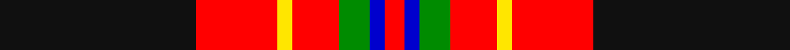

In pattern [KRYRGBR](/stripes/kryrgbr/).

This was sourced from register-of-tartans.  It is a [7 stripe tartan](/stripes/stripes7/).

Original link https://www.tartanregister.gov.uk/tartanDetails.aspx?ref=10770

## Also known as

This cloth is also recorded under:

- Totté

## Attestations

This cloth appears in 2 source records; the oldest owns this page.

- 22/01/2013 — Totté (from Hofstade de Baerebeeck) (Personal) (register-of-tartans, [record](https://www.tartanregister.gov.uk/tartanDetails.aspx?ref=10770))
- 22/01/2013 — Tott (Personal)) (tartans-authority, [record](http://www.tartansauthority.com/tartan-ferret/display/10770/))

## Register references

External register numbers recorded for this tartan.

- Scottish Register of Tartans: [10770](https://www.tartanregister.gov.uk/tartanDetails.aspx?ref=10770)

## Thread count
K/102 R42 Y8 R24 G16 B8 R/10

## Palette
Each colour and its ΔE from the base-6 reference it is a variant of.

| Colour | Shade | Base | ΔE (OKLab) |
|---|---|---|---|
| B | <code style="background-color:#0000CD;">#0000CD</code> `#0000CD` | B <code style="background-color:#2A418A;">#2A418A</code> | 0.14 |
| G | <code style="background-color:#008B00;">#008B00</code> `#008B00` | G <code style="background-color:#006100;">#006100</code> | 0.13 |
| K | <code style="background-color:#101010;">#101010</code> `#101010` | K <code style="background-color:#000000;">#000000</code> | 0.17 |
| R | <code style="background-color:#FF0000;">#FF0000</code> `#FF0000` | R <code style="background-color:#CC0000;">#CC0000</code> | 0.11 |
| Y | <code style="background-color:#FFE600;">#FFE600</code> `#FFE600` | Y <code style="background-color:#F2BF00;">#F2BF00</code> | 0.10 |

# Sample pattern

## Nearest tartans

The nearest existing variants by ΔTartan distance.

1. [Drambuie](/setts/s6/w6r36k48lo4k5ly6/) — ΔT 0.93
1. [Dean Brae](/setts/s8/k22o4k4g4k16r36y3r6~x2/) — ΔT 0.99
1. [Hoffman Texas German](/setts/s7/k23r27db3r5w3k14ly6~x2/) — ΔT 1.02
1. [State Seal of Alabama (Fashion)](/setts/s9/r60lo4k22g5k25t8k4r4k4~x2/) — ΔT 1.04
1. [Golfers](/setts/s10/lo4r2k9r25k3r2k3r4db15w3~x2/) — ΔT 1.11
1. [Castle Stewart (District)](/setts/s9/lo7k3db4k3r21k2r4k2w4~x2/) — ΔT 1.15
1. [Wormeck (2013) Germany](/setts/s5/db4lo4r33k30w2~x2/) — ΔT 1.19
1. [Ulster Ancestry](/setts/s9/do47r8k22r7w3r24do9r10ly3~x2/) — ΔT 1.24
1. [Caledonian Brewery (Corporate)](/setts/s7/w4dg20dg10r25b2r2dg2~x2/) — ΔT 1.24
1. [MacPherson Red Cluny](/setts/s7/r6k3r29k23w4k7ly3~x2/) — ΔT 1.25

## Neighbour map

Every grey dot is one of 14299 variants placed by the first two principal components of the ΔTartan feature space (44% of its variance). Red is this tartan; blue dots are its nearest — click one to open its page.

<svg viewBox="0 0 640 380" role="img" style="max-width:100%;height:auto;border:1px solid #e0e0e0;border-radius:4px;display:block" xmlns="http://www.w3.org/2000/svg"><image href="/nn/cloud.v1.png" width="640" height="380"/><a href="/setts/s6/w6r36k48lo4k5ly6/"><circle cx="266.4" cy="166.6" r="4" fill="#3465a4"><title>Drambuie</title></circle></a><a href="/setts/s8/k22o4k4g4k16r36y3r6~x2/"><circle cx="225.2" cy="142.5" r="4" fill="#3465a4"><title>Dean Brae</title></circle></a><a href="/setts/s7/k23r27db3r5w3k14ly6~x2/"><circle cx="207.4" cy="173.1" r="4" fill="#3465a4"><title>Hoffman Texas German</title></circle></a><a href="/setts/s9/r60lo4k22g5k25t8k4r4k4~x2/"><circle cx="279.5" cy="128.1" r="4" fill="#3465a4"><title>State Seal of Alabama (Fashion)</title></circle></a><a href="/setts/s10/lo4r2k9r25k3r2k3r4db15w3~x2/"><circle cx="218.3" cy="128.2" r="4" fill="#3465a4"><title>Golfers</title></circle></a><a href="/setts/s9/lo7k3db4k3r21k2r4k2w4~x2/"><circle cx="238.4" cy="145.9" r="4" fill="#3465a4"><title>Castle Stewart (District)</title></circle></a><a href="/setts/s5/db4lo4r33k30w2~x2/"><circle cx="267.9" cy="163.6" r="4" fill="#3465a4"><title>Wormeck (2013) Germany</title></circle></a><a href="/setts/s9/do47r8k22r7w3r24do9r10ly3~x2/"><circle cx="228.2" cy="142.3" r="4" fill="#3465a4"><title>Ulster Ancestry</title></circle></a><a href="/setts/s7/w4dg20dg10r25b2r2dg2~x2/"><circle cx="203.0" cy="153.8" r="4" fill="#3465a4"><title>Caledonian Brewery (Corporate)</title></circle></a><a href="/setts/s7/r6k3r29k23w4k7ly3~x2/"><circle cx="261.4" cy="174.4" r="4" fill="#3465a4"><title>MacPherson Red Cluny</title></circle></a><circle cx="246.5" cy="141.4" r="5" fill="#c00000"/></svg>

ID: /setts/s7/k51r21ly4r12g8db4r5~x2/
