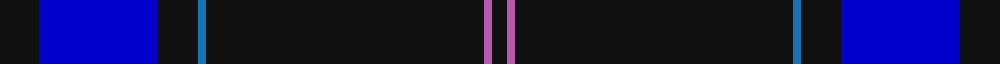
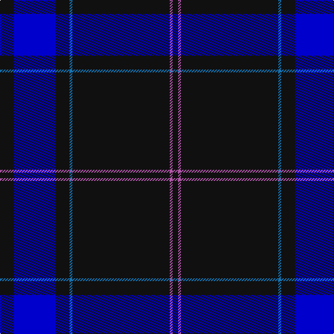

In pattern [KBKBKRK](/stripes/kbkbkrk/).

This was sourced from register-of-tartans.  It is a [7 stripe tartan](/stripes/stripes7/).

Original link https://www.tartanregister.gov.uk/tartanDetails.aspx?ref=11566

## Register references

External register numbers recorded for this tartan.

- Scottish Register of Tartans: [11566](https://www.tartanregister.gov.uk/tartanDetails.aspx?ref=11566)

## Thread count
K/20 B60 K20 Ba4 K140 P4 K/8

## Palette
Each colour and the base-6 reference it is a variant of.

| Colour | Shade | Base |
|---|---|---|
| B | <code style="background-color:#0000CD;">#0000CD</code> `oklch(38.3% 0.266 264.1)` <small>#0000CD</small> | B <code style="background-color:#2A418A;">#2A418A</code> |
| Ba | <code style="background-color:#1474B4;">#1474B4</code> `oklch(54.0% 0.129 245.1)` <small>#1474B4</small> | B <code style="background-color:#2A418A;">#2A418A</code> |
| K | <code style="background-color:#101010;">#101010</code> `oklch(17.3% 0.000 89.9)` <small>#101010</small> | K <code style="background-color:#000000;">#000000</code> |
| P | <code style="background-color:#B458AC;">#B458AC</code> `oklch(60.2% 0.158 330.7)` <small>#B458AC</small> | R <code style="background-color:#CC0000;">#CC0000</code> |

# Sample pattern

## Nearest tartans

The nearest existing variants by ΔTartan distance.

1. [McCann of Castlecraig (Personal)](/setts/s7/k64y12n6k15o1y5lr1~x2/) — ΔT 1.12
1. [Marine Harvest (Scotland)](/setts/s8/db10t2k2db1k6t1k45lo2~x2/) — ΔT 1.24
1. [Brooks Brothers Signature (Corporate](/setts/s9/k5lo1dg7r1k45r5lo3k4lo3~x2/) — ΔT 1.32
1. [Scotch Whisky Heritage Centre](/setts/s8/db73g16db10r8db10k4db10w2~x2/) — ΔT 1.35
1. [Calum's Cabin](/setts/s10/db32o4dt12db2dt4db2dt2y16db67o6/) — ΔT 1.37
1. [Scotch Whisky, Heritage](/setts/s8/db73g16db10r8db10k4db10w2/) — ΔT 1.39
1. [London Scottish Rugby Club](/setts/s6/r5k40w1k13g8k4~x2/) — ΔT 1.46
1. [United States](/setts/s9/db7k5lr6k5r7k2db2k70lr2/) — ΔT 1.52
1. [Clan Inebriated](/setts/s9/k21dp2o1k1o1dp2k6db2o1~x4/) — ΔT 1.53
1. [Affara (Personal)](/setts/s7/db80k5g12k2ly2g2k10~x2/) — ΔT 1.64

## Neighbour map

Every grey dot is one of 14299 variants placed by the first two principal components of the ΔTartan feature space (44% of its variance). Red is this tartan; blue dots are its nearest — click one to open its page.

<svg viewBox="0 0 640 380" role="img" style="max-width:100%;height:auto;border:1px solid #e0e0e0;border-radius:4px;display:block" xmlns="http://www.w3.org/2000/svg"><image href="/nn/cloud.v1.png" width="640" height="380"/><a href="/setts/s7/k64y12n6k15o1y5lr1~x2/"><circle cx="535.7" cy="132.6" r="4" fill="#3465a4"><title>McCann of Castlecraig (Personal)</title></circle></a><a href="/setts/s8/db10t2k2db1k6t1k45lo2~x2/"><circle cx="551.3" cy="125.6" r="4" fill="#3465a4"><title>Marine Harvest (Scotland)</title></circle></a><a href="/setts/s9/k5lo1dg7r1k45r5lo3k4lo3~x2/"><circle cx="509.7" cy="120.0" r="4" fill="#3465a4"><title>Brooks Brothers Signature (Corporate</title></circle></a><a href="/setts/s8/db73g16db10r8db10k4db10w2~x2/"><circle cx="541.2" cy="142.5" r="4" fill="#3465a4"><title>Scotch Whisky Heritage Centre</title></circle></a><a href="/setts/s10/db32o4dt12db2dt4db2dt2y16db67o6/"><circle cx="462.2" cy="137.7" r="4" fill="#3465a4"><title>Calum's Cabin</title></circle></a><a href="/setts/s8/db73g16db10r8db10k4db10w2/"><circle cx="504.0" cy="132.2" r="4" fill="#3465a4"><title>Scotch Whisky, Heritage</title></circle></a><a href="/setts/s6/r5k40w1k13g8k4~x2/"><circle cx="476.9" cy="149.8" r="4" fill="#3465a4"><title>London Scottish Rugby Club</title></circle></a><a href="/setts/s9/db7k5lr6k5r7k2db2k70lr2/"><circle cx="535.0" cy="120.6" r="4" fill="#3465a4"><title>United States</title></circle></a><a href="/setts/s9/k21dp2o1k1o1dp2k6db2o1~x4/"><circle cx="530.4" cy="161.5" r="4" fill="#3465a4"><title>Clan Inebriated</title></circle></a><a href="/setts/s7/db80k5g12k2ly2g2k10~x2/"><circle cx="535.8" cy="149.1" r="4" fill="#3465a4"><title>Affara (Personal)</title></circle></a><circle cx="525.0" cy="167.5" r="5" fill="#c00000"/></svg>

ID: /setts/s7/k5db15k5b1k35m1k2~x4/
