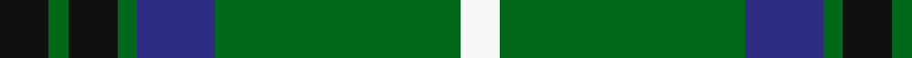
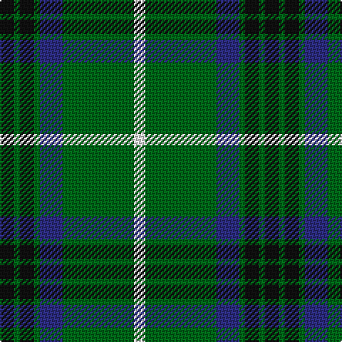

**Bands:** [KGKGBGW](/stripes/kgkgbgw/) · **Stripes:** [K G K G DB G W](/stripes/stripes7/) K G K G DB G W

This was sourced from register-of-tartans.  It is a [7 band tartan](/bands/bands7/).

Original link https://www.tartanregister.gov.uk/tartanDetails.aspx?ref=1951

## Attestations

This cloth appears in 2 source records; the oldest owns this page.

- 01/01/1882 — Keppoch (register-of-tartans, [record](https://www.tartanregister.gov.uk/tartanDetails.aspx?ref=1951))
- 1882 — Keppoch (District) (tartans-authority, [record](http://www.tartansauthority.com/tartan-ferret/display/7122/))

## Register references

External register numbers recorded for this tartan.

- Scottish Register of Tartans: [1951](https://www.tartanregister.gov.uk/tartanDetails.aspx?ref=1951)
- Scottish Tartans Authority (ITI): 7122

## Thread count
K/10 G4 K10 G4 DB16 G50 W/8

## Palette
Each colour and its ΔE from the base-6 reference it is a variant of.

| Colour | Shade | Base | ΔE (OKLab) |
|---|---|---|---|
| DB | <code style="background-color:#2C2C80;">#2C2C80</code> `#2C2C80` | B <code style="background-color:#2A418A;">#2A418A</code> | 0.06 |
| G | <code style="background-color:#006818;">#006818</code> `#006818` | G <code style="background-color:#006100;">#006100</code> | 0.02 |
| K | <code style="background-color:#101010;">#101010</code> `#101010` | K <code style="background-color:#000000;">#000000</code> | 0.17 |
| W | <code style="background-color:#F8F8F8;">#F8F8F8</code> `#F8F8F8` | W <code style="background-color:#F7F7F7;">#F7F7F7</code> | 0.00 |

# Sample pattern

## Nearest tartans

The nearest existing variants by ΔTartan distance.

1. [Hartmann (Personal)](/setts/s8/k4g32k4g4k8w3k8t4~x2/) — ΔT 0.76
1. [MacIntyre Hunting (VS)](/setts/s6/g4db12r3db12g32w4~x2/) — ΔT 0.83
1. [MacAuliffe (Name)](/setts/s8/g37w2g6db23ly6db2ly3db2~x2/) — ΔT 0.99
1. [Rowan](/setts/s9/db1k1db8ly1g12ly1db8k1db1~x2/) — ΔT 1.06
1. [St Andrews Links](/setts/s7/db26g4db3g3ly2g24r2~x2/) — ΔT 1.09
1. [Carrick, hunting](/setts/s8/g13p1g1p1g3db5k4ly2~x2/) — ΔT 1.09
1. [Carrick Hunting District Tartan Tartan Number: 721. Earliest known date: 1930 This sample comes from the MacGregor-Hastie collection which forms the basis of the cloth archive of the Scottish Tartans Society. Some of the samples, including this one, were unmarked. One can assume that the sample dates between 1930 and 1950. See products available Copyright © Blair Urquhart, Comrie, 2015](/setts/s8/g13dp1g1dp1g3db5k4ly2~x2/) — ΔT 1.10
1. [Limerick County Crest (Fashion)](/setts/s6/w12k3g50w3k13lo6~x2/) — ΔT 1.12
1. [Duke of York Hunting](/setts/s8/g99db20w8db30ly8db10ly8g46/) — ΔT 1.15
1. [Leatherneck U.S.Marine Corps Corporate Tartan Tartan Number: 975. Earliest known date: 1986 Designed by Madam Leask and the Scottish Tartans Society Accredited in 1981. See products available Copyright © Blair Urquhart, Comrie, 2015](/setts/s8/g28r2g2r2g8db24ly3r2~x2/) — ΔT 1.19

## Neighbour map

Every grey dot is one of 14299 variants placed by the first two principal components of the ΔTartan feature space (44% of its variance). Red is this tartan; blue dots are its nearest — click one to open its page.

<svg viewBox="0 0 640 380" role="img" style="max-width:100%;height:auto;border:1px solid #e0e0e0;border-radius:4px;display:block" xmlns="http://www.w3.org/2000/svg"><image href="/nn/cloud.v1.png" width="640" height="380"/><a href="/setts/s8/k4g32k4g4k8w3k8t4~x2/"><circle cx="305.3" cy="190.7" r="4" fill="#3465a4"><title>Hartmann (Personal)</title></circle></a><a href="/setts/s6/g4db12r3db12g32w4~x2/"><circle cx="295.2" cy="210.9" r="4" fill="#3465a4"><title>MacIntyre Hunting (VS)</title></circle></a><a href="/setts/s8/g37w2g6db23ly6db2ly3db2~x2/"><circle cx="317.6" cy="156.9" r="4" fill="#3465a4"><title>MacAuliffe (Name)</title></circle></a><a href="/setts/s9/db1k1db8ly1g12ly1db8k1db1~x2/"><circle cx="297.3" cy="177.1" r="4" fill="#3465a4"><title>Rowan</title></circle></a><a href="/setts/s7/db26g4db3g3ly2g24r2~x2/"><circle cx="288.7" cy="182.4" r="4" fill="#3465a4"><title>St Andrews Links</title></circle></a><a href="/setts/s8/g13p1g1p1g3db5k4ly2~x2/"><circle cx="260.2" cy="159.0" r="4" fill="#3465a4"><title>Carrick, hunting</title></circle></a><a href="/setts/s8/g13dp1g1dp1g3db5k4ly2~x2/"><circle cx="289.3" cy="173.1" r="4" fill="#3465a4"><title>Carrick Hunting District Tartan Tartan Number: 721. Earliest known date: 1930 This sample comes from the MacGregor-Hastie collection which forms the basis of the cloth archive of the Scottish Tartans Society. Some of the samples, including this one, were unmarked. One can assume that the sample dates between 1930 and 1950. See products available Copyright © Blair Urquhart, Comrie, 2015</title></circle></a><a href="/setts/s6/w12k3g50w3k13lo6~x2/"><circle cx="309.7" cy="166.2" r="4" fill="#3465a4"><title>Limerick County Crest (Fashion)</title></circle></a><a href="/setts/s8/g99db20w8db30ly8db10ly8g46/"><circle cx="357.0" cy="188.3" r="4" fill="#3465a4"><title>Duke of York Hunting</title></circle></a><a href="/setts/s8/g28r2g2r2g8db24ly3r2~x2/"><circle cx="330.5" cy="180.5" r="4" fill="#3465a4"><title>Leatherneck U.S.Marine Corps Corporate Tartan Tartan Number: 975. Earliest known date: 1986 Designed by Madam Leask and the Scottish Tartans Society Accredited in 1981. See products available Copyright © Blair Urquhart, Comrie, 2015</title></circle></a><circle cx="297.4" cy="186.8" r="5" fill="#c00000"/></svg>

ID: /setts/s7/k5g2k5g2db8g25w4~x2/
