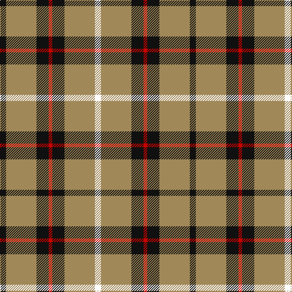

**Bands:** [KYKRKYW](/stripes/kykrkyw/) · **Stripes:** [K LO K R K LO W](/stripes/stripes7/) K LO K R K LO W

This was sourced from register-of-tartans.  It is a [7 band tartan](/bands/bands7/).

Original link https://www.tartanregister.gov.uk/tartanDetails.aspx?ref=3510

## Attestations

This cloth appears in 2 source records; the oldest owns this page.

- 09/01/1999 — Richmond de Ellel (Personal) (register-of-tartans, [record](https://www.tartanregister.gov.uk/tartanDetails.aspx?ref=3510))
- pre 2004 — Richmond de Ellel (Personal) (tartans-authority, [record](http://www.tartansauthority.com/tartan-ferret/display/6226/))

## Register references

External register numbers recorded for this tartan.

- Scottish Register of Tartans: [3510](https://www.tartanregister.gov.uk/tartanDetails.aspx?ref=3510)
- Scottish Tartans Authority (ITI): 6226
- Scottish Tartans World Register: 2777

## Thread count
K/10 LT50 K20 R6 K20 LT50 W/10

## Palette
Each colour and its ΔE from the base-6 reference it is a variant of.

| Colour | Shade | Base | ΔE (OKLab) |
|---|---|---|---|
| K | <code style="background-color:#101010;">#101010</code> `#101010` | K <code style="background-color:#000000;">#000000</code> | 0.17 |
| LT | <code style="background-color:#A08858;">#A08858</code> `#A08858` | Y <code style="background-color:#F2BF00;">#F2BF00</code> | 0.21 |
| R | <code style="background-color:#C80000;">#C80000</code> `#C80000` | R <code style="background-color:#CC0000;">#CC0000</code> | 0.01 |
| W | <code style="background-color:#FCFCFC;">#FCFCFC</code> `#FCFCFC` | W <code style="background-color:#F7F7F7;">#F7F7F7</code> | 0.01 |

# Sample pattern

## Nearest tartans

The nearest existing variants by ΔTartan distance.

1. [Grange School](/setts/s7/n27lr3n14k3n13k3ly23~x2/) — ΔT 1.10
1. [Blackberry (Fashion)](/setts/s7/r8ly6k11ly6k11ly30r3~x2/) — ΔT 1.20
1. [Buchanan VS](/setts/s6/lr2dr4lr2dr4lr9k1~x2/) — ΔT 1.24
1. [Unidentified (GMG 2002)](/setts/s12/lo10w1lo12k7w2k7lo12w1r4w1lo12k2~x2/) — ΔT 1.36
1. [Burberry Check Corporate Tartan Tartan Number: 1239. Earliest known date: 1984 Nothing See products available Copyright © Blair Urquhart, Comrie, 2015](/setts/s5/k6w6k6lo21r2~x4/) — ΔT 1.37
1. [Burns Battalion (Fashion)](/setts/s10/dy22b2dy3ly4dy3b2dy12b4w19dy3~x2/) — ΔT 1.37
1. [St Patrick's Krewe](/setts/s8/dg50r5dg8w10dg8db8dg8lo21~x2/) — ΔT 1.42
1. [MacCrimmon from Skye](/setts/s7/r5k3t22k17t22k3ly5~x2/) — ΔT 1.43
1. [Nooten-Boom (Personal)](/setts/s7/k10ly2k10w2k2ly13w3~x2/) — ΔT 1.44
1. [Braemar or Blair Atholl Trade Tartan Tartan Number: 1741. Earliest known date: 1984 Nothing See products available Copyright © Blair Urquhart, Comrie, 2015](/setts/s10/dy1w2k5dy3k1lo5k1lo11k1lo1~x4/) — ΔT 1.47

## Neighbour map

Every grey dot is one of 14299 variants placed by the first two principal components of the ΔTartan feature space (44% of its variance). Red is this tartan; blue dots are its nearest — click one to open its page.

<svg viewBox="0 0 640 380" role="img" style="max-width:100%;height:auto;border:1px solid #e0e0e0;border-radius:4px;display:block" xmlns="http://www.w3.org/2000/svg"><image href="/nn/cloud.v1.png" width="640" height="380"/><a href="/setts/s7/n27lr3n14k3n13k3ly23~x2/"><circle cx="334.3" cy="216.3" r="4" fill="#3465a4"><title>Grange School</title></circle></a><a href="/setts/s7/r8ly6k11ly6k11ly30r3~x2/"><circle cx="277.5" cy="198.0" r="4" fill="#3465a4"><title>Blackberry (Fashion)</title></circle></a><a href="/setts/s6/lr2dr4lr2dr4lr9k1~x2/"><circle cx="317.3" cy="221.8" r="4" fill="#3465a4"><title>Buchanan VS</title></circle></a><a href="/setts/s12/lo10w1lo12k7w2k7lo12w1r4w1lo12k2~x2/"><circle cx="323.5" cy="169.7" r="4" fill="#3465a4"><title>Unidentified (GMG 2002)</title></circle></a><a href="/setts/s5/k6w6k6lo21r2~x4/"><circle cx="244.9" cy="197.7" r="4" fill="#3465a4"><title>Burberry Check Corporate Tartan Tartan Number: 1239. Earliest known date: 1984 Nothing See products available Copyright © Blair Urquhart, Comrie, 2015</title></circle></a><a href="/setts/s10/dy22b2dy3ly4dy3b2dy12b4w19dy3~x2/"><circle cx="282.1" cy="154.3" r="4" fill="#3465a4"><title>Burns Battalion (Fashion)</title></circle></a><a href="/setts/s8/dg50r5dg8w10dg8db8dg8lo21~x2/"><circle cx="294.4" cy="164.9" r="4" fill="#3465a4"><title>St Patrick's Krewe</title></circle></a><a href="/setts/s7/r5k3t22k17t22k3ly5~x2/"><circle cx="264.7" cy="214.5" r="4" fill="#3465a4"><title>MacCrimmon from Skye</title></circle></a><a href="/setts/s7/k10ly2k10w2k2ly13w3~x2/"><circle cx="235.6" cy="219.1" r="4" fill="#3465a4"><title>Nooten-Boom (Personal)</title></circle></a><a href="/setts/s10/dy1w2k5dy3k1lo5k1lo11k1lo1~x4/"><circle cx="276.6" cy="162.1" r="4" fill="#3465a4"><title>Braemar or Blair Atholl Trade Tartan Tartan Number: 1741. Earliest known date: 1984 Nothing See products available Copyright © Blair Urquhart, Comrie, 2015</title></circle></a><circle cx="288.4" cy="204.1" r="5" fill="#c00000"/></svg>

ID: /setts/s7/k5lo25k10r3k10lo25w5~x2/
