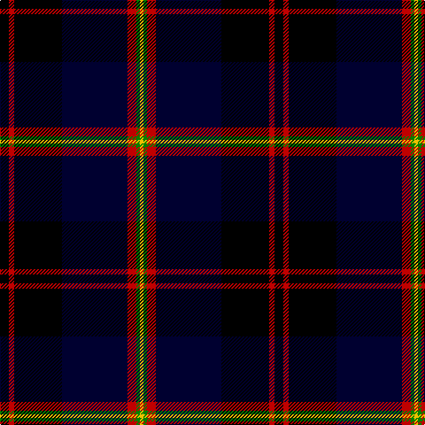

This page is one **sett** — a single exact thread-count. It belongs to the [tartan](/tartans/k5r3k27ki37r5g2ly2/)
(the same proportion at any scale), whose colour order is pattern [KRKKRGY](/stripes/krkkrgy/).

Sourced from weddslist.  It is a [7 stripe tartan](/stripes/stripes7/).

Original link http://www.weddslist.com/cgi-bin/tartans/pg.pl?source=sts

## Thread count
K/10 R6 K54 DB74 R10 G4 Y/4

## Palette

Palette: <strong>Ingles Buchan</strong> <small style="color:#888">(1 of 5 colours)</small>
<table><thead><tr><th>Colour</th><th>Threads</th><th>Shade</th><th>Base</th><th>OKLCh</th></tr></thead><tbody><tr><td>K/</td><td style="text-align:right;font-variant-numeric:tabular-nums">10</td><td><code style="background-color:#000000;">#000000</code> <small style="color:#888">#000000</small></td><td>K <code style="background-color:#000000;">#000000</code></td><td><small style="color:#888">oklch(0.0% 0.000 0.0)</small></td></tr><tr><td>R</td><td style="text-align:right;font-variant-numeric:tabular-nums">6</td><td><code style="background-color:#C00000;">#C00000</code> <small style="color:#888">#C00000</small></td><td>R <code style="background-color:#CC0000;">#CC0000</code></td><td><small style="color:#888">oklch(50.7% 0.208 29.2)</small></td></tr><tr><td>K</td><td style="text-align:right;font-variant-numeric:tabular-nums">54</td><td><code style="background-color:#000000;">#000000</code> <small style="color:#888">#000000</small></td><td>K <code style="background-color:#000000;">#000000</code></td><td><small style="color:#888">oklch(0.0% 0.000 0.0)</small></td></tr><tr><td>DB</td><td style="text-align:right;font-variant-numeric:tabular-nums">74</td><td><code style="background-color:#000030;">#000030</code> <small style="color:#888">#000030</small></td><td>K <code style="background-color:#000000;">#000000</code></td><td><small style="color:#888">oklch(14.0% 0.097 264.1)</small></td></tr><tr><td>R</td><td style="text-align:right;font-variant-numeric:tabular-nums">10</td><td><code style="background-color:#C00000;">#C00000</code> <small style="color:#888">#C00000</small></td><td>R <code style="background-color:#CC0000;">#CC0000</code></td><td><small style="color:#888">oklch(50.7% 0.208 29.2)</small></td></tr><tr><td>G</td><td style="text-align:right;font-variant-numeric:tabular-nums">4</td><td><code style="background-color:#008000;">#008000</code> <small style="color:#888">#008000</small></td><td>G <code style="background-color:#006100;">#006100</code></td><td><small style="color:#888">oklch(52.0% 0.177 142.5)</small></td></tr><tr><td>Y/</td><td style="text-align:right;font-variant-numeric:tabular-nums">4</td><td><code style="background-color:#F0C000;">#F0C000</code> <small style="color:#888">#F0C000</small></td><td>Y <code style="background-color:#F2BF00;">#F2BF00</code></td><td><small style="color:#888">oklch(82.7% 0.169 90.5)</small></td></tr></tbody></table>

# Sample pattern

## Nearest tartans

The nearest existing variants by ΔTartan distance, with this tartan at the top so the swatches line up against it.

ΔTartan

Tartan

Sett

—

<a href="/ttd/edit/#slug=k5r3k27ki37r5g2ly2~x2">Royal Marines Condor</a> <a class="nn-out" href="/setts/s7/k5r3k27ki37r5g2ly2~x2/" title="open its dictionary page">↗</a>

1.28

<a href="/setts/s9/r2k3ki40k3ly2k3dg20k3r2~x2/">Strachan</a>

1.30

<a href="/ttd/edit/#slug=lb3k19db24r2db2ly2db2~x2">Mensa</a> <a class="nn-out" href="/setts/s7/lb3k19db24r2db2ly2db2~x2/" title="open its dictionary page">↗</a>

1.40

<a href="/ttd/edit/#slug=db24k8dg8r2dg8k1ly2~x2">MacLaren</a> <a class="nn-out" href="/setts/s7/db24k8dg8r2dg8k1ly2~x2/" title="open its dictionary page">↗</a>

1.40

<a href="/ttd/edit/#slug=db24k8dg8r2dg8k1lr2~x2">Fergusson</a> <a class="nn-out" href="/setts/s7/db24k8dg8r2dg8k1lr2~x2/" title="open its dictionary page">↗</a>

1.40

<a href="/ttd/edit/#slug=db24k8dg8r2dg8k1lr2">Fergusson</a> <a class="nn-out" href="/setts/s7/db24k8dg8r2dg8k1lr2/" title="open its dictionary page">↗</a>

1.41

<a href="/ttd/edit/#slug=db24k8dg8r2dg8k1lb2">Fergusson</a> <a class="nn-out" href="/setts/s7/db24k8dg8r2dg8k1lb2/" title="open its dictionary page">↗</a>

1.54

<a href="/ttd/edit/#slug=db28ly1db2k16dg24k1dg2r3~x2">Ogilvy VS</a> <a class="nn-out" href="/setts/s8/db28ly1db2k16dg24k1dg2r3~x2/" title="open its dictionary page">↗</a>

1.54

<a href="/ttd/edit/#slug=db24k8dg8r2dg8k1ly2">MacLaren</a> <a class="nn-out" href="/setts/s7/db24k8dg8r2dg8k1ly2/" title="open its dictionary page">↗</a>

1.57

<a href="/ttd/edit/#slug=k8ly1k1db28k12g2k1t2~x2">Hope-Weir / Weir</a> <a class="nn-out" href="/setts/s8/k8ly1k1db28k12g2k1t2~x2/" title="open its dictionary page">↗</a>

1.59

<a href="/ttd/edit/#slug=r12lo6k88db45k6db6ly6">City of Rome Pipe Band (Corporate)</a> <a class="nn-out" href="/setts/s7/r12lo6k88db45k6db6ly6/" title="open its dictionary page">↗</a>

## Neighbour map

Every grey dot is one of 14359 variants placed by the first two principal components of the ΔTartan feature space (44% of its variance). Red is this tartan; blue dots are its nearest — click one to open its page.

<svg viewBox="0 0 640 380" role="img" style="max-width:100%;height:auto;border:1px solid #e0e0e0;border-radius:4px;display:block" xmlns="http://www.w3.org/2000/svg"><image href="/nn/cloud.v1.png" width="640" height="380"/><a href="/setts/s9/r2k3ki40k3ly2k3dg20k3r2~x2/"><circle cx="316.2" cy="141.7" r="4" fill="#3465a4"><title>Strachan</title></circle></a><a href="/setts/s7/lb3k19db24r2db2ly2db2~x2/"><circle cx="277.6" cy="166.4" r="4" fill="#3465a4"><title>Mensa</title></circle></a><a href="/setts/s7/db24k8dg8r2dg8k1ly2~x2/"><circle cx="267.4" cy="170.0" r="4" fill="#3465a4"><title>MacLaren</title></circle></a><a href="/setts/s7/db24k8dg8r2dg8k1lr2~x2/"><circle cx="268.0" cy="170.2" r="4" fill="#3465a4"><title>Fergusson</title></circle></a><a href="/setts/s7/db24k8dg8r2dg8k1lr2/"><circle cx="268.0" cy="170.2" r="4" fill="#3465a4"><title>Fergusson</title></circle></a><a href="/setts/s7/db24k8dg8r2dg8k1lb2/"><circle cx="254.1" cy="163.2" r="4" fill="#3465a4"><title>Fergusson</title></circle></a><a href="/setts/s8/db28ly1db2k16dg24k1dg2r3~x2/"><circle cx="250.1" cy="147.9" r="4" fill="#3465a4"><title>Ogilvy VS</title></circle></a><a href="/setts/s7/db24k8dg8r2dg8k1ly2/"><circle cx="249.7" cy="160.6" r="4" fill="#3465a4"><title>MacLaren</title></circle></a><a href="/setts/s8/k8ly1k1db28k12g2k1t2~x2/"><circle cx="320.2" cy="126.3" r="4" fill="#3465a4"><title>Hope-Weir / Weir</title></circle></a><a href="/setts/s7/r12lo6k88db45k6db6ly6/"><circle cx="336.3" cy="167.9" r="4" fill="#3465a4"><title>City of Rome Pipe Band (Corporate)</title></circle></a><circle cx="286.4" cy="165.0" r="5" fill="#c00000"/></svg>

ID: /setts/s7/k5r3k27ki37r5g2ly2~x2/
