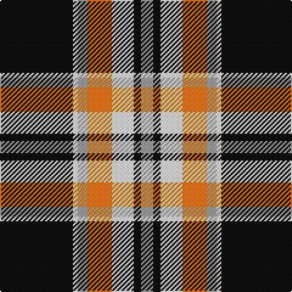

In pattern [KWYYWKY](/patterns/kwyywky/).

This was sourced from register-of-tartans.  It is a [7 stripes tartan](/stripes/stripes7/).

Original link https://www.tartanregister.gov.uk/tartanDetails.aspx?ref=11371

## Thread count
K/60 W4 N8 O20 W18 K6 N/10

## Palette
Each colour and its ΔE from the base-6 reference it is a variant of.

| Colour | Shade | Base | ΔE (OKLab) |
|---|---|---|---|
| K | <code style="background-color:#101010;">#101010</code> `#101010` | K <code style="background-color:#000000;">#000000</code> | 0.17 |
| N | <code style="background-color:#A0A0A0;">#A0A0A0</code> `#A0A0A0` | Y <code style="background-color:#F2BF00;">#F2BF00</code> | 0.21 |
| O | <code style="background-color:#D87C00;">#D87C00</code> `#D87C00` | Y <code style="background-color:#F2BF00;">#F2BF00</code> | 0.17 |
| W | <code style="background-color:#FFFFFF;">#FFFFFF</code> `#FFFFFF` | W <code style="background-color:#F7F7F7;">#F7F7F7</code> | 0.02 |

# Sample pattern

## Nearest tartans

The nearest existing variants by ΔTartan distance.

1. [Merric, Dark Camel..](/setts/s7/r4w16k28ra50w4k4w4-k000000-rc00000-ra806050-we0e0e0/) — ΔT 0.68
1. [Phantom](/setts/s7/w6r20k76wa22r12k4w6-k101010-r945067-wf7feee-waeeeeec/) — ΔT 0.81
1. [Merric Dark Camel.. Trade Tartan Tartan Number: 1688. Earliest known date: 1985 School colours. See products available Copyright © Blair Urquhart, Comrie, 2015](/setts/s7/r4w16k28g50w4k4w4-g604000-k101010-rc80000-we0e0e0/) — ΔT 0.90
1. [Braemar or Blair Atholl](/setts/s8/b8w8k24b12k8r56k4r4-b441800-k101010-ra07c58-wffffff/) — ΔT 0.94
1. [Distripress Annual Congress 2012](/setts/s8/r12k2w8k4b16r2k31b2-b666666-k101010-rff0000-wffffff/) — ΔT 0.95
1. [Loch Ness](/setts/s6/r20w4k20w20ra70k10-k000000-rc00000-ra806050-we0e0e0/) — ΔT 0.96
1. [Gordon Dress (MacGregor-Hastie)](/setts/s9/w8k4w32k8w8k74g24k8y8-g005020-k101010-we0e0e0-ye8c000/) — ΔT 0.99
1. [Gordon Dress (Variation) Trade Tartan Tartan Number: 1831. Earliest known date: pre 2003 This sample comes from the MacGregor-Hastie collection which forms the basis of the cloth archive of the Scottish Tartans Society. Some of the samples, including this one, were unmarked. One can assume that the sample dates between 1930 and 1950. See products available Copyright © Blair Urquhart, Comrie, 2015](/setts/s9/w8k4w32k8w8k74g24k8y8-g006818-k101010-we0e0e0-ye8c000/) — ΔT 1.00
1. [St Piran, Cornish dress](/setts/s8/r8w38g4w16g4w16k76w8-g003000-k000000-rc00000-we0e0e0/) — ΔT 1.04
1. [Meg Merrilees, New (1831)](/setts/s9/b5r5k58r5b5r5w25r5b4-b5c8ca8-k101010-rc80000-wfcfcfc/) — ΔT 1.05

## Neighbour map

Every grey dot is one of 15726 variants placed by the first two principal components of the ΔTartan feature space (44% of its variance). Red is this tartan; blue dots are its nearest — click one to open its page.

<svg viewBox="0 0 640 380" role="img" style="max-width:100%;height:auto;border:1px solid #e0e0e0;border-radius:4px;display:block" xmlns="http://www.w3.org/2000/svg"><image href="/nn/cloud.v1.png" width="640" height="380"/><a href="/setts/s7/r4w16k28ra50w4k4w4-k000000-rc00000-ra806050-we0e0e0/"><circle cx="219.2" cy="158.3" r="4" fill="#3465a4"><title>Merric, Dark Camel..</title></circle></a><a href="/setts/s7/w6r20k76wa22r12k4w6-k101010-r945067-wf7feee-waeeeeec/"><circle cx="284.2" cy="141.7" r="4" fill="#3465a4"><title>Phantom</title></circle></a><a href="/setts/s7/r4w16k28g50w4k4w4-g604000-k101010-rc80000-we0e0e0/"><circle cx="231.9" cy="164.0" r="4" fill="#3465a4"><title>Merric Dark Camel.. Trade Tartan Tartan Number: 1688. Earliest known date: 1985 School colours. See products available Copyright © Blair Urquhart, Comrie, 2015</title></circle></a><a href="/setts/s8/b8w8k24b12k8r56k4r4-b441800-k101010-ra07c58-wffffff/"><circle cx="254.2" cy="155.3" r="4" fill="#3465a4"><title>Braemar or Blair Atholl</title></circle></a><a href="/setts/s8/r12k2w8k4b16r2k31b2-b666666-k101010-rff0000-wffffff/"><circle cx="235.5" cy="151.6" r="4" fill="#3465a4"><title>Distripress Annual Congress 2012</title></circle></a><a href="/setts/s6/r20w4k20w20ra70k10-k000000-rc00000-ra806050-we0e0e0/"><circle cx="239.5" cy="162.9" r="4" fill="#3465a4"><title>Loch Ness</title></circle></a><a href="/setts/s9/w8k4w32k8w8k74g24k8y8-g005020-k101010-we0e0e0-ye8c000/"><circle cx="273.1" cy="137.1" r="4" fill="#3465a4"><title>Gordon Dress (MacGregor-Hastie)</title></circle></a><a href="/setts/s9/w8k4w32k8w8k74g24k8y8-g006818-k101010-we0e0e0-ye8c000/"><circle cx="272.1" cy="136.6" r="4" fill="#3465a4"><title>Gordon Dress (Variation) Trade Tartan Tartan Number: 1831. Earliest known date: pre 2003 This sample comes from the MacGregor-Hastie collection which forms the basis of the cloth archive of the Scottish Tartans Society. Some of the samples, including this one, were unmarked. One can assume that the sample dates between 1930 and 1950. See products available Copyright © Blair Urquhart, Comrie, 2015</title></circle></a><a href="/setts/s8/r8w38g4w16g4w16k76w8-g003000-k000000-rc00000-we0e0e0/"><circle cx="252.8" cy="136.5" r="4" fill="#3465a4"><title>St Piran, Cornish dress</title></circle></a><a href="/setts/s9/b5r5k58r5b5r5w25r5b4-b5c8ca8-k101010-rc80000-wfcfcfc/"><circle cx="245.2" cy="124.5" r="4" fill="#3465a4"><title>Meg Merrilees, New (1831)</title></circle></a><circle cx="246.0" cy="154.5" r="5" fill="#c00000"/></svg>

ID: /setts/s7/k60w4y8ya20w18k6y10-k101010-wffffff-ya0a0a0-yad87c00/
