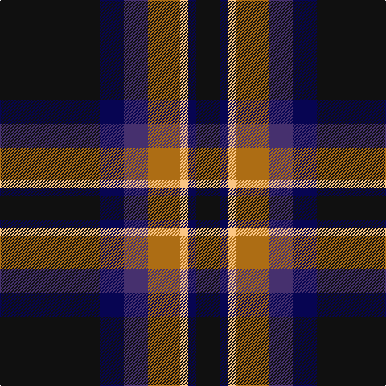

In pattern [KBBRYBK](/patterns/kbbrybk/).

This was sourced from register-of-tartans.  It is a [7 stripes tartan](/stripes/stripes7/).

Original link https://www.tartanregister.gov.uk/tartanDetails.aspx?ref=10166

## Thread count
K/124 DB30 DBa30 LT40 LY10 DB10 K/30

## Palette
Each colour and its ΔE from the base-6 reference it is a variant of.

| Colour | Shade | Base | ΔE (OKLab) |
|---|---|---|---|
| DB | <code style="background-color:#070552;">#070552</code> `#070552` | B <code style="background-color:#2A418A;">#2A418A</code> | 0.19 |
| DBa | <code style="background-color:#46306E;">#46306E</code> `#46306E` | B <code style="background-color:#2A418A;">#2A418A</code> | 0.07 |
| K | <code style="background-color:#101010;">#101010</code> `#101010` | K <code style="background-color:#000000;">#000000</code> | 0.17 |
| LT | <code style="background-color:#AD6D14;">#AD6D14</code> `#AD6D14` | R <code style="background-color:#CC0000;">#CC0000</code> | 0.16 |
| LY | <code style="background-color:#FBC684;">#FBC684</code> `#FBC684` | Y <code style="background-color:#F2BF00;">#F2BF00</code> | 0.08 |

# Sample pattern

## Nearest tartans

The nearest existing variants by ΔTartan distance.

1. [Black Raven (Fashion)](/setts/s7/k62b15ba15g20y5b5k15~b2c2c80-ba1870a4-g604000-k101010-yc4bc68~x2/) — ΔT 0.69
1. [City of Rome Pipe Band (Corporate)](/setts/s7/r12y6k88b45k6b6ya6~b2c2c80-k101010-r901c38-yd87c00-yae8c000/) — ΔT 1.03
1. [Joe Strummer Commemorative](/setts/s7/k3g3ga6k12gb1gc2g2~g572700-ga794400-gb675223-gc524e26-k00011f~x4/) — ΔT 1.03
1. [Croy, Jake (Personal)](/setts/s8/b10k7w2wa2k27ba7w2ba7~b505050-ba1870a4-k1c1714-w82cffd-wae8ccb8~x2/) — ΔT 1.04
1. [New York State Troopers](/setts/s7/b6ba4b2w2b25k26y4~b575757-ba551a8b-k101010-wffffff-yd9d919~x2/) — ΔT 1.21
1. [Model T Ford (Corporate)](/setts/s10/k4b16k3b3k32y7k3r10k2w4~b003c64-k101010-rc80000-we0e0e0-ybc8c00~x2/) — ΔT 1.21
1. [Apache](/setts/s12/k15b7r3k13r3b7k23r3b7y2ba4y2~b2c2c80-ba780078-k101010-r888888-ye8c000~x2/) — ΔT 1.26
1. [MacShimsi Personal Tartan Tartan Number: 7318. Earliest known date: 2007 Designed for the MacShimsi Clan in Dundee See products available Copyright © Blair Urquhart, Comrie, 2015](/setts/s5/r11b5g5k40y3~b601830-g285828-k101010-r882c4c-ydcd00c~x2/) — ΔT 1.29
1. [Reese (Personal)](/setts/s6/r4g2r2k5b22w2~b003c64-g006818-k101010-rc80000-we0e0e0~x4/) — ΔT 1.29
1. [Woodward, R Glenn](/setts/s6/b25k84w5g32y5ba8~b202060-ba780078-g006818-k101010-wfcfcfc-ye8c000~x2/) — ΔT 1.30

## Neighbour map

Every grey dot is one of 15726 variants placed by the first two principal components of the ΔTartan feature space (44% of its variance). Red is this tartan; blue dots are its nearest — click one to open its page.

<svg viewBox="0 0 640 380" role="img" style="max-width:100%;height:auto;border:1px solid #e0e0e0;border-radius:4px;display:block" xmlns="http://www.w3.org/2000/svg"><image href="/nn/cloud.v1.png" width="640" height="380"/><a href="/setts/s7/k62b15ba15g20y5b5k15~b2c2c80-ba1870a4-g604000-k101010-yc4bc68~x2/"><circle cx="302.2" cy="192.6" r="4" fill="#3465a4"><title>Black Raven (Fashion)</title></circle></a><a href="/setts/s7/r12y6k88b45k6b6ya6~b2c2c80-k101010-r901c38-yd87c00-yae8c000/"><circle cx="334.2" cy="165.3" r="4" fill="#3465a4"><title>City of Rome Pipe Band (Corporate)</title></circle></a><a href="/setts/s7/k3g3ga6k12gb1gc2g2~g572700-ga794400-gb675223-gc524e26-k00011f~x4/"><circle cx="282.6" cy="201.6" r="4" fill="#3465a4"><title>Joe Strummer Commemorative</title></circle></a><a href="/setts/s8/b10k7w2wa2k27ba7w2ba7~b505050-ba1870a4-k1c1714-w82cffd-wae8ccb8~x2/"><circle cx="264.0" cy="167.8" r="4" fill="#3465a4"><title>Croy, Jake (Personal)</title></circle></a><a href="/setts/s7/b6ba4b2w2b25k26y4~b575757-ba551a8b-k101010-wffffff-yd9d919~x2/"><circle cx="255.5" cy="167.0" r="4" fill="#3465a4"><title>New York State Troopers</title></circle></a><a href="/setts/s10/k4b16k3b3k32y7k3r10k2w4~b003c64-k101010-rc80000-we0e0e0-ybc8c00~x2/"><circle cx="262.1" cy="140.4" r="4" fill="#3465a4"><title>Model T Ford (Corporate)</title></circle></a><a href="/setts/s12/k15b7r3k13r3b7k23r3b7y2ba4y2~b2c2c80-ba780078-k101010-r888888-ye8c000~x2/"><circle cx="277.7" cy="171.6" r="4" fill="#3465a4"><title>Apache</title></circle></a><a href="/setts/s5/r11b5g5k40y3~b601830-g285828-k101010-r882c4c-ydcd00c~x2/"><circle cx="364.6" cy="191.1" r="4" fill="#3465a4"><title>MacShimsi Personal Tartan Tartan Number: 7318. Earliest known date: 2007 Designed for the MacShimsi Clan in Dundee See products available Copyright © Blair Urquhart, Comrie, 2015</title></circle></a><a href="/setts/s6/r4g2r2k5b22w2~b003c64-g006818-k101010-rc80000-we0e0e0~x4/"><circle cx="319.9" cy="176.6" r="4" fill="#3465a4"><title>Reese (Personal)</title></circle></a><a href="/setts/s6/b25k84w5g32y5ba8~b202060-ba780078-g006818-k101010-wfcfcfc-ye8c000~x2/"><circle cx="262.7" cy="153.5" r="4" fill="#3465a4"><title>Woodward, R Glenn</title></circle></a><circle cx="287.5" cy="184.7" r="5" fill="#c00000"/></svg>

ID: /setts/s7/k62b15ba15r20y5b5k15~b070552-ba46306e-k101010-rad6d14-yfbc684~x2/
