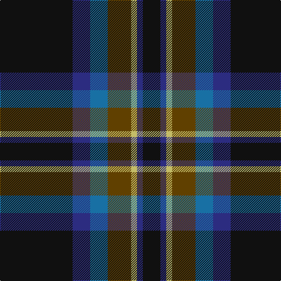

This page is one **sett** — a single exact thread-count. It belongs to the [tartan](/tartans/k62db15b15dy20ly5db5k15/)
(the same proportion at any scale), whose colour order is pattern [KBBGYBK](/stripes/kbbgybk/).

Sourced from tartans-authority.  It is a [7 stripe tartan](/stripes/stripes7/).

Original link http://www.tartansauthority.com/tartan-ferret/display/10166/

## Register references

External register numbers recorded for this tartan.

- Scottish Register of Tartans: [10166](https://www.tartanregister.gov.uk/tartanDetails?ref=10166)
- Scottish Tartans Authority (ITI): 10166

## Thread count
K/124 DB30 B30 T40 LG10 DB10 K/30

## Palette

Palette: <strong>Tartan Register</strong>
<table><thead><tr><th>Colour</th><th>Threads</th><th>Shade</th><th>Base</th><th>OKLCh</th></tr></thead><tbody><tr><td>K/</td><td style="text-align:right;font-variant-numeric:tabular-nums">124</td><td><code style="background-color:#101010;">#101010</code> <small style="color:#888">#101010</small></td><td>K <code style="background-color:#000000;">#000000</code></td><td><small style="color:#888">oklch(17.3% 0.000 89.9)</small></td></tr><tr><td>DB</td><td style="text-align:right;font-variant-numeric:tabular-nums">30</td><td><code style="background-color:#2C2C80;">#2C2C80</code> <small style="color:#888">#2C2C80</small></td><td>B <code style="background-color:#2A418A;">#2A418A</code></td><td><small style="color:#888">oklch(35.0% 0.138 276.6)</small></td></tr><tr><td>B</td><td style="text-align:right;font-variant-numeric:tabular-nums">30</td><td><code style="background-color:#1870A4;">#1870A4</code> <small style="color:#888">#1870A4</small></td><td>B <code style="background-color:#2A418A;">#2A418A</code></td><td><small style="color:#888">oklch(52.2% 0.113 241.2)</small></td></tr><tr><td>T</td><td style="text-align:right;font-variant-numeric:tabular-nums">40</td><td><code style="background-color:#604000;">#604000</code> <small style="color:#888">#604000</small></td><td>G <code style="background-color:#006100;">#006100</code></td><td><small style="color:#888">oklch(39.8% 0.083 76.8)</small></td></tr><tr><td>LG</td><td style="text-align:right;font-variant-numeric:tabular-nums">10</td><td><code style="background-color:#C4BC68;">#C4BC68</code> <small style="color:#888">#C4BC68</small></td><td>Y <code style="background-color:#F2BF00;">#F2BF00</code></td><td><small style="color:#888">oklch(78.4% 0.107 103.7)</small></td></tr><tr><td>DB</td><td style="text-align:right;font-variant-numeric:tabular-nums">10</td><td><code style="background-color:#2C2C80;">#2C2C80</code> <small style="color:#888">#2C2C80</small></td><td>B <code style="background-color:#2A418A;">#2A418A</code></td><td><small style="color:#888">oklch(35.0% 0.138 276.6)</small></td></tr><tr><td>K/</td><td style="text-align:right;font-variant-numeric:tabular-nums">30</td><td><code style="background-color:#101010;">#101010</code> <small style="color:#888">#101010</small></td><td>K <code style="background-color:#000000;">#000000</code></td><td><small style="color:#888">oklch(17.3% 0.000 89.9)</small></td></tr></tbody></table>

# Sample pattern

## Nearest tartans

The nearest existing variants by ΔTartan distance, with this tartan at the top so the swatches line up against it.

ΔTartan

Tartan

Sett

—

<a href="/ttd/edit/#slug=k62db15b15dy20ly5db5k15~x2">Black Raven (Fashion)</a> <a class="nn-out" href="/setts/s7/k62db15b15dy20ly5db5k15~x2/" title="open its dictionary page">↗</a>

0.68

<a href="/ttd/edit/#slug=k62db15dp15o20ly5db5k15~x2">Black Raven</a> <a class="nn-out" href="/setts/s7/k62db15dp15o20ly5db5k15~x2/" title="open its dictionary page">↗</a>

0.80

<a href="/setts/s7/k3dy3yi6k12y1dyi2dy2~x4/">Joe Strummer Commemorative</a>

1.05

<a href="/ttd/edit/#slug=r12lo6k88db45k6db6ly6">City of Rome Pipe Band (Corporate)</a> <a class="nn-out" href="/setts/s7/r12lo6k88db45k6db6ly6/" title="open its dictionary page">↗</a>

1.10

<a href="/ttd/edit/#slug=dg15db20k2r4k2db20dg15k2ly2~x2">Manroth (Personal)</a> <a class="nn-out" href="/setts/s9/dg15db20k2r4k2db20dg15k2ly2~x2/" title="open its dictionary page">↗</a>

1.12

<a href="/ttd/edit/#slug=n10k7lt2lb2k27b7lt2b7~x2">Croy, Jake (Personal)</a> <a class="nn-out" href="/setts/s8/n10k7lt2lb2k27b7lt2b7~x2/" title="open its dictionary page">↗</a>

1.19

<a href="/ttd/edit/#slug=r4dg4k2dg29db21k3db3ly3~x2">Peter of Lee (Chief) (Personal)</a> <a class="nn-out" href="/setts/s8/r4dg4k2dg29db21k3db3ly3~x2/" title="open its dictionary page">↗</a>

1.19

<a href="/ttd/edit/#slug=k2w1k12g5db11r1~x2">New England (Fashion)</a> <a class="nn-out" href="/setts/s6/k2w1k12g5db11r1~x2/" title="open its dictionary page">↗</a>

1.22

<a href="/ttd/edit/#slug=dt22k16ly4k11dp2n1~x4">Martinez, Clément (Personal)</a> <a class="nn-out" href="/setts/s6/dt22k16ly4k11dp2n1~x4/" title="open its dictionary page">↗</a>

1.23

<a href="/ttd/edit/#slug=dt25k84w5dg23lo5dp8~x2">Woodward, R Glenn (Personal)</a> <a class="nn-out" href="/setts/s6/dt25k84w5dg23lo5dp8~x2/" title="open its dictionary page">↗</a>

1.24

<a href="/ttd/edit/#slug=db8w2k8g12r2db3r2db24r2~x2">Burt #2 (Name)</a> <a class="nn-out" href="/setts/s9/db8w2k8g12r2db3r2db24r2~x2/" title="open its dictionary page">↗</a>

## Neighbour map

Every grey dot is one of 14359 variants placed by the first two principal components of the ΔTartan feature space (44% of its variance). Red is this tartan; blue dots are its nearest — click one to open its page.

<svg viewBox="0 0 640 380" role="img" style="max-width:100%;height:auto;border:1px solid #e0e0e0;border-radius:4px;display:block" xmlns="http://www.w3.org/2000/svg"><image href="/nn/cloud.v1.png" width="640" height="380"/><a href="/setts/s7/k62db15dp15o20ly5db5k15~x2/"><circle cx="289.6" cy="186.7" r="4" fill="#3465a4"><title>Black Raven</title></circle></a><a href="/setts/s7/k3dy3yi6k12y1dyi2dy2~x4/"><circle cx="284.7" cy="207.0" r="4" fill="#3465a4"><title>Joe Strummer Commemorative</title></circle></a><a href="/setts/s7/r12lo6k88db45k6db6ly6/"><circle cx="336.3" cy="167.9" r="4" fill="#3465a4"><title>City of Rome Pipe Band (Corporate)</title></circle></a><a href="/setts/s9/dg15db20k2r4k2db20dg15k2ly2~x2/"><circle cx="270.4" cy="203.5" r="4" fill="#3465a4"><title>Manroth (Personal)</title></circle></a><a href="/setts/s8/n10k7lt2lb2k27b7lt2b7~x2/"><circle cx="266.6" cy="169.9" r="4" fill="#3465a4"><title>Croy, Jake (Personal)</title></circle></a><a href="/setts/s8/r4dg4k2dg29db21k3db3ly3~x2/"><circle cx="297.5" cy="177.0" r="4" fill="#3465a4"><title>Peter of Lee (Chief) (Personal)</title></circle></a><a href="/setts/s6/k2w1k12g5db11r1~x2/"><circle cx="238.3" cy="204.6" r="4" fill="#3465a4"><title>New England (Fashion)</title></circle></a><a href="/setts/s6/dt22k16ly4k11dp2n1~x4/"><circle cx="296.3" cy="189.7" r="4" fill="#3465a4"><title>Martinez, Clément (Personal)</title></circle></a><a href="/setts/s6/dt25k84w5dg23lo5dp8~x2/"><circle cx="309.2" cy="166.3" r="4" fill="#3465a4"><title>Woodward, R Glenn (Personal)</title></circle></a><a href="/setts/s9/db8w2k8g12r2db3r2db24r2~x2/"><circle cx="287.6" cy="172.4" r="4" fill="#3465a4"><title>Burt #2 (Name)</title></circle></a><circle cx="304.5" cy="196.9" r="5" fill="#c00000"/></svg>

ID: /setts/s7/k62db15b15dy20ly5db5k15~x2/
