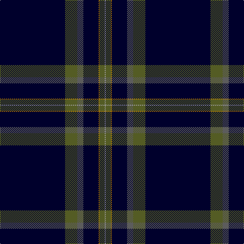

In pattern [KGBKRGY](/patterns/kgbkrgy/).

This was sourced from tartans-authority.  It is a [7 stripes tartan](/stripes/stripes7/).

Original link http://www.tartansauthority.com/tartan-ferret/display/8279/

## Thread count
DB/128 G24 N12 DB30 DY2 G10 Na/2

## Palette
Each colour and its ΔE from the base-6 reference it is a variant of.

| Colour | Shade | Base | ΔE (OKLab) |
|---|---|---|---|
| DB | <code style="background-color:#00002C;">#00002C</code> `#00002C` | K <code style="background-color:#000000;">#000000</code> | 0.16 |
| DY | <code style="background-color:#B47800;">#B47800</code> `#B47800` | R <code style="background-color:#CC0000;">#CC0000</code> | 0.18 |
| G | <code style="background-color:#545C24;">#545C24</code> `#545C24` | G <code style="background-color:#006100;">#006100</code> | 0.09 |
| N | <code style="background-color:#5C5C5C;">#5C5C5C</code> `#5C5C5C` | B <code style="background-color:#2A418A;">#2A418A</code> | 0.15 |
| Na | <code style="background-color:#A0A0A0;">#A0A0A0</code> `#A0A0A0` | Y <code style="background-color:#F2BF00;">#F2BF00</code> | 0.21 |

# Sample pattern

## Nearest tartans

The nearest existing variants by ΔTartan distance.

1. [Gibson, Robert (Personal)](/setts/s7/k5b15k5ba1k35r1k2x4~b0000cd-ba1474b4-k101010-rb458ac/) — ΔT 1.12
1. [Scotch Whisky, Heritage](/setts/s8/b73g16b10r8b10k4b10w2~b000050-g008000-k000000-rc00000-we0e0e0/) — ΔT 1.13
1. [London Scottish Rugby Club](/setts/s6/r5k40w1k13g8ka4x2~g008000-k000030-ka000000-rc00000-we0e0e0/) — ΔT 1.18
1. [Marine Harvest (Scotland)](/setts/s8/b10ba2k2b1k6ba1k45y2x2~b0000cd-ba778899-k101010-yffa500/) — ΔT 1.20
1. [Brooks Brothers Signature (Corporate](/setts/s9/k5y1g7r1k45r5y3k4y3x2~g003820-k00002c-r880000-ybc8c00/) — ΔT 1.37
1. [Scotch Whisky Heritage Centre](/setts/s8/b73g16b10r8b10k4b10w2x2~b202060-g006818-k101010-rc80000-we0e0e0/) — ΔT 1.37
1. [Scotch Whisky Heritage Corporate Tartan Tartan Number: 1920. Earliest known date: 1987 Half actual count for display. See products available Copyright © Blair Urquhart, Comrie, 2015](/setts/s8/b73g16b10r8b10k4b10w2~b202060-g006818-k101010-rc80000-we0e0e0/) — ΔT 1.37
1. [Center (Name)](/setts/s8/k50b2k13w1k13b5g15r2x2~b1474b4-g006818-k101010-rc80000-we0e0e0/) — ΔT 1.43
1. [Forand (Personal)](/setts/s5/k100r1ra10b10y2x2~b1c0070-k101010-rc80000-ra888888-ye8c000/) — ΔT 1.49
1. [Marine Harvest Scotland (Corporate)](/setts/s8/b10w2k2b1k6w1k45y2x2~b1474b4-k101010-wc0c0c0-yd87c00/) — ΔT 1.63

## Neighbour map

Every grey dot is one of 15726 variants placed by the first two principal components of the ΔTartan feature space (44% of its variance). Red is this tartan; blue dots are its nearest — click one to open its page.

<svg viewBox="0 0 640 380" role="img" style="max-width:100%;height:auto;border:1px solid #e0e0e0;border-radius:4px;display:block" xmlns="http://www.w3.org/2000/svg"><image href="/nn/cloud.v1.png" width="640" height="380"/><a href="/setts/s7/k5b15k5ba1k35r1k2x4~b0000cd-ba1474b4-k101010-rb458ac/"><circle cx="522.5" cy="167.2" r="4" fill="#3465a4"><title>Gibson, Robert (Personal)</title></circle></a><a href="/setts/s8/b73g16b10r8b10k4b10w2~b000050-g008000-k000000-rc00000-we0e0e0/"><circle cx="501.0" cy="133.7" r="4" fill="#3465a4"><title>Scotch Whisky, Heritage</title></circle></a><a href="/setts/s6/r5k40w1k13g8ka4x2~g008000-k000030-ka000000-rc00000-we0e0e0/"><circle cx="474.1" cy="151.8" r="4" fill="#3465a4"><title>London Scottish Rugby Club</title></circle></a><a href="/setts/s8/b10ba2k2b1k6ba1k45y2x2~b0000cd-ba778899-k101010-yffa500/"><circle cx="548.9" cy="127.7" r="4" fill="#3465a4"><title>Marine Harvest (Scotland)</title></circle></a><a href="/setts/s9/k5y1g7r1k45r5y3k4y3x2~g003820-k00002c-r880000-ybc8c00/"><circle cx="507.0" cy="121.2" r="4" fill="#3465a4"><title>Brooks Brothers Signature (Corporate</title></circle></a><a href="/setts/s8/b73g16b10r8b10k4b10w2x2~b202060-g006818-k101010-rc80000-we0e0e0/"><circle cx="539.4" cy="141.1" r="4" fill="#3465a4"><title>Scotch Whisky Heritage Centre</title></circle></a><a href="/setts/s8/b73g16b10r8b10k4b10w2~b202060-g006818-k101010-rc80000-we0e0e0/"><circle cx="539.4" cy="141.1" r="4" fill="#3465a4"><title>Scotch Whisky Heritage Corporate Tartan Tartan Number: 1920. Earliest known date: 1987 Half actual count for display. See products available Copyright © Blair Urquhart, Comrie, 2015</title></circle></a><a href="/setts/s8/k50b2k13w1k13b5g15r2x2~b1474b4-g006818-k101010-rc80000-we0e0e0/"><circle cx="513.2" cy="133.0" r="4" fill="#3465a4"><title>Center (Name)</title></circle></a><a href="/setts/s5/k100r1ra10b10y2x2~b1c0070-k101010-rc80000-ra888888-ye8c000/"><circle cx="597.1" cy="140.9" r="4" fill="#3465a4"><title>Forand (Personal)</title></circle></a><a href="/setts/s8/b10w2k2b1k6w1k45y2x2~b1474b4-k101010-wc0c0c0-yd87c00/"><circle cx="537.4" cy="121.6" r="4" fill="#3465a4"><title>Marine Harvest Scotland (Corporate)</title></circle></a><circle cx="533.1" cy="132.2" r="5" fill="#c00000"/></svg>

ID: /setts/s7/k64g12b6k15r1g5y1x2~b5c5c5c-g545c24-k00002c-rb47800-ya0a0a0/
