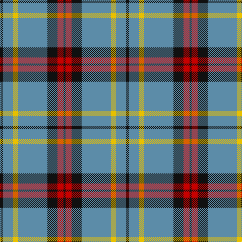

In pattern [KBYBKRK](/patterns/kbybkrk/).

This was sourced from tartans-authority.  It is a [7 stripes tartan](/stripes/stripes7/).

Original link http://www.tartansauthority.com/tartan-ferret/display/11211/

## Thread count
K/6 B20 Y10 B58 K20 R12 K/4

## Palette
Each colour and its ΔE from the base-6 reference it is a variant of.

| Colour | Shade | Base | ΔE (OKLab) |
|---|---|---|---|
| B | <code style="background-color:#5C8CA8;">#5C8CA8</code> `#5C8CA8` | B <code style="background-color:#2A418A;">#2A418A</code> | 0.23 |
| K | <code style="background-color:#101010;">#101010</code> `#101010` | K <code style="background-color:#000000;">#000000</code> | 0.17 |
| R | <code style="background-color:#C80000;">#C80000</code> `#C80000` | R <code style="background-color:#CC0000;">#CC0000</code> | 0.01 |
| Y | <code style="background-color:#E8C000;">#E8C000</code> `#E8C000` | Y <code style="background-color:#F2BF00;">#F2BF00</code> | 0.02 |

# Sample pattern

## Nearest tartans

The nearest existing variants by ΔTartan distance.

1. [Perkins (2015)](/setts/s7/k6b20y10b58k20r12k4-b5f749c-k101010-rc80000-ye0a126/) — ΔT 0.73
1. [Tiree Grey](/setts/s6/w12k12w12k12r60ra4-k101010-r888888-ra880000-wc0c0c0/) — ΔT 0.94
1. [Kinding (Personal)](/setts/s7/k20b60g6b6g6b6r12-b5c8ca8-g249018-k101010-rc80000/) — ΔT 0.99
1. [Moorpark Primary School (Corporate)](/setts/s8/b6ba20b6k6w20r8ba56k4-b1c0070-ba506878-k101010-rc8002c-we0e0e0/) — ΔT 1.08
1. [Katsushika Scottish Country Dancers](/setts/s8/b44y4b2y4b20r4g22r12-b304080-g008000-rc00000-yf0c000/) — ΔT 1.12
1. [Stewart Navy Clan Tartan Tartan Number: 1117. Earliest known date: 1971 Stewart Navy See products available Copyright © Blair Urquhart, Comrie, 2015](/setts/s10/b58ba6w20b4w4y20b10w4b8y4-b003c64-ba680028-we0e0e0-ya08858/) — ΔT 1.14
1. [Burberry Grey (Original)](/setts/s5/k20w28k20g80b4-b2c2c80-g7c7c7c-k101010-we0e0e0/) — ΔT 1.20
1. [MacCrimmon from Skye](/setts/s7/r10k6b44k34b44k6y10-b5c8ca8-k101010-rc80000-ye8c000/) — ΔT 1.23
1. [Bedford Academy](/setts/s9/g16y8g70b4w16b4g8b42g8-b000080-g707070-w86c3e3-yeec327/) — ΔT 1.25
1. [Kansai Highland Games Corporate Tartan Tartan Number: 2708. Earliest known date: 1999 Designed for the first Highland Games in Japan, started by Maud Robertson and heavy weight husband, Masonori Nomiyam. See products available Copyright © Blair Urquhart, Comrie, 2015](/setts/s5/b8k4b64g64w8-b780078-g289c18-k101010-we0e0e0/) — ΔT 1.25

## Neighbour map

Every grey dot is one of 15726 variants placed by the first two principal components of the ΔTartan feature space (44% of its variance). Red is this tartan; blue dots are its nearest — click one to open its page.

<svg viewBox="0 0 640 380" role="img" style="max-width:100%;height:auto;border:1px solid #e0e0e0;border-radius:4px;display:block" xmlns="http://www.w3.org/2000/svg"><image href="/nn/cloud.v1.png" width="640" height="380"/><a href="/setts/s7/k6b20y10b58k20r12k4-b5f749c-k101010-rc80000-ye0a126/"><circle cx="332.0" cy="181.7" r="4" fill="#3465a4"><title>Perkins (2015)</title></circle></a><a href="/setts/s6/w12k12w12k12r60ra4-k101010-r888888-ra880000-wc0c0c0/"><circle cx="289.6" cy="171.0" r="4" fill="#3465a4"><title>Tiree Grey</title></circle></a><a href="/setts/s7/k20b60g6b6g6b6r12-b5c8ca8-g249018-k101010-rc80000/"><circle cx="337.9" cy="184.1" r="4" fill="#3465a4"><title>Kinding (Personal)</title></circle></a><a href="/setts/s8/b6ba20b6k6w20r8ba56k4-b1c0070-ba506878-k101010-rc8002c-we0e0e0/"><circle cx="301.7" cy="149.3" r="4" fill="#3465a4"><title>Moorpark Primary School (Corporate)</title></circle></a><a href="/setts/s8/b44y4b2y4b20r4g22r12-b304080-g008000-rc00000-yf0c000/"><circle cx="344.3" cy="164.0" r="4" fill="#3465a4"><title>Katsushika Scottish Country Dancers</title></circle></a><a href="/setts/s10/b58ba6w20b4w4y20b10w4b8y4-b003c64-ba680028-we0e0e0-ya08858/"><circle cx="301.7" cy="144.2" r="4" fill="#3465a4"><title>Stewart Navy Clan Tartan Tartan Number: 1117. Earliest known date: 1971 Stewart Navy See products available Copyright © Blair Urquhart, Comrie, 2015</title></circle></a><a href="/setts/s5/k20w28k20g80b4-b2c2c80-g7c7c7c-k101010-we0e0e0/"><circle cx="278.9" cy="176.9" r="4" fill="#3465a4"><title>Burberry Grey (Original)</title></circle></a><a href="/setts/s7/r10k6b44k34b44k6y10-b5c8ca8-k101010-rc80000-ye8c000/"><circle cx="263.4" cy="214.9" r="4" fill="#3465a4"><title>MacCrimmon from Skye</title></circle></a><a href="/setts/s9/g16y8g70b4w16b4g8b42g8-b000080-g707070-w86c3e3-yeec327/"><circle cx="333.9" cy="157.1" r="4" fill="#3465a4"><title>Bedford Academy</title></circle></a><a href="/setts/s5/b8k4b64g64w8-b780078-g289c18-k101010-we0e0e0/"><circle cx="291.4" cy="181.0" r="4" fill="#3465a4"><title>Kansai Highland Games Corporate Tartan Tartan Number: 2708. Earliest known date: 1999 Designed for the first Highland Games in Japan, started by Maud Robertson and heavy weight husband, Masonori Nomiyam. See products available Copyright © Blair Urquhart, Comrie, 2015</title></circle></a><circle cx="315.5" cy="176.1" r="5" fill="#c00000"/></svg>

ID: /setts/s7/k6b20y10b58k20r12k4-b5c8ca8-k101010-rc80000-ye8c000/
