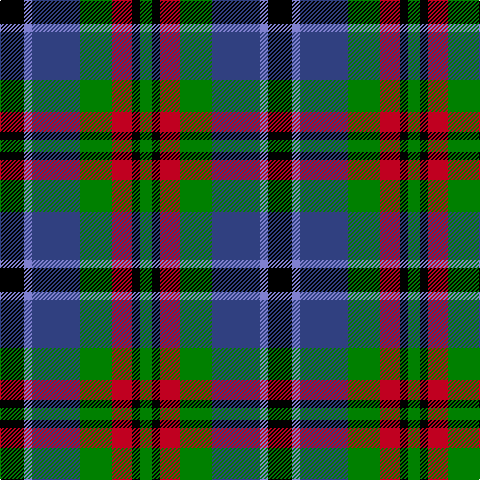

In pattern [GKRGBBK](/stripes/gkrgbbk/).

This was sourced from weddslist.  It is a [7 stripe tartan](/stripes/stripes7/).

Original link http://www.weddslist.com/cgi-bin/tartans/pg.pl?source=sts

## Thread count
K/24 B8 Ba48 G32 R20 K8 G/12

## Palette
Each colour and the base-6 reference it is a variant of.

| Colour | Shade | Base |
|---|---|---|
| B | <code style="background-color:#8080D0;">#8080D0</code> `oklch(63.4% 0.119 282.5)` <small>#8080D0</small> | B <code style="background-color:#2A418A;">#2A418A</code> |
| Ba | <code style="background-color:#304080;">#304080</code> `oklch(39.4% 0.109 270.2)` <small>#304080</small> | B <code style="background-color:#2A418A;">#2A418A</code> |
| G | <code style="background-color:#008000;">#008000</code> `oklch(52.0% 0.177 142.5)` <small>#008000</small> | G <code style="background-color:#006100;">#006100</code> |
| K | <code style="background-color:#000000;">#000000</code> `oklch(0.0% 0.000 0.0)` <small>#000000</small> | K <code style="background-color:#000000;">#000000</code> |
| R | <code style="background-color:#C00020;">#C00020</code> `oklch(50.9% 0.206 24.5)` <small>#C00020</small> | R <code style="background-color:#CC0000;">#CC0000</code> |

# Sample pattern

## Nearest tartans

The nearest existing variants by ΔTartan distance, with this tartan at the top so the swatches line up against it.

ΔTartan

Tartan

Sett

—

<a href="/ttd/edit/#slug=k6b2db12g8r5k2g3~x4">Cooke</a> <a class="nn-out" href="/setts/s7/k6b2db12g8r5k2g3~x4/" title="open its dictionary page">↗</a>

0.45

<a href="/ttd/edit/#slug=dp2g6k2db6k1r2~x4">MacCaughan, or MacEachain</a> <a class="nn-out" href="/setts/s6/dp2g6k2db6k1r2~x4/" title="open its dictionary page">↗</a>

0.64

<a href="/ttd/edit/#slug=lr4g17k17db17r3db3~x2">Royal Highland</a> <a class="nn-out" href="/setts/s6/lr4g17k17db17r3db3~x2/" title="open its dictionary page">↗</a>

0.67

<a href="/ttd/edit/#slug=r4g11k11g2db11y3~x4">Casely</a> <a class="nn-out" href="/setts/s6/r4g11k11g2db11y3~x4/" title="open its dictionary page">↗</a>

0.69

<a href="/ttd/edit/#slug=o8g4db16g4k14o14db4b3~x2">Hinnigan (Personal)</a> <a class="nn-out" href="/setts/s8/o8g4db16g4k14o14db4b3~x2/" title="open its dictionary page">↗</a>

0.73

<a href="/ttd/edit/#slug=k4g16k14ly3db16r4~x2">Birse</a> <a class="nn-out" href="/setts/s6/k4g16k14ly3db16r4~x2/" title="open its dictionary page">↗</a>

0.76

<a href="/ttd/edit/#slug=b2g6ly1k6db6k1db1~x2">Hogarth, of Firhill</a> <a class="nn-out" href="/setts/s7/b2g6ly1k6db6k1db1~x2/" title="open its dictionary page">↗</a>

0.77

<a href="/ttd/edit/#slug=t3g8k9db7r2db2~x2">Wellington, or Waterloo</a> <a class="nn-out" href="/setts/s6/t3g8k9db7r2db2~x2/" title="open its dictionary page">↗</a>

0.79

<a href="/ttd/edit/#slug=db1r1db6k6g6w1~x2">Wellington</a> <a class="nn-out" href="/setts/s6/db1r1db6k6g6w1~x2/" title="open its dictionary page">↗</a>

0.84

<a href="/ttd/edit/#slug=g17ly2k14r2db9r2db10~x2">MacDonald, (Flora.. )</a> <a class="nn-out" href="/setts/s7/g17ly2k14r2db9r2db10~x2/" title="open its dictionary page">↗</a>

0.85

<a href="/ttd/edit/#slug=r1dy6db2lb4k4lb1~x6">Thompson's Fancy (Fashion)</a> <a class="nn-out" href="/setts/s6/r1dy6db2lb4k4lb1~x6/" title="open its dictionary page">↗</a>

## Neighbour map

Every grey dot is one of 14299 variants placed by the first two principal components of the ΔTartan feature space (44% of its variance). Red is this tartan; blue dots are its nearest — click one to open its page.

<svg viewBox="0 0 640 380" role="img" style="max-width:100%;height:auto;border:1px solid #e0e0e0;border-radius:4px;display:block" xmlns="http://www.w3.org/2000/svg"><image href="/nn/cloud.v1.png" width="640" height="380"/><a href="/setts/s6/dp2g6k2db6k1r2~x4/"><circle cx="94.2" cy="225.7" r="4" fill="#3465a4"><title>MacCaughan, or MacEachain</title></circle></a><a href="/setts/s6/lr4g17k17db17r3db3~x2/"><circle cx="93.4" cy="223.9" r="4" fill="#3465a4"><title>Royal Highland</title></circle></a><a href="/setts/s6/r4g11k11g2db11y3~x4/"><circle cx="73.5" cy="236.1" r="4" fill="#3465a4"><title>Casely</title></circle></a><a href="/setts/s8/o8g4db16g4k14o14db4b3~x2/"><circle cx="84.5" cy="224.1" r="4" fill="#3465a4"><title>Hinnigan (Personal)</title></circle></a><a href="/setts/s6/k4g16k14ly3db16r4~x2/"><circle cx="77.6" cy="229.3" r="4" fill="#3465a4"><title>Birse</title></circle></a><a href="/setts/s7/b2g6ly1k6db6k1db1~x2/"><circle cx="83.2" cy="209.8" r="4" fill="#3465a4"><title>Hogarth, of Firhill</title></circle></a><a href="/setts/s6/t3g8k9db7r2db2~x2/"><circle cx="57.1" cy="245.0" r="4" fill="#3465a4"><title>Wellington, or Waterloo</title></circle></a><a href="/setts/s6/db1r1db6k6g6w1~x2/"><circle cx="101.9" cy="217.1" r="4" fill="#3465a4"><title>Wellington</title></circle></a><a href="/setts/s7/g17ly2k14r2db9r2db10~x2/"><circle cx="116.7" cy="199.0" r="4" fill="#3465a4"><title>MacDonald, (Flora.. )</title></circle></a><a href="/setts/s6/r1dy6db2lb4k4lb1~x6/"><circle cx="87.7" cy="218.9" r="4" fill="#3465a4"><title>Thompson's Fancy (Fashion)</title></circle></a><circle cx="81.8" cy="219.3" r="5" fill="#c00000"/></svg>

ID: /setts/s7/k6b2db12g8r5k2g3~x4/
