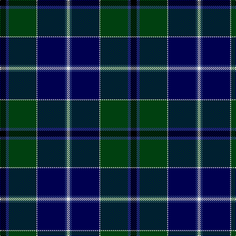

In pattern [KBGWBBW](/patterns/kbgwbbw/).

This was sourced from weddslist.  It is a [7 stripes tartan](/stripes/stripes7/).

Original link http://www.weddslist.com/cgi-bin/tartans/pg.pl?source=sts

## Thread count
K/12 B6 DG56 LN2 DB56 B4 LN/6

## Palette
Each colour and its ΔE from the base-6 reference it is a variant of.

| Colour | Shade | Base | ΔE (OKLab) |
|---|---|---|---|
| B | <code style="background-color:#304080;">#304080</code> `#304080` | B <code style="background-color:#2A418A;">#2A418A</code> | 0.02 |
| DB | <code style="background-color:#000050;">#000050</code> `#000050` | B <code style="background-color:#2A418A;">#2A418A</code> | 0.21 |
| DG | <code style="background-color:#004010;">#004010</code> `#004010` | G <code style="background-color:#006100;">#006100</code> | 0.11 |
| K | <code style="background-color:#000000;">#000000</code> `#000000` | K <code style="background-color:#000000;">#000000</code> | 0.00 |
| LN | <code style="background-color:#E0E0E0;">#E0E0E0</code> `#E0E0E0` | W <code style="background-color:#F7F7F7;">#F7F7F7</code> | 0.07 |

# Sample pattern

## Nearest tartans

The nearest existing variants by ΔTartan distance.

1. [Ogilvy VS](/setts/s8/b28y1b2k16g24k1g2r3x2~b00004c-g004c00-k000000-rc80000-yffc800/) — ΔT 0.73
1. [MacLaren](/setts/s7/b24k8g8r2g8k1y2~b000064-g004c00-k000000-rc80000-yffc800/) — ΔT 0.80
1. [Colquhoun VS](/setts/s7/b4k2b16w1k8g24r4~b000064-g004c00-k000000-rc80000-wd0d0d0/) — ΔT 0.81
1. [Fergusson](/setts/s7/b24k8g8r2g8k1w2~b00004c-g004c00-k000000-rc80000-wd0d0d0/) — ΔT 0.82
1. [Ogilvy Hunting](/setts/s9/b24y2k8g16k1g3k1g3r4x2~b000052-g11450d-k000000-raa0000-yaaaa00/) — ΔT 0.84
1. [Ogilvy VS](/setts/s8/b28y1b2k16g24k1g2r3x2~b000052-g11450d-k000000-raa0000-yaaaa00/) — ΔT 0.84
1. [MacLaren](/setts/s7/b24k8g8r2g8k1y2x2~b000052-g11450d-k000000-raa0000-yaaaa00/) — ΔT 0.85
1. [MacLaren](/setts/s7/b24k8g8r2g8k1y2~b000052-g11450d-k000000-raa0000-yaaaa00/) — ΔT 0.85
1. [Fergusson](/setts/s7/b24k8g8r2g8k1y2x2~b000052-g11450d-k000000-raa0000-yaaaaaa/) — ΔT 0.86
1. [Fergusson](/setts/s7/b24k8g8r2g8k1y2~b000052-g11450d-k000000-raa0000-yaaaaaa/) — ΔT 0.86

## Neighbour map

Every grey dot is one of 15726 variants placed by the first two principal components of the ΔTartan feature space (44% of its variance). Red is this tartan; blue dots are its nearest — click one to open its page.

<svg viewBox="0 0 640 380" role="img" style="max-width:100%;height:auto;border:1px solid #e0e0e0;border-radius:4px;display:block" xmlns="http://www.w3.org/2000/svg"><image href="/nn/cloud.v1.png" width="640" height="380"/><a href="/setts/s8/b28y1b2k16g24k1g2r3x2~b00004c-g004c00-k000000-rc80000-yffc800/"><circle cx="246.2" cy="142.8" r="4" fill="#3465a4"><title>Ogilvy VS</title></circle></a><a href="/setts/s7/b24k8g8r2g8k1y2~b000064-g004c00-k000000-rc80000-yffc800/"><circle cx="245.9" cy="157.4" r="4" fill="#3465a4"><title>MacLaren</title></circle></a><a href="/setts/s7/b4k2b16w1k8g24r4~b000064-g004c00-k000000-rc80000-wd0d0d0/"><circle cx="228.9" cy="159.9" r="4" fill="#3465a4"><title>Colquhoun VS</title></circle></a><a href="/setts/s7/b24k8g8r2g8k1w2~b00004c-g004c00-k000000-rc80000-wd0d0d0/"><circle cx="250.4" cy="159.6" r="4" fill="#3465a4"><title>Fergusson</title></circle></a><a href="/setts/s9/b24y2k8g16k1g3k1g3r4x2~b000052-g11450d-k000000-raa0000-yaaaa00/"><circle cx="236.8" cy="142.5" r="4" fill="#3465a4"><title>Ogilvy Hunting</title></circle></a><a href="/setts/s8/b28y1b2k16g24k1g2r3x2~b000052-g11450d-k000000-raa0000-yaaaa00/"><circle cx="258.6" cy="147.7" r="4" fill="#3465a4"><title>Ogilvy VS</title></circle></a><a href="/setts/s7/b24k8g8r2g8k1y2x2~b000052-g11450d-k000000-raa0000-yaaaa00/"><circle cx="263.8" cy="165.0" r="4" fill="#3465a4"><title>MacLaren</title></circle></a><a href="/setts/s7/b24k8g8r2g8k1y2~b000052-g11450d-k000000-raa0000-yaaaa00/"><circle cx="263.8" cy="165.0" r="4" fill="#3465a4"><title>MacLaren</title></circle></a><a href="/setts/s7/b24k8g8r2g8k1y2x2~b000052-g11450d-k000000-raa0000-yaaaaaa/"><circle cx="264.4" cy="165.1" r="4" fill="#3465a4"><title>Fergusson</title></circle></a><a href="/setts/s7/b24k8g8r2g8k1y2~b000052-g11450d-k000000-raa0000-yaaaaaa/"><circle cx="264.4" cy="165.1" r="4" fill="#3465a4"><title>Fergusson</title></circle></a><circle cx="249.8" cy="145.1" r="5" fill="#c00000"/></svg>

ID: /setts/s7/k6b3g28w1ba28b2w3x2~b304080-ba000050-g004010-k000000-we0e0e0/
