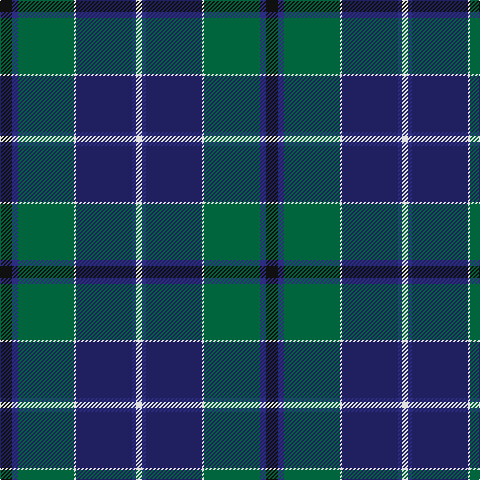

**Bands:** [KBGWBBW](/stripes/kbgwbbw/) · **Stripes:** [K DB G W DB DB W](/stripes/stripes7/) K DB G W DB DB W

This was sourced from tartans-authority.  It is a [7 band tartan](/bands/bands7/).

Original link http://www.tartansauthority.com/tartan-ferret/display/2617/

## Thread count
K/12 DB6 G56 LN2 DBa56 DB4 LN/6

## Palette
Each colour and its ΔE from the base-6 reference it is a variant of.

| Colour | Shade | Base | ΔE (OKLab) |
|---|---|---|---|
| DB | <code style="background-color:#2C2C80;">#2C2C80</code> `#2C2C80` | B <code style="background-color:#2A418A;">#2A418A</code> | 0.06 |
| DBa | <code style="background-color:#202060;">#202060</code> `#202060` | B <code style="background-color:#2A418A;">#2A418A</code> | 0.11 |
| G | <code style="background-color:#00643C;">#00643C</code> `#00643C` | G <code style="background-color:#006100;">#006100</code> | 0.05 |
| K | <code style="background-color:#101010;">#101010</code> `#101010` | K <code style="background-color:#000000;">#000000</code> | 0.17 |
| LN | <code style="background-color:#E0E0E0;">#E0E0E0</code> `#E0E0E0` | W <code style="background-color:#F7F7F7;">#F7F7F7</code> | 0.07 |

# Sample pattern

## Nearest tartans

The nearest existing variants by ΔTartan distance.

1. [Ogilvie of Inverarity - 1842 (V.S.)](/setts/s8/db28ly1db2k26g24k1g2r3~x2/) — ΔT 0.81
1. [Laurie Clan Tartan Tartan Number: 3201. Earliest known date: 2000 One of a set of three similar designs for Laurie, Lawrie and Lowry, designed by Peter MacDonald for Iain Laurie. See products available Copyright © Blair Urquhart, Comrie, 2015](/setts/s7/dp6r2dp1g25db16k2db4~x2/) — ΔT 0.86
1. [Lowry](/setts/s7/dp6ly2dp1g25db16k2db4~x2/) — ΔT 0.87
1. [West Lothian](/setts/s9/g40k8g4k8g4r14db64t9db3/) — ΔT 0.93
1. [Colquhoun](/setts/s7/db4k2db16w1k8dg24r4~x2/) — ΔT 0.95
1. [Lawrie Clan Tartan Tartan Number: 3202. Earliest known date: 2000 One of a set of three similar designs for Laurie, Lawrie and Lowry, designed by Peter MacDonald for Iain Laurie. See products available Copyright © Blair Urquhart, Comrie, 2015](/setts/s7/dp6o2dp1g25db16k2db4~x2/) — ΔT 0.97
1. [Spirit of Morningside (Fashion)](/setts/s10/dp4db5dp3db50k15g3k5g32w2g3/) — ΔT 1.01
1. [McFadden (Personal)](/setts/s8/db18dp2db16k13g3k2g42lo3~x2/) — ΔT 1.04
1. [Weisfeld](/setts/s7/k6db3dg28w1db28db2w3~x2/) — ΔT 1.05
1. [Ferguson of Atholl Clan](/setts/s7/b24k8g8r2g8k1w2~x2/) — ΔT 1.08

## Neighbour map

Every grey dot is one of 14313 variants placed by the first two principal components of the ΔTartan feature space (44% of its variance). Red is this tartan; blue dots are its nearest — click one to open its page.

<svg viewBox="0 0 640 380" role="img" style="max-width:100%;height:auto;border:1px solid #e0e0e0;border-radius:4px;display:block" xmlns="http://www.w3.org/2000/svg"><image href="/nn/cloud.v1.png" width="640" height="380"/><a href="/setts/s8/db28ly1db2k26g24k1g2r3~x2/"><circle cx="245.6" cy="149.2" r="4" fill="#3465a4"><title>Ogilvie of Inverarity - 1842 (V.S.)</title></circle></a><a href="/setts/s7/dp6r2dp1g25db16k2db4~x2/"><circle cx="299.7" cy="166.2" r="4" fill="#3465a4"><title>Laurie Clan Tartan Tartan Number: 3201. Earliest known date: 2000 One of a set of three similar designs for Laurie, Lawrie and Lowry, designed by Peter MacDonald for Iain Laurie. See products available Copyright © Blair Urquhart, Comrie, 2015</title></circle></a><a href="/setts/s7/dp6ly2dp1g25db16k2db4~x2/"><circle cx="304.0" cy="169.6" r="4" fill="#3465a4"><title>Lowry</title></circle></a><a href="/setts/s9/g40k8g4k8g4r14db64t9db3/"><circle cx="261.2" cy="145.8" r="4" fill="#3465a4"><title>West Lothian</title></circle></a><a href="/setts/s7/db4k2db16w1k8dg24r4~x2/"><circle cx="265.4" cy="175.0" r="4" fill="#3465a4"><title>Colquhoun</title></circle></a><a href="/setts/s7/dp6o2dp1g25db16k2db4~x2/"><circle cx="304.7" cy="169.8" r="4" fill="#3465a4"><title>Lawrie Clan Tartan Tartan Number: 3202. Earliest known date: 2000 One of a set of three similar designs for Laurie, Lawrie and Lowry, designed by Peter MacDonald for Iain Laurie. See products available Copyright © Blair Urquhart, Comrie, 2015</title></circle></a><a href="/setts/s10/dp4db5dp3db50k15g3k5g32w2g3/"><circle cx="293.4" cy="135.3" r="4" fill="#3465a4"><title>Spirit of Morningside (Fashion)</title></circle></a><a href="/setts/s8/db18dp2db16k13g3k2g42lo3~x2/"><circle cx="270.5" cy="160.1" r="4" fill="#3465a4"><title>McFadden (Personal)</title></circle></a><a href="/setts/s7/k6db3dg28w1db28db2w3~x2/"><circle cx="253.7" cy="149.1" r="4" fill="#3465a4"><title>Weisfeld</title></circle></a><a href="/setts/s7/b24k8g8r2g8k1w2~x2/"><circle cx="253.7" cy="157.0" r="4" fill="#3465a4"><title>Ferguson of Atholl Clan</title></circle></a><circle cx="268.8" cy="151.9" r="5" fill="#c00000"/></svg>

ID: /setts/s7/k6db3g28w1db28db2w3~x2/
