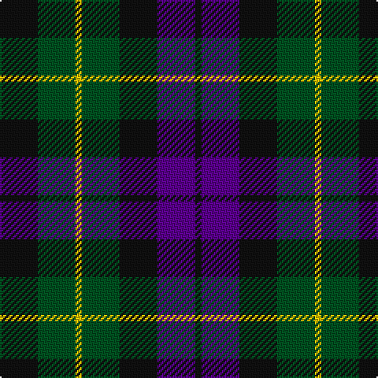

In pattern [KBKGYGK](/stripes/kbkgygk/).

This was sourced from register-of-tartans.  It is a [7 stripe tartan](/stripes/stripes7/).

Original link https://www.tartanregister.gov.uk/tartanDetails.aspx?ref=12

## Also known as

This cloth is also recorded under:

- Abercrombie,

## Register references

External register numbers recorded for this tartan.

- Scottish Register of Tartans: [12](https://www.tartanregister.gov.uk/tartanDetails.aspx?ref=12)
- Scottish Tartans World Register: 1048

## Thread count
K/24 G24 Y4 G24 K24 P24 K/4

## Palette
Each colour and its ΔE from the base-6 reference it is a variant of.

| Colour | Shade | Base | ΔE (OKLab) |
|---|---|---|---|
| G | <code style="background-color:#005020;">#005020</code> `#005020` | G <code style="background-color:#006100;">#006100</code> | 0.07 |
| K | <code style="background-color:#101010;">#101010</code> `#101010` | K <code style="background-color:#000000;">#000000</code> | 0.17 |
| P | <code style="background-color:#5A008C;">#5A008C</code> `#5A008C` | B <code style="background-color:#2A418A;">#2A418A</code> | 0.13 |
| Y | <code style="background-color:#E8C000;">#E8C000</code> `#E8C000` | Y <code style="background-color:#F2BF00;">#F2BF00</code> | 0.02 |

# Sample pattern

## Nearest tartans

The nearest existing variants by ΔTartan distance.

1. [Wilson's No 97](/setts/s7/k11dg12k2dg12k12dp12w3~x2/) — ΔT 0.55
1. [MacNeil of Colonsay](/setts/s7/db4dg6w1dg6k6db6k2~x2/) — ΔT 0.67
1. [MacLaggan](/setts/s7/k13g12w2g12k13dp12k2~x2/) — ΔT 0.80
1. [MacNeil of Colonsay (Clan)](/setts/s7/db16g14w2g14k13db12k4~x2/) — ΔT 0.86
1. [MacKay Coat](/setts/s7/k4dg4ly1dg4k4db4k1~x2/) — ΔT 0.89
1. [Unidentified No 39](/setts/s7/k4dg4k1dg4k4db4ly1~x2/) — ΔT 0.89
1. [Unidentified Pinafore](/setts/s7/dg24k4dg24k24t7r24t7~x2/) — ΔT 0.93
1. [Gunn - 1810 (Clan)](/setts/s6/r4g12k12g2db12g3~x2/) — ΔT 0.93
1. [Wilson's No 108](/setts/s8/k7dg7k1dg7k7t1dp7k1~x4/) — ΔT 0.95
1. [MacCallum](/setts/s7/g21k6t3g11k17db17k3~x2/) — ΔT 1.00

## Neighbour map

Every grey dot is one of 14299 variants placed by the first two principal components of the ΔTartan feature space (44% of its variance). Red is this tartan; blue dots are its nearest — click one to open its page.

<svg viewBox="0 0 640 380" role="img" style="max-width:100%;height:auto;border:1px solid #e0e0e0;border-radius:4px;display:block" xmlns="http://www.w3.org/2000/svg"><image href="/nn/cloud.v1.png" width="640" height="380"/><a href="/setts/s7/k11dg12k2dg12k12dp12w3~x2/"><circle cx="165.1" cy="274.7" r="4" fill="#3465a4"><title>Wilson's No 97</title></circle></a><a href="/setts/s7/db4dg6w1dg6k6db6k2~x2/"><circle cx="161.7" cy="279.7" r="4" fill="#3465a4"><title>MacNeil of Colonsay</title></circle></a><a href="/setts/s7/k13g12w2g12k13dp12k2~x2/"><circle cx="185.5" cy="266.3" r="4" fill="#3465a4"><title>MacLaggan</title></circle></a><a href="/setts/s7/db16g14w2g14k13db12k4~x2/"><circle cx="173.9" cy="269.3" r="4" fill="#3465a4"><title>MacNeil of Colonsay (Clan)</title></circle></a><a href="/setts/s7/k4dg4ly1dg4k4db4k1~x2/"><circle cx="169.0" cy="305.0" r="4" fill="#3465a4"><title>MacKay Coat</title></circle></a><a href="/setts/s7/k4dg4k1dg4k4db4ly1~x2/"><circle cx="169.0" cy="305.0" r="4" fill="#3465a4"><title>Unidentified No 39</title></circle></a><a href="/setts/s7/dg24k4dg24k24t7r24t7~x2/"><circle cx="192.5" cy="268.7" r="4" fill="#3465a4"><title>Unidentified Pinafore</title></circle></a><a href="/setts/s6/r4g12k12g2db12g3~x2/"><circle cx="167.6" cy="263.6" r="4" fill="#3465a4"><title>Gunn - 1810 (Clan)</title></circle></a><a href="/setts/s8/k7dg7k1dg7k7t1dp7k1~x4/"><circle cx="234.9" cy="264.8" r="4" fill="#3465a4"><title>Wilson's No 108</title></circle></a><a href="/setts/s7/g21k6t3g11k17db17k3~x2/"><circle cx="205.9" cy="262.1" r="4" fill="#3465a4"><title>MacCallum</title></circle></a><circle cx="192.7" cy="278.7" r="5" fill="#c00000"/></svg>

ID: /setts/s7/k6dg6ly1dg6k6dp6k1~x4/
