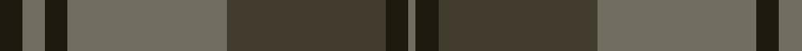

In pattern [GKGGKGK](/patterns/gkggkgk/).

This was sourced from house-of-tartan.  It is a [7 stripes tartan](/stripes/stripes7/).

Original link http://www.house-of-tartan.scotland.net/house/TartanViewjs.asp?colr=Def&tnam=7459

## Thread count
K/6 N6 K6 N42 T42 K6 N/2

## Palette
Each colour and its ΔE from the base-6 reference it is a variant of.

| Colour | Shade | Base | ΔE (OKLab) |
|---|---|---|---|
| K | <code style="background-color:#1E1A10;">#1E1A10</code> `#1E1A10` | K <code style="background-color:#000000;">#000000</code> | 0.22 |
| N | <code style="background-color:#716D61;">#716D61</code> `#716D61` | G <code style="background-color:#006100;">#006100</code> | 0.17 |
| T | <code style="background-color:#413C2E;">#413C2E</code> `#413C2E` | G <code style="background-color:#006100;">#006100</code> | 0.15 |

# Sample pattern

## Nearest tartans

The nearest existing variants by ΔTartan distance.

1. [Brave for Men (Fashion)](/setts/s8/k5g5k5g34b33k6b5r2-b5c5c5c-g604000-k101010-r888888/) — ΔT 1.17
1. [Lindsay](/setts/s9/g40b4g4b4g4b16ba48b4ba6-b000052-ba59110d-g11450d/) — ΔT 1.51
1. [Lindsay](/setts/s9/g20b2g2b2g2b8ba24b2ba3-b000052-ba59110d-g11450d/) — ΔT 1.51
1. [Southdown Grey](/setts/s10/b12r8ra4b8ba24b24ba16b24r88ra12-b4c3428-ba5c5c5c-r888888-ra880000/) — ΔT 1.54
1. [Nithsdale](/setts/s10/g40r8ga8r24ga64r4ga8r4ga12r24-g005448-ga5c6428-ra00000/) — ΔT 1.55
1. [Aisteach](/setts/s7/b64g32r28k8r12b14k4-b3d2e60-g005020-k1c1714-r97342f/) — ΔT 1.60
1. [Eastern Western Motor Group, Dalbraith](/setts/s8/g56ga4g8b36ga46b4ga6y8-b202060-g604000-ga006818-ya08858/) — ΔT 1.62
1. [Hanna of Leith (yellow line)](/setts/s10/g18b8g4b8g4b60g18b8ba28y4-b5c5c5c-ba2888c4-g603800-yd09800/) — ΔT 1.65
1. [Gray (Name)](/setts/s10/r6g66ga20r6ga6r6ga6r16g20r6-g6c6c6c-ga006818-ra00000/) — ΔT 1.67
1. [Gammell (Brown) (Personal)](/setts/s8/b40g4b4g4b4g12ga30g4-b2c2c80-g604000-ga006818/) — ΔT 1.73

## Neighbour map

Every grey dot is one of 15726 variants placed by the first two principal components of the ΔTartan feature space (44% of its variance). Red is this tartan; blue dots are its nearest — click one to open its page.

<svg viewBox="0 0 640 380" role="img" style="max-width:100%;height:auto;border:1px solid #e0e0e0;border-radius:4px;display:block" xmlns="http://www.w3.org/2000/svg"><image href="/nn/cloud.v1.png" width="640" height="380"/><a href="/setts/s8/k5g5k5g34b33k6b5r2-b5c5c5c-g604000-k101010-r888888/"><circle cx="352.7" cy="206.2" r="4" fill="#3465a4"><title>Brave for Men (Fashion)</title></circle></a><a href="/setts/s9/g40b4g4b4g4b16ba48b4ba6-b000052-ba59110d-g11450d/"><circle cx="347.4" cy="221.8" r="4" fill="#3465a4"><title>Lindsay</title></circle></a><a href="/setts/s9/g20b2g2b2g2b8ba24b2ba3-b000052-ba59110d-g11450d/"><circle cx="347.4" cy="221.8" r="4" fill="#3465a4"><title>Lindsay</title></circle></a><a href="/setts/s10/b12r8ra4b8ba24b24ba16b24r88ra12-b4c3428-ba5c5c5c-r888888-ra880000/"><circle cx="327.9" cy="169.8" r="4" fill="#3465a4"><title>Southdown Grey</title></circle></a><a href="/setts/s10/g40r8ga8r24ga64r4ga8r4ga12r24-g005448-ga5c6428-ra00000/"><circle cx="389.7" cy="222.0" r="4" fill="#3465a4"><title>Nithsdale</title></circle></a><a href="/setts/s7/b64g32r28k8r12b14k4-b3d2e60-g005020-k1c1714-r97342f/"><circle cx="348.8" cy="226.7" r="4" fill="#3465a4"><title>Aisteach</title></circle></a><a href="/setts/s8/g56ga4g8b36ga46b4ga6y8-b202060-g604000-ga006818-ya08858/"><circle cx="285.3" cy="210.8" r="4" fill="#3465a4"><title>Eastern Western Motor Group, Dalbraith</title></circle></a><a href="/setts/s10/g18b8g4b8g4b60g18b8ba28y4-b5c5c5c-ba2888c4-g603800-yd09800/"><circle cx="393.4" cy="205.6" r="4" fill="#3465a4"><title>Hanna of Leith (yellow line)</title></circle></a><a href="/setts/s10/r6g66ga20r6ga6r6ga6r16g20r6-g6c6c6c-ga006818-ra00000/"><circle cx="411.5" cy="217.0" r="4" fill="#3465a4"><title>Gray (Name)</title></circle></a><a href="/setts/s8/b40g4b4g4b4g12ga30g4-b2c2c80-g604000-ga006818/"><circle cx="337.0" cy="231.4" r="4" fill="#3465a4"><title>Gammell (Brown) (Personal)</title></circle></a><circle cx="393.1" cy="215.7" r="5" fill="#c00000"/></svg>

ID: /setts/s7/k6g6k6g42ga42k6g2-g716d61-ga413c2e-k1e1a10/
