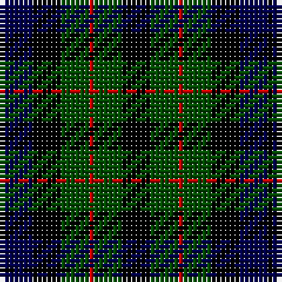

In pattern [KBKGRGK](/patterns/kbkgrgk/).

This was sourced from weddslist.  It is a [7 stripes tartan](/stripes/stripes7/).

Original link http://www.weddslist.com/cgi-bin/tartans/pg.pl?source=rb

## Thread count
K/1 DB6 K6 G6 R1 G6 K/6

## Palette
Each colour and its ΔE from the base-6 reference it is a variant of.

| Colour | Shade | Base | ΔE (OKLab) |
|---|---|---|---|
| DB | <code style="background-color:#00004C;">#00004C</code> `#00004C` | B <code style="background-color:#2A418A;">#2A418A</code> | 0.21 |
| G | <code style="background-color:#004C00;">#004C00</code> `#004C00` | G <code style="background-color:#006100;">#006100</code> | 0.07 |
| K | <code style="background-color:#000000;">#000000</code> `#000000` | K <code style="background-color:#000000;">#000000</code> | 0.00 |
| R | <code style="background-color:#C80000;">#C80000</code> `#C80000` | R <code style="background-color:#CC0000;">#CC0000</code> | 0.01 |

# Sample pattern

## Nearest tartans

The nearest existing variants by ΔTartan distance.

1. [MacCallum W](/setts/s7/k12g12r2g12k12b12k2-b000052-g11450d-k000000-raa0000/) — ΔT 0.34
1. [MacCallum W](/setts/s7/k6g6r1g6k6b6k1-b000052-g11450d-k000000-raa0000/) — ΔT 0.34
1. [Campbell of Breadalbane](/setts/s7/k18g18y4g18k18b18k6-b000052-g11450d-k000000-yaaaa00/) — ΔT 0.65
1. [Campbell of Breadalbane](/setts/s7/k9g9y2g9k9b9k3-b000052-g11450d-k000000-yaaaa00/) — ΔT 0.65
1. [MacNiel of Colonsay](/setts/s7/b8g12y2g12k12b12k4-b000052-g11450d-k000000-yaaaaaa/) — ΔT 0.75
1. [Graham of Montrose](/setts/s7/k8g8y2g8k8b8k2-b000052-g11450d-k000000-yaaaaaa/) — ΔT 0.76
1. [Graham of Montrose](/setts/s7/k4g4y1g4k4b4k1-b000052-g11450d-k000000-yaaaaaa/) — ΔT 0.76
1. [Campbell Breadalbane](/setts/s7/k9g9y2g9k9b9k3-b00004c-g004c00-k000000-yffc800/) — ΔT 0.83
1. [MacNeil of Colonsay](/setts/s7/b8g12w2g12k12b12k4-b000064-g004c00-k000000-wd0d0d0/) — ΔT 0.88
1. [Graham of Montrose](/setts/s7/k4g4w1g4k4b4k1-b00004c-g004c00-k000000-wd0d0d0/) — ΔT 0.91

## Neighbour map

Every grey dot is one of 15726 variants placed by the first two principal components of the ΔTartan feature space (44% of its variance). Red is this tartan; blue dots are its nearest — click one to open its page.

<svg viewBox="0 0 640 380" role="img" style="max-width:100%;height:auto;border:1px solid #e0e0e0;border-radius:4px;display:block" xmlns="http://www.w3.org/2000/svg"><image href="/nn/cloud.v1.png" width="640" height="380"/><a href="/setts/s7/k12g12r2g12k12b12k2-b000052-g11450d-k000000-raa0000/"><circle cx="183.4" cy="278.5" r="4" fill="#3465a4"><title>MacCallum W</title></circle></a><a href="/setts/s7/k6g6r1g6k6b6k1-b000052-g11450d-k000000-raa0000/"><circle cx="183.4" cy="278.5" r="4" fill="#3465a4"><title>MacCallum W</title></circle></a><a href="/setts/s7/k18g18y4g18k18b18k6-b000052-g11450d-k000000-yaaaa00/"><circle cx="152.8" cy="294.3" r="4" fill="#3465a4"><title>Campbell of Breadalbane</title></circle></a><a href="/setts/s7/k9g9y2g9k9b9k3-b000052-g11450d-k000000-yaaaa00/"><circle cx="152.8" cy="294.3" r="4" fill="#3465a4"><title>Campbell of Breadalbane</title></circle></a><a href="/setts/s7/b8g12y2g12k12b12k4-b000052-g11450d-k000000-yaaaaaa/"><circle cx="157.9" cy="281.9" r="4" fill="#3465a4"><title>MacNiel of Colonsay</title></circle></a><a href="/setts/s7/k8g8y2g8k8b8k2-b000052-g11450d-k000000-yaaaaaa/"><circle cx="143.3" cy="294.4" r="4" fill="#3465a4"><title>Graham of Montrose</title></circle></a><a href="/setts/s7/k4g4y1g4k4b4k1-b000052-g11450d-k000000-yaaaaaa/"><circle cx="143.3" cy="294.4" r="4" fill="#3465a4"><title>Graham of Montrose</title></circle></a><a href="/setts/s7/k9g9y2g9k9b9k3-b00004c-g004c00-k000000-yffc800/"><circle cx="140.8" cy="289.1" r="4" fill="#3465a4"><title>Campbell Breadalbane</title></circle></a><a href="/setts/s7/b8g12w2g12k12b12k4-b000064-g004c00-k000000-wd0d0d0/"><circle cx="142.3" cy="275.5" r="4" fill="#3465a4"><title>MacNeil of Colonsay</title></circle></a><a href="/setts/s7/k4g4w1g4k4b4k1-b00004c-g004c00-k000000-wd0d0d0/"><circle cx="132.0" cy="290.0" r="4" fill="#3465a4"><title>Graham of Montrose</title></circle></a><circle cx="174.2" cy="275.0" r="5" fill="#c00000"/></svg>

ID: /setts/s7/k6g6r1g6k6b6k1-b00004c-g004c00-k000000-rc80000/
