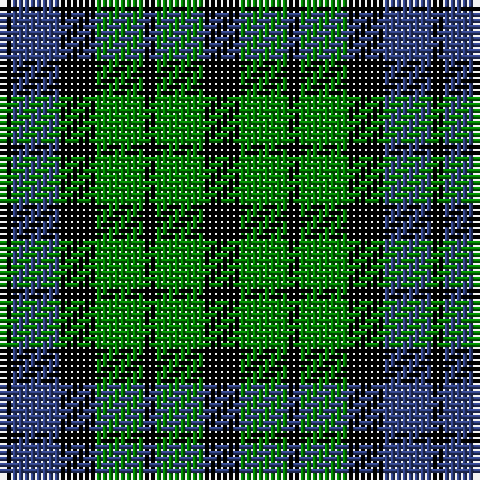

In pattern [KBKGKGK](/patterns/kbkgkgk/).

This was sourced from weddslist.  It is a [7 stripes tartan](/stripes/stripes7/).

Original link http://www.weddslist.com/cgi-bin/tartans/pg.pl?source=sts

## Thread count
K/2 B8 K6 G8 K2 G8 K/6

## Palette
Each colour and its ΔE from the base-6 reference it is a variant of.

| Colour | Shade | Base | ΔE (OKLab) |
|---|---|---|---|
| B | <code style="background-color:#304080;">#304080</code> `#304080` | B <code style="background-color:#2A418A;">#2A418A</code> | 0.02 |
| G | <code style="background-color:#008000;">#008000</code> `#008000` | G <code style="background-color:#006100;">#006100</code> | 0.10 |
| K | <code style="background-color:#000000;">#000000</code> `#000000` | K <code style="background-color:#000000;">#000000</code> | 0.00 |

# Sample pattern

## Nearest tartans

The nearest existing variants by ΔTartan distance.

1. [MacKay, Coat](/setts/s7/k8g8y2g8k8b8k2-b304080-g008000-k000000-yf0c000/) — ΔT 0.91
1. [Unnamed, No 39](/setts/s7/k8g8k2g8k8b8y2-b304080-g008000-k000000-yf0c000/) — ΔT 0.91
1. [Graham of Montrose](/setts/s7/k16g16w4g16k16b16k4-b304080-g008000-k000000-we0e0e0/) — ΔT 0.92
1. [Campbell of Breadalbane](/setts/s7/k18g18y4g18k18b18k6-b304080-g008000-k000000-yf0c000/) — ΔT 0.93
1. [Unnamed 1](/setts/s5/k10g28k32b24g8-b000050-g008000-k000000/) — ΔT 0.93
1. [Campbell, the 42nd](/setts/s6/b6k6b18k18g22k5-b304080-g008000-k000000/) — ΔT 0.97
1. [Campbell of Breadalbane (Clan)](/setts/s7/k18g18y4g18k18b18k6-b2c2c80-g006818-k000000-ydcbc00/) — ΔT 1.03
1. [Norwich No.064](/setts/s8/b24k32g28k10g28k32b24g8-b2c2c80-g006818-k000000/) — ΔT 1.03
1. [Austin, or Keith](/setts/s5/b8k8b8g18k4-b304080-g008000-k000000/) — ΔT 1.03
1. [Sutherland, 42nd](/setts/s6/b4k4b12k12g12k4-b304080-g008000-k000000/) — ΔT 1.05

## Neighbour map

Every grey dot is one of 15726 variants placed by the first two principal components of the ΔTartan feature space (44% of its variance). Red is this tartan; blue dots are its nearest — click one to open its page.

<svg viewBox="0 0 640 380" role="img" style="max-width:100%;height:auto;border:1px solid #e0e0e0;border-radius:4px;display:block" xmlns="http://www.w3.org/2000/svg"><image href="/nn/cloud.v1.png" width="640" height="380"/><a href="/setts/s7/k8g8y2g8k8b8k2-b304080-g008000-k000000-yf0c000/"><circle cx="109.0" cy="277.3" r="4" fill="#3465a4"><title>MacKay, Coat</title></circle></a><a href="/setts/s7/k8g8k2g8k8b8y2-b304080-g008000-k000000-yf0c000/"><circle cx="109.0" cy="277.3" r="4" fill="#3465a4"><title>Unnamed, No 39</title></circle></a><a href="/setts/s7/k16g16w4g16k16b16k4-b304080-g008000-k000000-we0e0e0/"><circle cx="107.3" cy="276.8" r="4" fill="#3465a4"><title>Graham of Montrose</title></circle></a><a href="/setts/s7/k18g18y4g18k18b18k6-b304080-g008000-k000000-yf0c000/"><circle cx="117.0" cy="276.5" r="4" fill="#3465a4"><title>Campbell of Breadalbane</title></circle></a><a href="/setts/s5/k10g28k32b24g8-b000050-g008000-k000000/"><circle cx="155.2" cy="309.8" r="4" fill="#3465a4"><title>Unnamed 1</title></circle></a><a href="/setts/s6/b6k6b18k18g22k5-b304080-g008000-k000000/"><circle cx="152.4" cy="284.4" r="4" fill="#3465a4"><title>Campbell, the 42nd</title></circle></a><a href="/setts/s7/k18g18y4g18k18b18k6-b2c2c80-g006818-k000000-ydcbc00/"><circle cx="127.0" cy="280.9" r="4" fill="#3465a4"><title>Campbell of Breadalbane (Clan)</title></circle></a><a href="/setts/s8/b24k32g28k10g28k32b24g8-b2c2c80-g006818-k000000/"><circle cx="136.1" cy="305.2" r="4" fill="#3465a4"><title>Norwich No.064</title></circle></a><a href="/setts/s5/b8k8b8g18k4-b304080-g008000-k000000/"><circle cx="154.3" cy="297.0" r="4" fill="#3465a4"><title>Austin, or Keith</title></circle></a><a href="/setts/s6/b4k4b12k12g12k4-b304080-g008000-k000000/"><circle cx="147.1" cy="306.0" r="4" fill="#3465a4"><title>Sutherland, 42nd</title></circle></a><circle cx="138.6" cy="296.5" r="5" fill="#c00000"/></svg>

ID: /setts/s7/k6g8k2g8k6b8k2-b304080-g008000-k000000/
