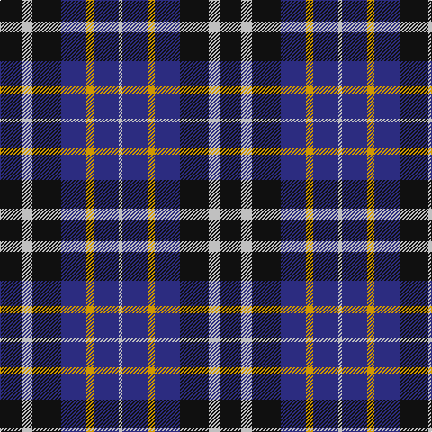

In pattern [KWKBYBW](/stripes/kwkbybw/).

This was sourced from tartans-authority.  It is a [7 stripe tartan](/stripes/stripes7/).

Original link http://www.tartansauthority.com/tartan-ferret/display/2425/

## Thread count
K/24 N12 K32 DB28 DY8 DB28 N/4

## Palette
Each colour and the base-6 reference it is a variant of.

| Colour | Shade | Base |
|---|---|---|
| DB | <code style="background-color:#2C2C80;">#2C2C80</code> `oklch(35.0% 0.138 276.6)` <small>#2C2C80</small> | B <code style="background-color:#2A418A;">#2A418A</code> |
| DY | <code style="background-color:#D09800;">#D09800</code> `oklch(71.4% 0.147 82.1)` <small>#D09800</small> | Y <code style="background-color:#F2BF00;">#F2BF00</code> |
| K | <code style="background-color:#101010;">#101010</code> `oklch(17.3% 0.000 89.9)` <small>#101010</small> | K <code style="background-color:#000000;">#000000</code> |
| N | <code style="background-color:#C0C0C0;">#C0C0C0</code> `oklch(80.8% 0.000 89.9)` <small>#C0C0C0</small> | W <code style="background-color:#F7F7F7;">#F7F7F7</code> |

# Sample pattern

## Nearest tartans

The nearest existing variants by ΔTartan distance.

1. [Greyhound Grenadiers (Corporate)](/setts/s7/db9k7o5r1o5k1o2~x4/) — ΔT 0.81
1. [Baillie (Highland Society)](/setts/s7/dp3k1dp8k6dg8k1w2~x2/) — ΔT 1.02
1. [Kilmarnock Football Club (Old)](/setts/s8/db3w3db5k6ly1~x4/) — ΔT 1.11
1. [St. Johnstone Football Club](/setts/s12/k6lb3k8db7lo2db7lb1~x4/) — ΔT 1.18
1. [Old Brigade](/setts/s6/db9k9r3db9k9ly1~x4/) — ΔT 1.19
1. [Allianz Deutschland 2012](/setts/s7/n6db3n6db20k20db8w4~x2/) — ΔT 1.28
1. [Scotsburn Croft](/setts/s9/lg16k3lg16k26dp4k26o20k3o8/) — ΔT 1.31
1. [Kilgour](/setts/s6/db14dg21db4r21db14ly2~x2/) — ΔT 1.32
1. [Hawick Rugby Club (Corporate)](/setts/s6/db2ly1db7w1k7w2~x6/) — ΔT 1.33
1. [Kilgour](/setts/s6/db14g21db4r21db14ly2~x2/) — ΔT 1.33

## Neighbour map

Every grey dot is one of 14299 variants placed by the first two principal components of the ΔTartan feature space (44% of its variance). Red is this tartan; blue dots are its nearest — click one to open its page.

<svg viewBox="0 0 640 380" role="img" style="max-width:100%;height:auto;border:1px solid #e0e0e0;border-radius:4px;display:block" xmlns="http://www.w3.org/2000/svg"><image href="/nn/cloud.v1.png" width="640" height="380"/><a href="/setts/s7/db9k7o5r1o5k1o2~x4/"><circle cx="185.6" cy="220.7" r="4" fill="#3465a4"><title>Greyhound Grenadiers (Corporate)</title></circle></a><a href="/setts/s7/dp3k1dp8k6dg8k1w2~x2/"><circle cx="177.2" cy="225.7" r="4" fill="#3465a4"><title>Baillie (Highland Society)</title></circle></a><a href="/setts/s8/db3w3db5k6ly1~x4/"><circle cx="124.8" cy="250.0" r="4" fill="#3465a4"><title>Kilmarnock Football Club (Old)</title></circle></a><a href="/setts/s12/k6lb3k8db7lo2db7lb1~x4/"><circle cx="181.6" cy="224.4" r="4" fill="#3465a4"><title>St. Johnstone Football Club</title></circle></a><a href="/setts/s6/db9k9r3db9k9ly1~x4/"><circle cx="233.7" cy="264.0" r="4" fill="#3465a4"><title>Old Brigade</title></circle></a><a href="/setts/s7/n6db3n6db20k20db8w4~x2/"><circle cx="199.7" cy="236.2" r="4" fill="#3465a4"><title>Allianz Deutschland 2012</title></circle></a><a href="/setts/s9/lg16k3lg16k26dp4k26o20k3o8/"><circle cx="197.6" cy="209.6" r="4" fill="#3465a4"><title>Scotsburn Croft</title></circle></a><a href="/setts/s6/db14dg21db4r21db14ly2~x2/"><circle cx="197.8" cy="227.0" r="4" fill="#3465a4"><title>Kilgour</title></circle></a><a href="/setts/s6/db2ly1db7w1k7w2~x6/"><circle cx="197.2" cy="217.3" r="4" fill="#3465a4"><title>Hawick Rugby Club (Corporate)</title></circle></a><a href="/setts/s6/db14g21db4r21db14ly2~x2/"><circle cx="185.6" cy="224.4" r="4" fill="#3465a4"><title>Kilgour</title></circle></a><circle cx="180.7" cy="242.7" r="5" fill="#c00000"/></svg>

ID: /setts/s7/k6lb3k8db7lo2db7lb1~x4/
