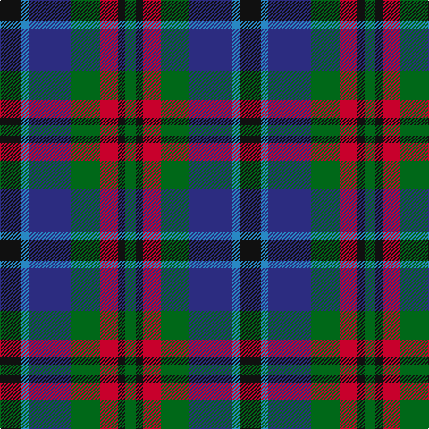

In pattern [GKRGBBK](/stripes/gkrgbbk/).

This was sourced from register-of-tartans.  It is a [7 stripe tartan](/stripes/stripes7/).

Original link https://www.tartanregister.gov.uk/tartanDetails.aspx?ref=751

## Attestations

This cloth appears in 3 source records; the oldest owns this page.

- 01/01/1993 — Cooke (Personal) (register-of-tartans, [record](https://www.tartanregister.gov.uk/tartanDetails.aspx?ref=751))
- circa 1993 — Cooke (Personal) (tartans-authority, [record](http://www.tartansauthority.com/tartan-ferret/display/2130/))
- undated — Cooke Family Tartan Tartan Number: 2131. Earliest known date: 1993 Designed for Mr Bob Cooke and his family. Cookes were seafarers from the West Coast of Scotland and Ireland. Some including the designer, can trace forebears to Liverpool and the North West coast of England. The colours of the tartan reflect the seas, the skys and the heart of the sailor. See products available Copyright © Blair Urquhart, Comrie, 2015 (house-of-tartan, [record](http://www.house-of-tartan.scotland.net/house/TartanViewjs.asp?colr=Def&tnam=2131))

## Register references

External register numbers recorded for this tartan.

- Scottish Register of Tartans: [751](https://www.tartanregister.gov.uk/tartanDetails.aspx?ref=751)
- Scottish Tartans Authority (ITI): 2130
- Scottish Tartans World Register: 2130

## Thread count
K/24 B8 DB48 G32 R20 K8 G/12

## Palette
Each colour and its ΔE from the base-6 reference it is a variant of.

| Colour | Shade | Base | ΔE (OKLab) |
|---|---|---|---|
| B | <code style="background-color:#2888C4;">#2888C4</code> `#2888C4` | B <code style="background-color:#2A418A;">#2A418A</code> | 0.21 |
| DB | <code style="background-color:#2C2C80;">#2C2C80</code> `#2C2C80` | B <code style="background-color:#2A418A;">#2A418A</code> | 0.06 |
| G | <code style="background-color:#006818;">#006818</code> `#006818` | G <code style="background-color:#006100;">#006100</code> | 0.02 |
| K | <code style="background-color:#101010;">#101010</code> `#101010` | K <code style="background-color:#000000;">#000000</code> | 0.17 |
| R | <code style="background-color:#C8002C;">#C8002C</code> `#C8002C` | R <code style="background-color:#CC0000;">#CC0000</code> | 0.03 |

# Sample pattern

## Nearest tartans

The nearest existing variants by ΔTartan distance.

1. [MacEachain (Clan)](/setts/s6/r2k1db6k2g6m2~x4/) — ΔT 0.42
1. [Wellington](/setts/s6/db1r1db6k6dg6w1~x2/) — ΔT 0.68
1. [Hogarth of Firhill](/setts/s7/t2g6ly1k6db6k1db1~x2/) — ΔT 0.73
1. [Swankie (Personal)](/setts/s7/k4b21dy10y4k20r6b3~x2/) — ΔT 0.77
1. [Hogarth of Firhill #2](/setts/s7/b2dg6ly1k6db6k1db1~x2/) — ΔT 0.78
1. [Hogarth of Firhill (Clan)](/setts/s7/t4g14ly2k14db14k2db3~x2/) — ΔT 0.80
1. [Birse](/setts/s6/k4g16k14lo3n16r4~x2/) — ΔT 0.80
1. [Argyll](/setts/s7/r2k1db8k8g8k1t2~x2/) — ΔT 0.81
1. [Campbell of Cawdor](/setts/s7/r2k1db8k8g8k1t2~x4/) — ΔT 0.81
1. [Campbell of Cawdor Clan Tartan Tartan Number: 2. Earliest known date: 1798 Campbell of Cawdor is one of Wilson's variations based on the military sett. It was originally a numbered pattern, acquiring the name 'Argyle' in 1798 and 'Argylle' in 1819. It is not until W. and A. Smith's work of 1850 that the full title is given, 'Campbell of Cawdor'. This sett is authorized by the present Clan Chief, MacCailien Mor. See products available Copyright © Blair Urquhart, Comrie, 2015](/setts/s7/r2k1db8k8g8k1y2~x2/) — ΔT 0.81

## Neighbour map

Every grey dot is one of 14299 variants placed by the first two principal components of the ΔTartan feature space (44% of its variance). Red is this tartan; blue dots are its nearest — click one to open its page.

<svg viewBox="0 0 640 380" role="img" style="max-width:100%;height:auto;border:1px solid #e0e0e0;border-radius:4px;display:block" xmlns="http://www.w3.org/2000/svg"><image href="/nn/cloud.v1.png" width="640" height="380"/><a href="/setts/s6/r2k1db6k2g6m2~x4/"><circle cx="118.5" cy="240.6" r="4" fill="#3465a4"><title>MacEachain (Clan)</title></circle></a><a href="/setts/s6/db1r1db6k6dg6w1~x2/"><circle cx="142.2" cy="236.4" r="4" fill="#3465a4"><title>Wellington</title></circle></a><a href="/setts/s7/t2g6ly1k6db6k1db1~x2/"><circle cx="116.1" cy="225.7" r="4" fill="#3465a4"><title>Hogarth of Firhill</title></circle></a><a href="/setts/s7/k4b21dy10y4k20r6b3~x2/"><circle cx="147.4" cy="213.4" r="4" fill="#3465a4"><title>Swankie (Personal)</title></circle></a><a href="/setts/s7/b2dg6ly1k6db6k1db1~x2/"><circle cx="120.0" cy="229.0" r="4" fill="#3465a4"><title>Hogarth of Firhill #2</title></circle></a><a href="/setts/s7/t4g14ly2k14db14k2db3~x2/"><circle cx="134.8" cy="220.9" r="4" fill="#3465a4"><title>Hogarth of Firhill (Clan)</title></circle></a><a href="/setts/s6/k4g16k14lo3n16r4~x2/"><circle cx="127.2" cy="254.5" r="4" fill="#3465a4"><title>Birse</title></circle></a><a href="/setts/s7/r2k1db8k8g8k1t2~x2/"><circle cx="150.9" cy="216.8" r="4" fill="#3465a4"><title>Argyll</title></circle></a><a href="/setts/s7/r2k1db8k8g8k1t2~x4/"><circle cx="150.9" cy="216.8" r="4" fill="#3465a4"><title>Campbell of Cawdor</title></circle></a><a href="/setts/s7/r2k1db8k8g8k1y2~x2/"><circle cx="149.5" cy="215.8" r="4" fill="#3465a4"><title>Campbell of Cawdor Clan Tartan Tartan Number: 2. Earliest known date: 1798 Campbell of Cawdor is one of Wilson's variations based on the military sett. It was originally a numbered pattern, acquiring the name 'Argyle' in 1798 and 'Argylle' in 1819. It is not until W. and A. Smith's work of 1850 that the full title is given, 'Campbell of Cawdor'. This sett is authorized by the present Clan Chief, MacCailien Mor. See products available Copyright © Blair Urquhart, Comrie, 2015</title></circle></a><circle cx="114.2" cy="235.2" r="5" fill="#c00000"/></svg>

ID: /setts/s7/k6t2db12g8r5k2g3~x4/
