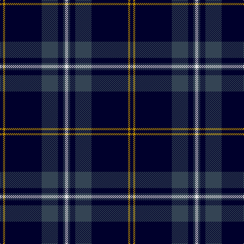

In pattern [KYKBKBW](/patterns/kykbkbw/).

This was sourced from tartans-authority.  It is a [7 stripes tartan](/stripes/stripes7/).

Original link http://www.tartansauthority.com/tartan-ferret/display/7881/

## Thread count
DB/6 DY4 DB72 N32 DB10 N4 LN/6

## Palette
Each colour and its ΔE from the base-6 reference it is a variant of.

| Colour | Shade | Base | ΔE (OKLab) |
|---|---|---|---|
| DB | <code style="background-color:#00002C;">#00002C</code> `#00002C` | K <code style="background-color:#000000;">#000000</code> | 0.16 |
| DY | <code style="background-color:#BC8C00;">#BC8C00</code> `#BC8C00` | Y <code style="background-color:#F2BF00;">#F2BF00</code> | 0.16 |
| LN | <code style="background-color:#E0E0E0;">#E0E0E0</code> `#E0E0E0` | W <code style="background-color:#F7F7F7;">#F7F7F7</code> | 0.07 |
| N | <code style="background-color:#344454;">#344454</code> `#344454` | B <code style="background-color:#2A418A;">#2A418A</code> | 0.10 |

# Sample pattern

## Nearest tartans

The nearest existing variants by ΔTartan distance.

1. [Jon's Theme (Fashion)](/setts/s6/k2y4k6b24k36w2-b2c2c80-k00002c-wfcfcfc-ybc8c00/) — ΔT 1.03
1. [Ailsa, Navy (Fashion)](/setts/s6/k120r6k10r6y36ra6-k00002c-r880000-ra888888-ya0a0a0/) — ΔT 1.07
1. [Jon's Theme](/setts/s6/k2y4k6b24k36w2-b555b7c-k010542-wffffff-y9e8f00/) — ΔT 1.07
1. [Roxburgh, Green (District)](/setts/s8/b92w4b4w4b32g88r4b12-b1c0070-g006818-rc80000-wf8f8f8/) — ΔT 1.28
1. [MacKay](/setts/s6/b4k12b4k12b32r2-b304080-k000000-rc00000/) — ΔT 1.34
1. [Edinburgh Crystal](/setts/s5/k122w8ka22b10r10-b304080-k000030-ka000000-r802040-we0e0e0/) — ΔT 1.36
1. [Loretto School](/setts/s8/b4r14ba6r5b12g8b70ra4-b000048-ba5a008c-g004c00-rff0000-rab458ac/) — ΔT 1.40
1. [Calum's Cabin](/setts/s10/b32r4ba12b2ba4b2ba2g16b67r6-b000048-ba003c64-g808080-re86000/) — ΔT 1.41
1. [Genet, Edmond Charles 'Citizen' (Personal)](/setts/s7/r8k18g18ka80r4ka4w4-g285800-k101010-ka000028-rdc0000-wf8f8f8/) — ΔT 1.42
1. [Round Table of Britain and Ireland, RtbI.](/setts/s6/b94g28ba10r4ra6g14-b000050-ba401000-g008000-r806050-rac00000/) — ΔT 1.49

## Neighbour map

Every grey dot is one of 15726 variants placed by the first two principal components of the ΔTartan feature space (44% of its variance). Red is this tartan; blue dots are its nearest — click one to open its page.

<svg viewBox="0 0 640 380" role="img" style="max-width:100%;height:auto;border:1px solid #e0e0e0;border-radius:4px;display:block" xmlns="http://www.w3.org/2000/svg"><image href="/nn/cloud.v1.png" width="640" height="380"/><a href="/setts/s6/k2y4k6b24k36w2-b2c2c80-k00002c-wfcfcfc-ybc8c00/"><circle cx="370.3" cy="190.4" r="4" fill="#3465a4"><title>Jon's Theme (Fashion)</title></circle></a><a href="/setts/s6/k120r6k10r6y36ra6-k00002c-r880000-ra888888-ya0a0a0/"><circle cx="433.7" cy="159.3" r="4" fill="#3465a4"><title>Ailsa, Navy (Fashion)</title></circle></a><a href="/setts/s6/k2y4k6b24k36w2-b555b7c-k010542-wffffff-y9e8f00/"><circle cx="363.0" cy="184.0" r="4" fill="#3465a4"><title>Jon's Theme</title></circle></a><a href="/setts/s8/b92w4b4w4b32g88r4b12-b1c0070-g006818-rc80000-wf8f8f8/"><circle cx="370.8" cy="155.0" r="4" fill="#3465a4"><title>Roxburgh, Green (District)</title></circle></a><a href="/setts/s6/b4k12b4k12b32r2-b304080-k000000-rc00000/"><circle cx="387.2" cy="215.2" r="4" fill="#3465a4"><title>MacKay</title></circle></a><a href="/setts/s5/k122w8ka22b10r10-b304080-k000030-ka000000-r802040-we0e0e0/"><circle cx="430.4" cy="181.4" r="4" fill="#3465a4"><title>Edinburgh Crystal</title></circle></a><a href="/setts/s8/b4r14ba6r5b12g8b70ra4-b000048-ba5a008c-g004c00-rff0000-rab458ac/"><circle cx="408.0" cy="136.2" r="4" fill="#3465a4"><title>Loretto School</title></circle></a><a href="/setts/s10/b32r4ba12b2ba4b2ba2g16b67r6-b000048-ba003c64-g808080-re86000/"><circle cx="457.8" cy="133.6" r="4" fill="#3465a4"><title>Calum's Cabin</title></circle></a><a href="/setts/s7/r8k18g18ka80r4ka4w4-g285800-k101010-ka000028-rdc0000-wf8f8f8/"><circle cx="354.2" cy="143.9" r="4" fill="#3465a4"><title>Genet, Edmond Charles 'Citizen' (Personal)</title></circle></a><a href="/setts/s6/b94g28ba10r4ra6g14-b000050-ba401000-g008000-r806050-rac00000/"><circle cx="355.5" cy="151.8" r="4" fill="#3465a4"><title>Round Table of Britain and Ireland, RtbI.</title></circle></a><circle cx="410.5" cy="174.1" r="5" fill="#c00000"/></svg>

ID: /setts/s7/k6y4k72b32k10b4w6-b344454-k00002c-we0e0e0-ybc8c00/
