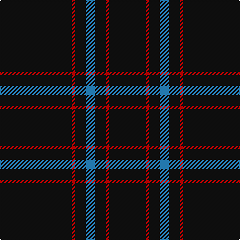

This page is one **sett** — a single exact thread-count. It belongs to the [tartan](/tartans/k72r3k11b9k11r3k37/)
(the same proportion at any scale), whose colour order is pattern [KRKBKRK](/stripes/krkbkrk/).

Sourced from tartans-authority.  It is a [7 stripe tartan](/stripes/stripes7/).

Original link http://www.tartansauthority.com/tartan-ferret/display/8062/

## Thread count
K/72 R3 K11 B9 K11 R3 K/37

## Palette
Each colour and the base-6 reference it is a variant of.

| Colour | Shade | Base |
|---|---|---|
| B | <code style="background-color:#2888C4;">#2888C4</code> `oklch(60.1% 0.125 241.5)` <small>#2888C4</small> | B <code style="background-color:#2A418A;">#2A418A</code> |
| K | <code style="background-color:#101010;">#101010</code> `oklch(17.3% 0.000 89.9)` <small>#101010</small> | K <code style="background-color:#000000;">#000000</code> |
| R | <code style="background-color:#C80000;">#C80000</code> `oklch(52.3% 0.215 29.2)` <small>#C80000</small> | R <code style="background-color:#CC0000;">#CC0000</code> |

# Sample pattern

## Nearest tartans

The nearest existing variants by ΔTartan distance, with this tartan at the top so the swatches line up against it.

ΔTartan

Tartan

Sett

—

<a href="/ttd/edit/#slug=k72r3k11t9k11r3k37">Chafyn House (School)</a> <a class="nn-out" href="/setts/s7/k72r3k11t9k11r3k37/" title="open its dictionary page">↗</a>

1.30

<a href="/ttd/edit/#slug=k72w3k11db9">Dunnotar (School)</a> <a class="nn-out" href="/setts/s4/k72w3k11db9/" title="open its dictionary page">↗</a>

1.37

<a href="/ttd/edit/#slug=k31r2k10db1k1w1~x4">NewGeneration Alchemy (NGA) Inc</a> <a class="nn-out" href="/setts/s6/k31r2k10db1k1w1~x4/" title="open its dictionary page">↗</a>

1.50

<a href="/ttd/edit/#slug=k60t3k9g7">Wallington (Corporate?)</a> <a class="nn-out" href="/setts/s4/k60t3k9g7/" title="open its dictionary page">↗</a>

1.68

<a href="/ttd/edit/#slug=k24dg3r3k24r2k2r2">Unidentified #45</a> <a class="nn-out" href="/setts/s7/k24dg3r3k24r2k2r2/" title="open its dictionary page">↗</a>

1.69

<a href="/ttd/edit/#slug=do10ly1do30y3~x4">Pasteur Fancy Tartan Tartan Number: 7094. Earliest known date: 1836 The pattern is taken from a shawl or cloak which appears in a portrait of Louie Pasteur's mother. The portrait was drawn in pastels when Pasteur was just 13 years old. The information came Marie-Claude Fortier researching the life of Pasteur. See products available Copyright © Blair Urquhart, Comrie, 2015</a> <a class="nn-out" href="/setts/s4/do10ly1do30y3~x4/" title="open its dictionary page">↗</a>

1.84

<a href="/ttd/edit/#slug=k8ly3k120ly3k40t2k4~x2">Lochaber (Hesketh)</a> <a class="nn-out" href="/setts/s7/k8ly3k120ly3k40t2k4~x2/" title="open its dictionary page">↗</a>

1.84

<a href="/ttd/edit/#slug=r2k4r2k22n1k3n1k3n1k22ly1k8r1~x2">Edinburgh Castle (Corporate?)</a> <a class="nn-out" href="/setts/s13/r2k4r2k22n1k3n1k3n1k22ly1k8r1~x2/" title="open its dictionary page">↗</a>

1.94

<a href="/ttd/edit/#slug=dg30r2dg8r1dg5w2dg5r1dg8r2dg30">Brithwe Dewi Sant (Welsh)</a> <a class="nn-out" href="/setts/s11/dg30r2dg8r1dg5w2dg5r1dg8r2dg30/" title="open its dictionary page">↗</a>

2.00

<a href="/ttd/edit/#slug=k24w1r6k21lo2k24dg1~x2">Gourlay, George (Personal)</a> <a class="nn-out" href="/setts/s7/k24w1r6k21lo2k24dg1~x2/" title="open its dictionary page">↗</a>

2.01

<a href="/ttd/edit/#slug=k24w1r6k21lo2k24g1~x2">Gourlay, George (Personal)</a> <a class="nn-out" href="/setts/s7/k24w1r6k21lo2k24g1~x2/" title="open its dictionary page">↗</a>

## Neighbour map

Every grey dot is one of 14299 variants placed by the first two principal components of the ΔTartan feature space (44% of its variance). Red is this tartan; blue dots are its nearest — click one to open its page.

<svg viewBox="0 0 640 380" role="img" style="max-width:100%;height:auto;border:1px solid #e0e0e0;border-radius:4px;display:block" xmlns="http://www.w3.org/2000/svg"><image href="/nn/cloud.v1.png" width="640" height="380"/><a href="/setts/s4/k72w3k11db9/"><circle cx="626.0" cy="233.0" r="4" fill="#3465a4"><title>Dunnotar (School)</title></circle></a><a href="/setts/s6/k31r2k10db1k1w1~x4/"><circle cx="626.0" cy="172.4" r="4" fill="#3465a4"><title>NewGeneration Alchemy (NGA) Inc</title></circle></a><a href="/setts/s4/k60t3k9g7/"><circle cx="626.0" cy="231.3" r="4" fill="#3465a4"><title>Wallington (Corporate?)</title></circle></a><a href="/setts/s7/k24dg3r3k24r2k2r2/"><circle cx="578.3" cy="225.2" r="4" fill="#3465a4"><title>Unidentified #45</title></circle></a><a href="/setts/s4/do10ly1do30y3~x4/"><circle cx="626.0" cy="231.9" r="4" fill="#3465a4"><title>Pasteur Fancy Tartan Tartan Number: 7094. Earliest known date: 1836 The pattern is taken from a shawl or cloak which appears in a portrait of Louie Pasteur's mother. The portrait was drawn in pastels when Pasteur was just 13 years old. The information came Marie-Claude Fortier researching the life of Pasteur. See products available Copyright © Blair Urquhart, Comrie, 2015</title></circle></a><a href="/setts/s7/k8ly3k120ly3k40t2k4~x2/"><circle cx="626.0" cy="169.5" r="4" fill="#3465a4"><title>Lochaber (Hesketh)</title></circle></a><a href="/setts/s13/r2k4r2k22n1k3n1k3n1k22ly1k8r1~x2/"><circle cx="626.0" cy="173.0" r="4" fill="#3465a4"><title>Edinburgh Castle (Corporate?)</title></circle></a><a href="/setts/s11/dg30r2dg8r1dg5w2dg5r1dg8r2dg30/"><circle cx="626.0" cy="181.6" r="4" fill="#3465a4"><title>Brithwe Dewi Sant (Welsh)</title></circle></a><a href="/setts/s7/k24w1r6k21lo2k24dg1~x2/"><circle cx="588.9" cy="186.5" r="4" fill="#3465a4"><title>Gourlay, George (Personal)</title></circle></a><a href="/setts/s7/k24w1r6k21lo2k24g1~x2/"><circle cx="582.5" cy="185.8" r="4" fill="#3465a4"><title>Gourlay, George (Personal)</title></circle></a><circle cx="626.0" cy="213.8" r="5" fill="#c00000"/></svg>

ID: /setts/s7/k72r3k11t9k11r3k37/
