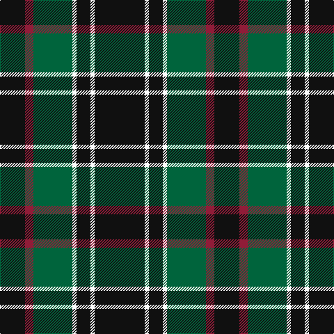

In pattern [KRGWKWK](/patterns/krgwkwk/).

This was sourced from tartans-authority.  It is a [7 stripes tartan](/stripes/stripes7/).

Original link http://www.tartansauthority.com/tartan-ferret/display/4046/

## Thread count
K/36 DR12 G56 W6 K20 W6 K/72

## Palette
Each colour and its ΔE from the base-6 reference it is a variant of.

| Colour | Shade | Base | ΔE (OKLab) |
|---|---|---|---|
| DR | <code style="background-color:#901C38;">#901C38</code> `#901C38` | R <code style="background-color:#C80000;">#C80000</code> | 0.12 |
| G | <code style="background-color:#00643C;">#00643C</code> `#00643C` | G <code style="background-color:#006400;">#006400</code> | 0.06 |
| K | <code style="background-color:#101010;">#101010</code> `#101010` | K <code style="background-color:#000000;">#000000</code> | 0.17 |
| W | <code style="background-color:#FCFCFC;">#FCFCFC</code> `#FCFCFC` | W <code style="background-color:#F4F4F0;">#F4F4F0</code> | 0.03 |

# Sample pattern

## Nearest tartans

The nearest existing variants by ΔTartan distance.

1. [Frame (Edinburgh) (Personal)](/setts/s7/k32g30k8b24k44w4k12-b2888c4-g006818-k101010-wfcfcfc/) — ΔT 0.90
1. [Callaway (Corporate)](/setts/s6/r4k40b8w20k20r4-b5c5c5c-k101010-r880000-wc0c0c0/) — ΔT 1.00
1. [Hasegawa (Akasaka) (Personal)](/setts/s8/g6w10g6b12g10b2g24r2-b202060-g003820-rc80000-wfcfcfc/) — ΔT 1.08
1. [Mountain Rescue Assoc. (Corporate)](/setts/s7/k64b4k12b4k26ba60w4-b1474b4-ba5c5c5c-k101010-wfcfcfc/) — ΔT 1.09
1. [London Community Gospel Choir](/setts/s7/k50y10k10g50k50b6k20-b1474b4-g006818-k101010-ye8c000/) — ΔT 1.10
1. [Dunfermline Athletic (2008) (Corp)](/setts/s7/k88w8k8w8k32r64ra8-k101010-r888888-rac80000-we0e0e0/) — ΔT 1.14
1. [MacKintosh Hunting](/setts/s7/y4g24b12r6g24r8b2-b000064-g004c00-rc80000-yffff00/) — ΔT 1.14
1. [Holestone (Corporate)](/setts/s8/k8y16k52r12g30r12k52w4-g006818-k101010-rc04c08-wf8f8f8-ybc8c00/) — ΔT 1.20
1. [Brotherhood of the Kilt](/setts/s5/k100g40k10b20r10-b7884a8-g505420-k101010-rc80000/) — ΔT 1.26
1. [MacAulay Hunting](/setts/s8/g12k32w2k32g16k8g24r4-g006818-k101010-rc80000-wfcfcfc/) — ΔT 1.26

## Neighbour map

Every grey dot is one of 15726 variants placed by the first two principal components of the ΔTartan feature space (44% of its variance). Red is this tartan; blue dots are its nearest — click one to open its page.

<svg viewBox="0 0 640 380" role="img" style="max-width:100%;height:auto;border:1px solid #e0e0e0;border-radius:4px;display:block" xmlns="http://www.w3.org/2000/svg"><image href="/nn/cloud.v1.png" width="640" height="380"/><a href="/setts/s7/k32g30k8b24k44w4k12-b2888c4-g006818-k101010-wfcfcfc/"><circle cx="303.9" cy="231.1" r="4" fill="#3465a4"><title>Frame (Edinburgh) (Personal)</title></circle></a><a href="/setts/s6/r4k40b8w20k20r4-b5c5c5c-k101010-r880000-wc0c0c0/"><circle cx="308.5" cy="209.6" r="4" fill="#3465a4"><title>Callaway (Corporate)</title></circle></a><a href="/setts/s8/g6w10g6b12g10b2g24r2-b202060-g003820-rc80000-wfcfcfc/"><circle cx="310.0" cy="200.6" r="4" fill="#3465a4"><title>Hasegawa (Akasaka) (Personal)</title></circle></a><a href="/setts/s7/k64b4k12b4k26ba60w4-b1474b4-ba5c5c5c-k101010-wfcfcfc/"><circle cx="364.0" cy="189.8" r="4" fill="#3465a4"><title>Mountain Rescue Assoc. (Corporate)</title></circle></a><a href="/setts/s7/k50y10k10g50k50b6k20-b1474b4-g006818-k101010-ye8c000/"><circle cx="349.4" cy="239.9" r="4" fill="#3465a4"><title>London Community Gospel Choir</title></circle></a><a href="/setts/s7/k88w8k8w8k32r64ra8-k101010-r888888-rac80000-we0e0e0/"><circle cx="310.0" cy="183.2" r="4" fill="#3465a4"><title>Dunfermline Athletic (2008) (Corp)</title></circle></a><a href="/setts/s7/y4g24b12r6g24r8b2-b000064-g004c00-rc80000-yffff00/"><circle cx="300.9" cy="208.7" r="4" fill="#3465a4"><title>MacKintosh Hunting</title></circle></a><a href="/setts/s8/k8y16k52r12g30r12k52w4-g006818-k101010-rc04c08-wf8f8f8-ybc8c00/"><circle cx="285.6" cy="180.1" r="4" fill="#3465a4"><title>Holestone (Corporate)</title></circle></a><a href="/setts/s5/k100g40k10b20r10-b7884a8-g505420-k101010-rc80000/"><circle cx="355.6" cy="224.8" r="4" fill="#3465a4"><title>Brotherhood of the Kilt</title></circle></a><a href="/setts/s8/g12k32w2k32g16k8g24r4-g006818-k101010-rc80000-wfcfcfc/"><circle cx="324.5" cy="213.4" r="4" fill="#3465a4"><title>MacAulay Hunting</title></circle></a><circle cx="327.3" cy="207.6" r="5" fill="#c00000"/></svg>

ID: /setts/s7/k72w6k20w6g56r12k36-g00643c-k101010-r901c38-wfcfcfc/
