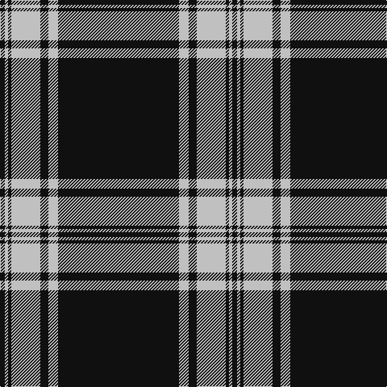

**Bands:** [KWKWKWK](/stripes/kwkwkwk/) · **Stripes:** [K LB K LB K LB K](/stripes/stripes7/) K LB K LB K LB K

This was sourced from register-of-tartans.  It is a [7 band tartan](/bands/bands7/).

Original link https://www.tartanregister.gov.uk/tartanDetails.aspx?ref=216

## Attestations

This cloth appears in 2 source records; the oldest owns this page.

- 01/09/2000 — Bargain Booze (register-of-tartans, [record](https://www.tartanregister.gov.uk/tartanDetails.aspx?ref=216))
- pre 2002 — Bargain Booze (Corporate) (tartans-authority, [record](http://www.tartansauthority.com/tartan-ferret/display/5358/))

## Register references

External register numbers recorded for this tartan.

- Scottish Register of Tartans: [216](https://www.tartanregister.gov.uk/tartanDetails.aspx?ref=216)
- Scottish Tartans Authority (ITI): 5358
- Scottish Tartans World Register: 2826

## Thread count
K/6 N4 K4 N36 K10 N12 K/150

## Palette
Each colour and its ΔE from the base-6 reference it is a variant of.

| Colour | Shade | Base | ΔE (OKLab) |
|---|---|---|---|
| K | <code style="background-color:#101010;">#101010</code> `#101010` | K <code style="background-color:#000000;">#000000</code> | 0.17 |
| N | <code style="background-color:#C0C0C0;">#C0C0C0</code> `#C0C0C0` | W <code style="background-color:#F7F7F7;">#F7F7F7</code> | 0.17 |

# Sample pattern

## Nearest tartans

The nearest existing variants by ΔTartan distance.

1. [Royal Stewart B & W (Universal?)](/setts/s11/k36w4k6w1k1w1k1w8k4w1k6~x2/) — ΔT 1.06
1. [Erck, Georges van (Personal),](/setts/s8/k38lo1w7lo1k4lo2k3lo2~x2/) — ΔT 1.07
1. [Menzies](/setts/s8/k32w4k2w4k4w2k1w6~x2/) — ΔT 1.14
1. [Mull Rugby Club](/setts/s8/k44r2w10r3k6r1w2k18~x2/) — ΔT 1.17
1. [Montrose Football Club](/setts/s6/w6r13dt80w4dt2w4/) — ΔT 1.28
1. [Merola (2016)](/setts/s6/k36ly5k1ly1lr5k12~x2/) — ΔT 1.35
1. [Volkswagen Black Trim (Fashion)](/setts/s8/k20w1k1w3k1r1k1w1~x4/) — ΔT 1.37
1. [London Fog Black (Fashion)](/setts/s8/k198lb9k17t13lb9k4lb13k4/) — ΔT 1.49
1. [Brockton](/setts/s8/k2w1k2r6k6r3k28w2~x2/) — ΔT 1.52
1. [Stuart/Stewart Mourning](/setts/s12/k43w4k6w2k3w2k3w9k5w3k3w3~x2/) — ΔT 1.53

## Neighbour map

Every grey dot is one of 14313 variants placed by the first two principal components of the ΔTartan feature space (44% of its variance). Red is this tartan; blue dots are its nearest — click one to open its page.

<svg viewBox="0 0 640 380" role="img" style="max-width:100%;height:auto;border:1px solid #e0e0e0;border-radius:4px;display:block" xmlns="http://www.w3.org/2000/svg"><image href="/nn/cloud.v1.png" width="640" height="380"/><a href="/setts/s11/k36w4k6w1k1w1k1w8k4w1k6~x2/"><circle cx="537.5" cy="125.5" r="4" fill="#3465a4"><title>Royal Stewart B &amp; W (Universal?)</title></circle></a><a href="/setts/s8/k38lo1w7lo1k4lo2k3lo2~x2/"><circle cx="531.1" cy="120.6" r="4" fill="#3465a4"><title>Erck, Georges van (Personal),</title></circle></a><a href="/setts/s8/k32w4k2w4k4w2k1w6~x2/"><circle cx="479.6" cy="150.0" r="4" fill="#3465a4"><title>Menzies</title></circle></a><a href="/setts/s8/k44r2w10r3k6r1w2k18~x2/"><circle cx="528.8" cy="132.3" r="4" fill="#3465a4"><title>Mull Rugby Club</title></circle></a><a href="/setts/s6/w6r13dt80w4dt2w4/"><circle cx="524.4" cy="137.4" r="4" fill="#3465a4"><title>Montrose Football Club</title></circle></a><a href="/setts/s6/k36ly5k1ly1lr5k12~x2/"><circle cx="552.3" cy="162.1" r="4" fill="#3465a4"><title>Merola (2016)</title></circle></a><a href="/setts/s8/k20w1k1w3k1r1k1w1~x4/"><circle cx="526.6" cy="142.4" r="4" fill="#3465a4"><title>Volkswagen Black Trim (Fashion)</title></circle></a><a href="/setts/s8/k198lb9k17t13lb9k4lb13k4/"><circle cx="611.1" cy="116.5" r="4" fill="#3465a4"><title>London Fog Black (Fashion)</title></circle></a><a href="/setts/s8/k2w1k2r6k6r3k28w2~x2/"><circle cx="522.1" cy="156.5" r="4" fill="#3465a4"><title>Brockton</title></circle></a><a href="/setts/s12/k43w4k6w2k3w2k3w9k5w3k3w3~x2/"><circle cx="481.2" cy="138.0" r="4" fill="#3465a4"><title>Stuart/Stewart Mourning</title></circle></a><circle cx="548.6" cy="148.5" r="5" fill="#c00000"/></svg>

ID: /setts/s7/k75lb6k5lb18k2lb2k3~x2/
