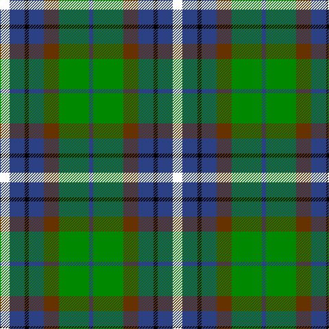

In pattern [BGGBKBK](/stripes/bggbkbk/).

This was sourced from house-of-tartan.  It is a [7 stripe tartan](/stripes/stripes7/).

Original link http://www.house-of-tartan.scotland.net/house/TartanViewjs.asp?colr=Def&tnam=4071

## Thread count
LB/14 B22 K6 B22 T22 G44 B/6

## Palette
Each colour and the base-6 reference it is a variant of.

| Colour | Shade | Base |
|---|---|---|
| B | <code style="background-color:#2C4084;">#2C4084</code> `oklch(39.4% 0.117 268.3)` <small>#2C4084</small> | B <code style="background-color:#2A418A;">#2A418A</code> |
| DB | <code style="background-color:#000080;">#000080</code> `oklch(27.1% 0.188 264.1)` <small>#000080</small> | B <code style="background-color:#2A418A;">#2A418A</code> |
| G | <code style="background-color:#008800;">#008800</code> `oklch(54.3% 0.185 142.5)` <small>#008800</small> | G <code style="background-color:#006100;">#006100</code> |
| K | <code style="background-color:#000000;">#000000</code> `oklch(0.0% 0.000 0.0)` <small>#000000</small> | K <code style="background-color:#000000;">#000000</code> |
| T | <code style="background-color:#663300;">#663300</code> `oklch(38.0% 0.092 56.8)` <small>#663300</small> | G <code style="background-color:#006100;">#006100</code> |

# Sample pattern

## Nearest tartans

The nearest existing variants by ΔTartan distance.

1. [Dyce #3](/setts/s6/k2ly1dg6k6db6w1~x4/) — ΔT 0.73
1. [Disciples of Christ Motorcycle Ministry (Switzerland)](/setts/s7/k22g21k5g12t12o3w4~x2/) — ΔT 0.74
1. [Lanarkshire](/setts/s6/g31ly4g6k19db18t9~x2/) — ΔT 0.75
1. [Lanark](/setts/s6/dg31ly4dg6k19db18t9~x2/) — ΔT 0.81
1. [Wilson's No.217](/setts/s8/dp11t2k10g10ly3~x2/) — ΔT 0.86
1. [MacLean, Donald (Personal)](/setts/s7/g16lb3g3k10db12r2db3~x2/) — ΔT 0.87
1. [Brodie Hunting](/setts/s7/r2k8lo1k8g8t8r2~x4/) — ΔT 0.89
1. [MacDonald, (Flora.. )](/setts/s7/g17ly2k14r2db9r2db10~x2/) — ΔT 0.90
1. [Nelson Mandela (Personal)](/setts/s7/db27g5ly8k20ly3g15r3~x2/) — ΔT 0.90
1. [Selkirk (Personal) Original](/setts/s8/dp11y2k10g10lo2~x2/) — ΔT 0.93

## Neighbour map

Every grey dot is one of 14299 variants placed by the first two principal components of the ΔTartan feature space (44% of its variance). Red is this tartan; blue dots are its nearest — click one to open its page.

<svg viewBox="0 0 640 380" role="img" style="max-width:100%;height:auto;border:1px solid #e0e0e0;border-radius:4px;display:block" xmlns="http://www.w3.org/2000/svg"><image href="/nn/cloud.v1.png" width="640" height="380"/><a href="/setts/s6/k2ly1dg6k6db6w1~x4/"><circle cx="135.4" cy="239.1" r="4" fill="#3465a4"><title>Dyce #3</title></circle></a><a href="/setts/s7/k22g21k5g12t12o3w4~x2/"><circle cx="156.2" cy="221.1" r="4" fill="#3465a4"><title>Disciples of Christ Motorcycle Ministry (Switzerland)</title></circle></a><a href="/setts/s6/g31ly4g6k19db18t9~x2/"><circle cx="165.2" cy="232.1" r="4" fill="#3465a4"><title>Lanarkshire</title></circle></a><a href="/setts/s6/dg31ly4dg6k19db18t9~x2/"><circle cx="154.1" cy="228.0" r="4" fill="#3465a4"><title>Lanark</title></circle></a><a href="/setts/s8/dp11t2k10g10ly3~x2/"><circle cx="106.5" cy="240.9" r="4" fill="#3465a4"><title>Wilson's No.217</title></circle></a><a href="/setts/s7/g16lb3g3k10db12r2db3~x2/"><circle cx="164.3" cy="215.2" r="4" fill="#3465a4"><title>MacLean, Donald (Personal)</title></circle></a><a href="/setts/s7/r2k8lo1k8g8t8r2~x4/"><circle cx="155.6" cy="218.0" r="4" fill="#3465a4"><title>Brodie Hunting</title></circle></a><a href="/setts/s7/g17ly2k14r2db9r2db10~x2/"><circle cx="116.7" cy="199.0" r="4" fill="#3465a4"><title>MacDonald, (Flora.. )</title></circle></a><a href="/setts/s7/db27g5ly8k20ly3g15r3~x2/"><circle cx="121.4" cy="196.0" r="4" fill="#3465a4"><title>Nelson Mandela (Personal)</title></circle></a><a href="/setts/s8/dp11y2k10g10lo2~x2/"><circle cx="119.0" cy="236.2" r="4" fill="#3465a4"><title>Selkirk (Personal) Original</title></circle></a><circle cx="127.9" cy="223.8" r="5" fill="#c00000"/></svg>

ID: /setts/s7/k7db11k3db11dy11g22db3~x2/
