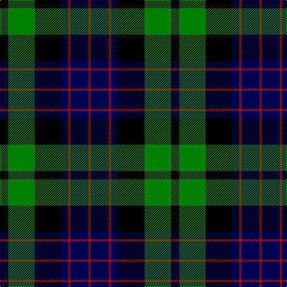

In pattern [KGKBRBR](/patterns/kgkbrbr/).

This was sourced from weddslist.  It is a [7 stripes tartan](/stripes/stripes7/).

Original link http://www.weddslist.com/cgi-bin/tartans/pg.pl?source=sts

## Thread count
K/14 G44 K44 DB12 R4 DB30 R/4

## Palette
Each colour and its ΔE from the base-6 reference it is a variant of.

| Colour | Shade | Base | ΔE (OKLab) |
|---|---|---|---|
| DB | <code style="background-color:#000050;">#000050</code> `#000050` | B <code style="background-color:#2A418A;">#2A418A</code> | 0.21 |
| G | <code style="background-color:#008000;">#008000</code> `#008000` | G <code style="background-color:#006100;">#006100</code> | 0.10 |
| K | <code style="background-color:#000000;">#000000</code> `#000000` | K <code style="background-color:#000000;">#000000</code> | 0.00 |
| R | <code style="background-color:#C00000;">#C00000</code> `#C00000` | R <code style="background-color:#CC0000;">#CC0000</code> | 0.03 |

# Sample pattern

## Nearest tartans

The nearest existing variants by ΔTartan distance.

1. [Mowat](/setts/s7/b48k6b10k46y4k22g43~b304080-g008000-k000000-yf0c000/) — ΔT 0.54
1. [Reid Taylor, "House Check"](/setts/s7/b2k1r1b9k9g10k2x2~b304080-g008000-k000000-rc00000/) — ΔT 0.64
1. [Graham W](/setts/s6/g21w2g4k17b14k3~b5a3094-g004c00-k000000-wd0d0d0/) — ΔT 0.65
1. [Unnamed, No 59](/setts/s6/b1ba11k11g11k2b1x2~b5480b0-ba304080-g008000-k000000/) — ΔT 0.77
1. [Black Watch](/setts/s7/r4k4b24k24g24k2r3x2~b304080-g008000-k000000-rc00000/) — ΔT 0.80
1. [Ferguson of Balquhidder](/setts/s6/g2b12r1k12g12k2x2~b304080-g008000-k000000-rc00000/) — ΔT 0.82
1. [Glenturret](/setts/s6/k3g14k14g2b15y2x2~b000050-g008000-k000000-yf0c000/) — ΔT 0.85
1. [Unnamed, No 115](/setts/s8/b10k6ba1g6k1g6ba1k6x2~b304080-ba5480b0-g008000-k000000/) — ΔT 0.85
1. [Melville](/setts/s6/k5w2g18k17b16k3~b5a3094-g004c00-k000000-wd0d0d0/) — ΔT 0.86
1. [Graham of Menteith](/setts/s6/g8w2g1k12b12k1x2~b000064-g004c00-k000000-wd0d0d0/) — ΔT 0.88

## Neighbour map

Every grey dot is one of 15726 variants placed by the first two principal components of the ΔTartan feature space (44% of its variance). Red is this tartan; blue dots are its nearest — click one to open its page.

<svg viewBox="0 0 640 380" role="img" style="max-width:100%;height:auto;border:1px solid #e0e0e0;border-radius:4px;display:block" xmlns="http://www.w3.org/2000/svg"><image href="/nn/cloud.v1.png" width="640" height="380"/><a href="/setts/s7/b48k6b10k46y4k22g43~b304080-g008000-k000000-yf0c000/"><circle cx="188.8" cy="210.8" r="4" fill="#3465a4"><title>Mowat</title></circle></a><a href="/setts/s7/b2k1r1b9k9g10k2x2~b304080-g008000-k000000-rc00000/"><circle cx="166.2" cy="207.6" r="4" fill="#3465a4"><title>Reid Taylor, &quot;House Check&quot;</title></circle></a><a href="/setts/s6/g21w2g4k17b14k3~b5a3094-g004c00-k000000-wd0d0d0/"><circle cx="197.2" cy="222.2" r="4" fill="#3465a4"><title>Graham W</title></circle></a><a href="/setts/s6/b1ba11k11g11k2b1x2~b5480b0-ba304080-g008000-k000000/"><circle cx="163.5" cy="212.1" r="4" fill="#3465a4"><title>Unnamed, No 59</title></circle></a><a href="/setts/s7/r4k4b24k24g24k2r3x2~b304080-g008000-k000000-rc00000/"><circle cx="166.5" cy="194.0" r="4" fill="#3465a4"><title>Black Watch</title></circle></a><a href="/setts/s6/g2b12r1k12g12k2x2~b304080-g008000-k000000-rc00000/"><circle cx="167.5" cy="211.8" r="4" fill="#3465a4"><title>Ferguson of Balquhidder</title></circle></a><a href="/setts/s6/k3g14k14g2b15y2x2~b000050-g008000-k000000-yf0c000/"><circle cx="139.1" cy="233.0" r="4" fill="#3465a4"><title>Glenturret</title></circle></a><a href="/setts/s8/b10k6ba1g6k1g6ba1k6x2~b304080-ba5480b0-g008000-k000000/"><circle cx="142.3" cy="214.2" r="4" fill="#3465a4"><title>Unnamed, No 115</title></circle></a><a href="/setts/s6/k5w2g18k17b16k3~b5a3094-g004c00-k000000-wd0d0d0/"><circle cx="183.8" cy="231.9" r="4" fill="#3465a4"><title>Melville</title></circle></a><a href="/setts/s6/g8w2g1k12b12k1x2~b000064-g004c00-k000000-wd0d0d0/"><circle cx="186.3" cy="215.2" r="4" fill="#3465a4"><title>Graham of Menteith</title></circle></a><circle cx="173.3" cy="212.8" r="5" fill="#c00000"/></svg>

ID: /setts/s7/k7g22k22b6r2b15r2x2~b000050-g008000-k000000-rc00000/
