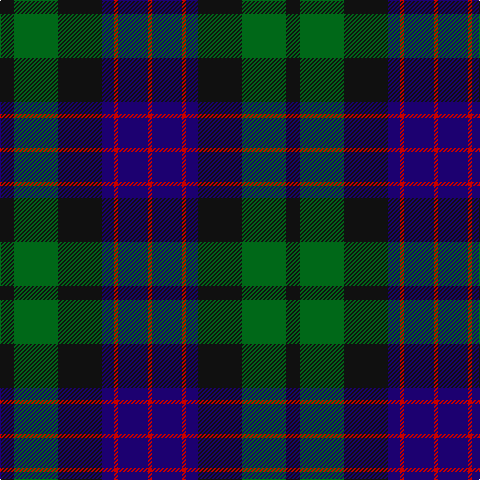

In pattern [KGKBRBR](/stripes/kgkbrbr/).

This was sourced from register-of-tartans.  It is a [7 stripe tartan](/stripes/stripes7/).

Original link https://www.tartanregister.gov.uk/tartanDetails.aspx?ref=3097

## Also known as

This cloth is also recorded under:

- National Galleries of Scotland (Corp
- National Galleries, of Scotland

## Attestations

This cloth appears in 4 source records; the oldest owns this page.

- 01/11/1991 — National Galleries of Scotland (register-of-tartans, [record](https://www.tartanregister.gov.uk/tartanDetails.aspx?ref=3097))
- November 1991 — National Galleries of Scotland (Corp (tartans-authority, [record](http://www.tartansauthority.com/tartan-ferret/display/2050/))
- undated — National Galleries, of Scotland (weddslist, [record](http://www.weddslist.com/cgi-bin/tartans/pg.pl?source=sts))
- undated — National Galleries of Scotland Corporate Tartan Tartan Number: 2050. Earliest known date: November 1991 Based on the Black Watch or Government tartan. The three claret stripes represent the three galleries and the colour is that of William Playfair's original colour scheme for the National Gallery. See products available Copyright © Blair Urquhart, Comrie, 2015 (house-of-tartan, [record](http://www.house-of-tartan.scotland.net/house/TartanViewjs.asp?colr=Def&tnam=2050))

## Register references

External register numbers recorded for this tartan.

- Scottish Register of Tartans: [3097](https://www.tartanregister.gov.uk/tartanDetails.aspx?ref=3097)
- Scottish Tartans Authority (ITI): 2050
- Scottish Tartans World Register: 2050

## Thread count
K/14 G44 K44 DB12 R4 DB30 R/4

## Palette
Each colour and the base-6 reference it is a variant of.

| Colour | Shade | Base |
|---|---|---|
| DB | <code style="background-color:#1C0070;">#1C0070</code> `oklch(26.3% 0.162 277.1)` <small>#1C0070</small> | B <code style="background-color:#2A418A;">#2A418A</code> |
| G | <code style="background-color:#006818;">#006818</code> `oklch(45.0% 0.142 145.0)` <small>#006818</small> | G <code style="background-color:#006100;">#006100</code> |
| K | <code style="background-color:#101010;">#101010</code> `oklch(17.3% 0.000 89.9)` <small>#101010</small> | K <code style="background-color:#000000;">#000000</code> |
| R | <code style="background-color:#C80000;">#C80000</code> `oklch(52.3% 0.215 29.2)` <small>#C80000</small> | R <code style="background-color:#CC0000;">#CC0000</code> |

# Sample pattern

## Nearest tartans

The nearest existing variants by ΔTartan distance, with this tartan at the top so the swatches line up against it.

ΔTartan

Tartan

Sett

—

<a href="/ttd/edit/#slug=k7g22k22db6r2db15r2~x2">National Galleries of Scotland</a> <a class="nn-out" href="/setts/s7/k7g22k22db6r2db15r2~x2/" title="open its dictionary page">↗</a>

0.43

<a href="/ttd/edit/#slug=db24k3db5k23ly2k11g22~x2">Mowat (Clans Originaux)</a> <a class="nn-out" href="/setts/s7/db24k3db5k23ly2k11g22~x2/" title="open its dictionary page">↗</a>

0.47

<a href="/ttd/edit/#slug=r2g12k12g1db12g2~x2">Gunn</a> <a class="nn-out" href="/setts/s6/r2g12k12g1db12g2~x2/" title="open its dictionary page">↗</a>

0.53

<a href="/ttd/edit/#slug=k2g10k9db9r1k1db2~x2">Reid and Taylor</a> <a class="nn-out" href="/setts/s7/k2g10k9db9r1k1db2~x2/" title="open its dictionary page">↗</a>

0.60

<a href="/ttd/edit/#slug=db6k2db18k18g18k3r2~x2">Renfrew</a> <a class="nn-out" href="/setts/s7/db6k2db18k18g18k3r2~x2/" title="open its dictionary page">↗</a>

0.64

<a href="/ttd/edit/#slug=r4k4db24k24g24k2r3~x2">Black Watch (Coarse Kilt)</a> <a class="nn-out" href="/setts/s7/r4k4db24k24g24k2r3~x2/" title="open its dictionary page">↗</a>

0.70

<a href="/ttd/edit/#slug=k3dg17ly2k18dp17dg3~x2">Wilson's No.100</a> <a class="nn-out" href="/setts/s6/k3dg17ly2k18dp17dg3~x2/" title="open its dictionary page">↗</a>

0.76

<a href="/ttd/edit/#slug=k4g25k24r3db24g4~x2">Ferguson of Balquhidder #2</a> <a class="nn-out" href="/setts/s6/k4g25k24r3db24g4~x2/" title="open its dictionary page">↗</a>

0.78

<a href="/ttd/edit/#slug=k4g21k10r2k10db21k4db4k4~x2">Swallow Hotels (Corporate)</a> <a class="nn-out" href="/setts/s9/k4g21k10r2k10db21k4db4k4~x2/" title="open its dictionary page">↗</a>

0.78

<a href="/ttd/edit/#slug=k4db16k12g12r1g2k2~x2">Dundas #2</a> <a class="nn-out" href="/setts/s7/k4db16k12g12r1g2k2~x2/" title="open its dictionary page">↗</a>

0.79

<a href="/ttd/edit/#slug=db3r2db22k11g22r2g3~x2">Gammell (1978) (Personal)</a> <a class="nn-out" href="/setts/s7/db3r2db22k11g22r2g3~x2/" title="open its dictionary page">↗</a>

## Neighbour map

Every grey dot is one of 14299 variants placed by the first two principal components of the ΔTartan feature space (44% of its variance). Red is this tartan; blue dots are its nearest — click one to open its page.

<svg viewBox="0 0 640 380" role="img" style="max-width:100%;height:auto;border:1px solid #e0e0e0;border-radius:4px;display:block" xmlns="http://www.w3.org/2000/svg"><image href="/nn/cloud.v1.png" width="640" height="380"/><a href="/setts/s7/db24k3db5k23ly2k11g22~x2/"><circle cx="238.5" cy="231.6" r="4" fill="#3465a4"><title>Mowat (Clans Originaux)</title></circle></a><a href="/setts/s6/r2g12k12g1db12g2~x2/"><circle cx="216.6" cy="230.6" r="4" fill="#3465a4"><title>Gunn</title></circle></a><a href="/setts/s7/k2g10k9db9r1k1db2~x2/"><circle cx="221.3" cy="231.7" r="4" fill="#3465a4"><title>Reid and Taylor</title></circle></a><a href="/setts/s7/db6k2db18k18g18k3r2~x2/"><circle cx="219.3" cy="238.9" r="4" fill="#3465a4"><title>Renfrew</title></circle></a><a href="/setts/s7/r4k4db24k24g24k2r3~x2/"><circle cx="220.5" cy="218.1" r="4" fill="#3465a4"><title>Black Watch (Coarse Kilt)</title></circle></a><a href="/setts/s6/k3dg17ly2k18dp17dg3~x2/"><circle cx="204.3" cy="239.3" r="4" fill="#3465a4"><title>Wilson's No.100</title></circle></a><a href="/setts/s6/k4g25k24r3db24g4~x2/"><circle cx="204.4" cy="248.3" r="4" fill="#3465a4"><title>Ferguson of Balquhidder #2</title></circle></a><a href="/setts/s9/k4g21k10r2k10db21k4db4k4~x2/"><circle cx="224.8" cy="213.8" r="4" fill="#3465a4"><title>Swallow Hotels (Corporate)</title></circle></a><a href="/setts/s7/k4db16k12g12r1g2k2~x2/"><circle cx="248.7" cy="216.6" r="4" fill="#3465a4"><title>Dundas #2</title></circle></a><a href="/setts/s7/db3r2db22k11g22r2g3~x2/"><circle cx="231.6" cy="210.5" r="4" fill="#3465a4"><title>Gammell (1978) (Personal)</title></circle></a><circle cx="218.5" cy="229.4" r="5" fill="#c00000"/></svg>

ID: /setts/s7/k7g22k22db6r2db15r2~x2/
