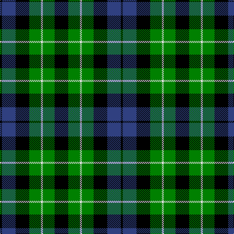

In pattern [KBKGWGK](/patterns/kbkgwgk/).

This was sourced from weddslist.  It is a [7 stripes tartan](/stripes/stripes7/).

Original link http://www.weddslist.com/cgi-bin/tartans/pg.pl?source=sts

## Thread count
K/4 B28 K28 G24 LN4 G24 K/28

## Palette
Each colour and its ΔE from the base-6 reference it is a variant of.

| Colour | Shade | Base | ΔE (OKLab) |
|---|---|---|---|
| B | <code style="background-color:#304080;">#304080</code> `#304080` | B <code style="background-color:#2A418A;">#2A418A</code> | 0.02 |
| G | <code style="background-color:#008000;">#008000</code> `#008000` | G <code style="background-color:#006100;">#006100</code> | 0.10 |
| K | <code style="background-color:#000000;">#000000</code> `#000000` | K <code style="background-color:#000000;">#000000</code> | 0.00 |
| LN | <code style="background-color:#E0E0E0;">#E0E0E0</code> `#E0E0E0` | W <code style="background-color:#F7F7F7;">#F7F7F7</code> | 0.07 |

# Sample pattern

## Nearest tartans

The nearest existing variants by ΔTartan distance.

1. [MacCallum](/setts/s7/k6g6r1g6k6b6k1~b304080-g008000-k000000-rc00000~x2/) — ΔT 0.37
1. [MacIntyre](/setts/s7/k12g12k2g12k12b12ba3~b304080-ba5480b0-g008000-k000000~x2/) — ΔT 0.46
1. [Wilson's, No 64 or Abercrombie](/setts/s7/k6g6w1g6k6b6k1~b800080-g008000-k000000-we0e0e0~x4/) — ΔT 0.69
1. [Abercrombie, (Wilson's No 64)](/setts/s7/k6g6y1g6k6b6k1~b800080-g008000-k000000-yf0c000~x4/) — ΔT 0.71
1. [Unnamed, No 31](/setts/s7/k8g8k1g8k8b8w2~b8080d0-g008000-k000000-we0e0e0~x2/) — ΔT 0.76
1. [Wilson's, No 108](/setts/s8/k7g7k1g7k7b1ba7k1~b5480b0-ba800080-g008000-k000000~x4/) — ΔT 0.78
1. [Wilson's, No 97](/setts/s7/k11g12k2g12k12b12w3~b800080-g008000-k000000-we0e0e0~x2/) — ΔT 0.82
1. [MacCallum](/setts/s7/g8k2b1g4k6ba6k1~b5480b0-ba304080-g008000-k000000~x2/) — ΔT 0.82
1. [Campbell of Breadalbane](/setts/s7/k9g9y2g9k9b9k3~b304080-g008000-k000000-yf0c000~x2/) — ΔT 0.89
1. [MacNeil of Colonsay](/setts/s7/b4g6w1g6k6b6k2~b304080-g008000-k000000-we0e0e0~x4/) — ΔT 0.89

## Neighbour map

Every grey dot is one of 15726 variants placed by the first two principal components of the ΔTartan feature space (44% of its variance). Red is this tartan; blue dots are its nearest — click one to open its page.

<svg viewBox="0 0 640 380" role="img" style="max-width:100%;height:auto;border:1px solid #e0e0e0;border-radius:4px;display:block" xmlns="http://www.w3.org/2000/svg"><image href="/nn/cloud.v1.png" width="640" height="380"/><a href="/setts/s7/k6g6r1g6k6b6k1~b304080-g008000-k000000-rc00000~x2/"><circle cx="137.5" cy="258.7" r="4" fill="#3465a4"><title>MacCallum</title></circle></a><a href="/setts/s7/k12g12k2g12k12b12ba3~b304080-ba5480b0-g008000-k000000~x2/"><circle cx="126.6" cy="262.7" r="4" fill="#3465a4"><title>MacIntyre</title></circle></a><a href="/setts/s7/k6g6w1g6k6b6k1~b800080-g008000-k000000-we0e0e0~x4/"><circle cx="133.2" cy="252.4" r="4" fill="#3465a4"><title>Wilson's, No 64 or Abercrombie</title></circle></a><a href="/setts/s7/k6g6y1g6k6b6k1~b800080-g008000-k000000-yf0c000~x4/"><circle cx="134.2" cy="252.7" r="4" fill="#3465a4"><title>Abercrombie, (Wilson's No 64)</title></circle></a><a href="/setts/s7/k8g8k1g8k8b8w2~b8080d0-g008000-k000000-we0e0e0~x2/"><circle cx="124.8" cy="241.8" r="4" fill="#3465a4"><title>Unnamed, No 31</title></circle></a><a href="/setts/s8/k7g7k1g7k7b1ba7k1~b5480b0-ba800080-g008000-k000000~x4/"><circle cx="160.3" cy="230.2" r="4" fill="#3465a4"><title>Wilson's, No 108</title></circle></a><a href="/setts/s7/k11g12k2g12k12b12w3~b800080-g008000-k000000-we0e0e0~x2/"><circle cx="118.0" cy="254.6" r="4" fill="#3465a4"><title>Wilson's, No 97</title></circle></a><a href="/setts/s7/g8k2b1g4k6ba6k1~b5480b0-ba304080-g008000-k000000~x2/"><circle cx="167.4" cy="231.5" r="4" fill="#3465a4"><title>MacCallum</title></circle></a><a href="/setts/s7/k9g9y2g9k9b9k3~b304080-g008000-k000000-yf0c000~x2/"><circle cx="115.1" cy="277.9" r="4" fill="#3465a4"><title>Campbell of Breadalbane</title></circle></a><a href="/setts/s7/b4g6w1g6k6b6k2~b304080-g008000-k000000-we0e0e0~x4/"><circle cx="116.0" cy="261.4" r="4" fill="#3465a4"><title>MacNeil of Colonsay</title></circle></a><circle cx="148.6" cy="250.2" r="5" fill="#c00000"/></svg>

ID: /setts/s7/k7g6w1g6k7b7k1~b304080-g008000-k000000-we0e0e0~x4/
