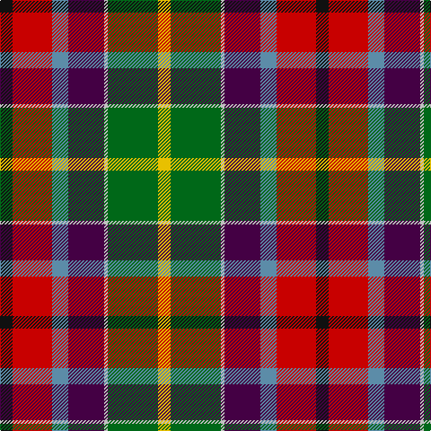

In pattern [KRBBWGY](/patterns/krbbwgy/).

This was sourced from tartans-authority.  It is a [7 stripes tartan](/stripes/stripes7/).

Original link http://www.tartansauthority.com/tartan-ferret/display/6450/

## Thread count
K/14 R44 B18 DP40 N4 G56 Y/14

## Palette
Each colour and its ΔE from the base-6 reference it is a variant of.

| Colour | Shade | Base | ΔE (OKLab) |
|---|---|---|---|
| B | <code style="background-color:#5C8CA8;">#5C8CA8</code> `#5C8CA8` | B <code style="background-color:#2A418A;">#2A418A</code> | 0.23 |
| DP | <code style="background-color:#440044;">#440044</code> `#440044` | B <code style="background-color:#2A418A;">#2A418A</code> | 0.18 |
| G | <code style="background-color:#006818;">#006818</code> `#006818` | G <code style="background-color:#006100;">#006100</code> | 0.02 |
| K | <code style="background-color:#101010;">#101010</code> `#101010` | K <code style="background-color:#000000;">#000000</code> | 0.17 |
| N | <code style="background-color:#C0C0C0;">#C0C0C0</code> `#C0C0C0` | W <code style="background-color:#F7F7F7;">#F7F7F7</code> | 0.17 |
| R | <code style="background-color:#C80000;">#C80000</code> `#C80000` | R <code style="background-color:#CC0000;">#CC0000</code> | 0.01 |
| Y | <code style="background-color:#E8C000;">#E8C000</code> `#E8C000` | Y <code style="background-color:#F2BF00;">#F2BF00</code> | 0.02 |

# Sample pattern

## Nearest tartans

The nearest existing variants by ΔTartan distance.

1. [Teall of Teallach (Personal)](/setts/s9/k2b6k1ba7g13w1k11r14y2~b5c8ca8-ba2c2c80-g006818-k101010-rc80000-we0e0e0-ye8c000~x2/) — ΔT 0.92
1. [Gallowater New District Tartan Tartan Number: 1571. Earliest known date: 1819 The Gallowater district tartan, sometimes referred to as the 'Gala Water' was first mentioned in the records of Wilson's of Bannockburn in 1793. The design progressed until 1819 when this 'New' sett was recorded in the company's pattern book with a red band and a thin white stripe. See products available Copyright © Blair Urquhart, Comrie, 2015](/setts/s7/r5k16b7ba16w1g21y5~b5c8ca8-ba780078-g006818-k101010-rc80000-we0e0e0-ye8c000~x2/) — ΔT 0.93
1. [Teall of Teallach](/setts/s9/k2b6k1ba7g13w1k11r14y2~b3c82af-ba2c4084-g005020-k101010-rdc0000-we0e0e0-ye8c000~x2/) — ΔT 0.95
1. [Gallowater, New (District)](/setts/s7/r11k33b14ba32w2g42y10~b5c8ca8-ba440044-g3c9450-k101010-rc8002c-we0e0e0-ye8c000/) — ΔT 1.03
1. [Culloden 1746 - Original](/setts/s8/r5w1b10wa2k10g10k1y3~b003c64-g5c6428-k101010-rc80000-w98c8e8-wafcfcfc-ye8c000~x4/) — ΔT 1.04
1. [Wilson's, No 121](/setts/s7/b4ba3g1ga9w1r8k1~b5480b0-ba800080-g30a010-ga008000-k000000-rc00000-we0e0e0~x4/) — ΔT 1.12
1. [Jefferson (Personal)](/setts/s12/g28w2b20ba9r22k7r22ba9b20w2g28y7~b440044-ba5c8ca8-g006818-k101010-rc80000-wc0c0c0-ye8c000~x2/) — ΔT 1.16
1. [Nicolson of Taransay (Personal)](/setts/s7/w6g10r22b16ga2ga4ga5~b2c2c80-g006818-ga289c18-rc80000-we0e0e0~x2/) — ΔT 1.16
1. [Nicolson of Taransay (Personal)](/setts/s7/w6g10r22b16ga2k4k5~b2c2c80-g006818-ga289c18-k101010-rc80000-we0e0e0~x2/) — ΔT 1.24
1. [Wilson's, No 110](/setts/s9/b3ba10w3k3g19r14b3k2y3~b5480b0-ba800080-g008000-k000000-rc00000-we0e0e0-yf0c000~x2/) — ΔT 1.24

## Neighbour map

Every grey dot is one of 15726 variants placed by the first two principal components of the ΔTartan feature space (44% of its variance). Red is this tartan; blue dots are its nearest — click one to open its page.

<svg viewBox="0 0 640 380" role="img" style="max-width:100%;height:auto;border:1px solid #e0e0e0;border-radius:4px;display:block" xmlns="http://www.w3.org/2000/svg"><image href="/nn/cloud.v1.png" width="640" height="380"/><a href="/setts/s9/k2b6k1ba7g13w1k11r14y2~b5c8ca8-ba2c2c80-g006818-k101010-rc80000-we0e0e0-ye8c000~x2/"><circle cx="58.4" cy="125.0" r="4" fill="#3465a4"><title>Teall of Teallach (Personal)</title></circle></a><a href="/setts/s7/r5k16b7ba16w1g21y5~b5c8ca8-ba780078-g006818-k101010-rc80000-we0e0e0-ye8c000~x2/"><circle cx="85.4" cy="132.0" r="4" fill="#3465a4"><title>Gallowater New District Tartan Tartan Number: 1571. Earliest known date: 1819 The Gallowater district tartan, sometimes referred to as the 'Gala Water' was first mentioned in the records of Wilson's of Bannockburn in 1793. The design progressed until 1819 when this 'New' sett was recorded in the company's pattern book with a red band and a thin white stripe. See products available Copyright © Blair Urquhart, Comrie, 2015</title></circle></a><a href="/setts/s9/k2b6k1ba7g13w1k11r14y2~b3c82af-ba2c4084-g005020-k101010-rdc0000-we0e0e0-ye8c000~x2/"><circle cx="59.4" cy="125.0" r="4" fill="#3465a4"><title>Teall of Teallach</title></circle></a><a href="/setts/s7/r11k33b14ba32w2g42y10~b5c8ca8-ba440044-g3c9450-k101010-rc8002c-we0e0e0-ye8c000/"><circle cx="74.1" cy="130.2" r="4" fill="#3465a4"><title>Gallowater, New (District)</title></circle></a><a href="/setts/s8/r5w1b10wa2k10g10k1y3~b003c64-g5c6428-k101010-rc80000-w98c8e8-wafcfcfc-ye8c000~x4/"><circle cx="41.2" cy="144.8" r="4" fill="#3465a4"><title>Culloden 1746 - Original</title></circle></a><a href="/setts/s7/b4ba3g1ga9w1r8k1~b5480b0-ba800080-g30a010-ga008000-k000000-rc00000-we0e0e0~x4/"><circle cx="95.3" cy="147.6" r="4" fill="#3465a4"><title>Wilson's, No 121</title></circle></a><a href="/setts/s12/g28w2b20ba9r22k7r22ba9b20w2g28y7~b440044-ba5c8ca8-g006818-k101010-rc80000-wc0c0c0-ye8c000~x2/"><circle cx="81.6" cy="128.9" r="4" fill="#3465a4"><title>Jefferson (Personal)</title></circle></a><a href="/setts/s7/w6g10r22b16ga2ga4ga5~b2c2c80-g006818-ga289c18-rc80000-we0e0e0~x2/"><circle cx="103.5" cy="160.2" r="4" fill="#3465a4"><title>Nicolson of Taransay (Personal)</title></circle></a><a href="/setts/s7/w6g10r22b16ga2k4k5~b2c2c80-g006818-ga289c18-k101010-rc80000-we0e0e0~x2/"><circle cx="102.6" cy="159.8" r="4" fill="#3465a4"><title>Nicolson of Taransay (Personal)</title></circle></a><a href="/setts/s9/b3ba10w3k3g19r14b3k2y3~b5480b0-ba800080-g008000-k000000-rc00000-we0e0e0-yf0c000~x2/"><circle cx="64.1" cy="121.9" r="4" fill="#3465a4"><title>Wilson's, No 110</title></circle></a><circle cx="72.5" cy="145.3" r="5" fill="#c00000"/></svg>

ID: /setts/s7/k7r22b9ba20w2g28y7~b5c8ca8-ba440044-g006818-k101010-rc80000-wc0c0c0-ye8c000~x2/
