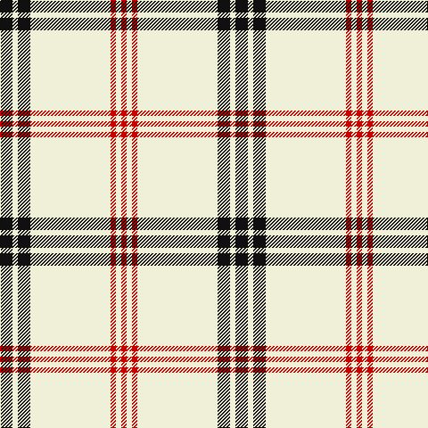

**Bands:** [KWKWRWR](/stripes/kwkwrwr/) · **Stripes:** [K W K W R W R](/stripes/stripes7/) K W K W R W R

This was sourced from tartans-authority.  It is a [7 band tartan](/bands/bands7/).

Original link http://www.tartansauthority.com/tartan-ferret/display/7461/

## Attestations

This cloth appears in 2 source records; the oldest owns this page.

- pre 2008 — White Stripes (Corporate) (tartans-authority, [record](http://www.tartansauthority.com/tartan-ferret/display/7461/))
- undated — White Stripes, The (register-of-tartans, [record](https://www.tartanregister.gov.uk/tartanDetails.aspx?ref=5507))

## Register references

External register numbers recorded for this tartan.

- Scottish Register of Tartans: [5507](https://www.tartanregister.gov.uk/tartanDetails.aspx?ref=5507)
- Scottish Tartans Authority (ITI): 7461

## Thread count
K/14 LY6 K14 LY90 R6 LY6 R/6

## Palette
Each colour and its ΔE from the base-6 reference it is a variant of.

| Colour | Shade | Base | ΔE (OKLab) |
|---|---|---|---|
| K | <code style="background-color:#101010;">#101010</code> `#101010` | K <code style="background-color:#000000;">#000000</code> | 0.17 |
| LY | <code style="background-color:#F0F0D8;">#F0F0D8</code> `#F0F0D8` | W <code style="background-color:#F7F7F7;">#F7F7F7</code> | 0.04 |
| R | <code style="background-color:#C80000;">#C80000</code> `#C80000` | R <code style="background-color:#CC0000;">#CC0000</code> | 0.01 |

# Sample pattern

## Nearest tartans

The nearest existing variants by ΔTartan distance.

1. [Summer Spirit (Fashion)](/setts/s8/ly2k1w9k8w28k2w2r2~x2/) — ΔT 1.38
1. [Guzzo Dress (Personal)](/setts/s8/w20k2w20lo5k3w3lo4k2/) — ΔT 1.40
1. [Butties](/setts/s6/w93o6w13db35w12o6/) — ΔT 1.42
1. [Guzzo Dress (Montreal, Canada) (Personal)](/setts/s8/w20k2w20ly5k3w3ly4k2/) — ΔT 1.69
1. [Anthony Plaid Ecru](/setts/s9/lr18k1ly3k1lr2r2k2r2lr2~x4/) — ΔT 1.73
1. [Morris (Welsh Name)](/setts/s8/db6db3ly3db2ly3db4ly48db4/) — ΔT 1.80
1. [Burns (Fashion)](/setts/s6/w15do6w1do3o3w1~x4/) — ΔT 1.84
1. [Triplett, Jack Arnold](/setts/s4/w35n12r2n2~x2/) — ΔT 1.87
1. [Young in Australia](/setts/s4/w81dg6lo8dg8~x2/) — ΔT 1.89
1. [Shaw of Tordarroch, Mrs (Personal)](/setts/s11/o8lb46db4lb4db4lb5y7lb7y7lb4db2~x2/) — ΔT 1.93

## Neighbour map

Every grey dot is one of 14313 variants placed by the first two principal components of the ΔTartan feature space (44% of its variance). Red is this tartan; blue dots are its nearest — click one to open its page.

<svg viewBox="0 0 640 380" role="img" style="max-width:100%;height:auto;border:1px solid #e0e0e0;border-radius:4px;display:block" xmlns="http://www.w3.org/2000/svg"><image href="/nn/cloud.v1.png" width="640" height="380"/><a href="/setts/s8/ly2k1w9k8w28k2w2r2~x2/"><circle cx="415.0" cy="97.5" r="4" fill="#3465a4"><title>Summer Spirit (Fashion)</title></circle></a><a href="/setts/s8/w20k2w20lo5k3w3lo4k2/"><circle cx="401.5" cy="174.6" r="4" fill="#3465a4"><title>Guzzo Dress (Personal)</title></circle></a><a href="/setts/s6/w93o6w13db35w12o6/"><circle cx="408.0" cy="156.5" r="4" fill="#3465a4"><title>Butties</title></circle></a><a href="/setts/s8/w20k2w20ly5k3w3ly4k2/"><circle cx="386.8" cy="165.4" r="4" fill="#3465a4"><title>Guzzo Dress (Montreal, Canada) (Personal)</title></circle></a><a href="/setts/s9/lr18k1ly3k1lr2r2k2r2lr2~x4/"><circle cx="383.9" cy="115.9" r="4" fill="#3465a4"><title>Anthony Plaid Ecru</title></circle></a><a href="/setts/s8/db6db3ly3db2ly3db4ly48db4/"><circle cx="474.2" cy="113.4" r="4" fill="#3465a4"><title>Morris (Welsh Name)</title></circle></a><a href="/setts/s6/w15do6w1do3o3w1~x4/"><circle cx="323.5" cy="166.4" r="4" fill="#3465a4"><title>Burns (Fashion)</title></circle></a><a href="/setts/s4/w35n12r2n2~x2/"><circle cx="394.1" cy="163.4" r="4" fill="#3465a4"><title>Triplett, Jack Arnold</title></circle></a><a href="/setts/s4/w81dg6lo8dg8~x2/"><circle cx="498.1" cy="184.3" r="4" fill="#3465a4"><title>Young in Australia</title></circle></a><a href="/setts/s11/o8lb46db4lb4db4lb5y7lb7y7lb4db2~x2/"><circle cx="397.4" cy="100.5" r="4" fill="#3465a4"><title>Shaw of Tordarroch, Mrs (Personal)</title></circle></a><circle cx="420.8" cy="134.2" r="5" fill="#c00000"/></svg>

ID: /setts/s7/k7w3k7w45r3w3r3~x2/
