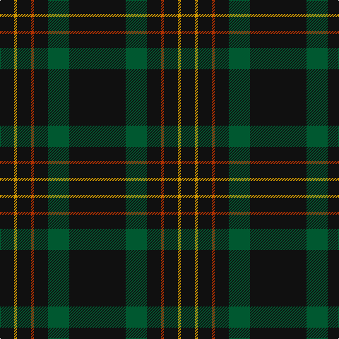

In pattern [KGKRKYK](/patterns/kgkrkyk/).

This was sourced from tartans-authority.  It is a [7 stripes tartan](/stripes/stripes7/).

Original link http://www.tartansauthority.com/tartan-ferret/display/3235/

## Thread count
K/20 DY4 K20 R4 K20 G30 K/80

## Palette
Each colour and its ΔE from the base-6 reference it is a variant of.

| Colour | Shade | Base | ΔE (OKLab) |
|---|---|---|---|
| DY | <code style="background-color:#D09800;">#D09800</code> `#D09800` | Y <code style="background-color:#E8C000;">#E8C000</code> | 0.11 |
| G | <code style="background-color:#005830;">#005830</code> `#005830` | G <code style="background-color:#006400;">#006400</code> | 0.06 |
| K | <code style="background-color:#101010;">#101010</code> `#101010` | K <code style="background-color:#000000;">#000000</code> | 0.17 |
| R | <code style="background-color:#B03000;">#B03000</code> `#B03000` | R <code style="background-color:#C80000;">#C80000</code> | 0.05 |

# Sample pattern

## Nearest tartans

The nearest existing variants by ΔTartan distance.

1. [Langhein, Alex (Personal)](/setts/s8/k80g30k20r4k20y4k20y4-g003820-k101010-rb03000-yd09800/) — ΔT 0.77
1. [Langhein Family Tartan Tartan Number: 3235. Earliest known date: April 2002 Based on Black Watch Sett See products available Copyright © Blair Urquhart, Comrie, 2015](/setts/s7/k80g30k20r4k20y4k20-g003820-k101010-rc80000-ye8c000/) — ΔT 0.96
1. [Rikaco Vintage](/setts/s8/b148r18b8ra10b8r18b74ba18-b1c1c1c-ba000048-r9c68a4-raff0000/) — ΔT 1.38
1. [Laird Abdullah (Personal)](/setts/s8/k20b4k4b16k80r8k10ra4-b5c5c5c-k101010-rc80000-rae87878/) — ΔT 1.43
1. [Kalkofen (Name)](/setts/s6/k80g30k20r4k20y4-g003820-k101010-rb03000-yd09800/) — ΔT 1.51
1. [MacLaine of Lochbuie Hunting](/setts/s5/b64r6b8k4y6-b14283c-k101010-r880000-yd09800/) — ΔT 1.60
1. [Renwick](/setts/s10/k6g4k40r4k24g4k8g4k12g4-g006818-k101010-rc80000/) — ΔT 1.65
1. [MacNathair Sgianach](/setts/s4/b4r4k48g4-b1c0070-g006818-k101010-rc80000/) — ΔT 1.68
1. [Spirit of Glyndwr Gold (Fashion)](/setts/s8/k24b18k11b4k11b18k53r4-b5c5c5c-k101010-rc80000/) — ΔT 1.74
1. [Harley Davidson](/setts/s10/k49r8k4b6ra4b6k4r8k49ra2-b5c5c5c-k101010-rb84c00-ra888888/) — ΔT 1.77

## Neighbour map

Every grey dot is one of 15726 variants placed by the first two principal components of the ΔTartan feature space (44% of its variance). Red is this tartan; blue dots are its nearest — click one to open its page.

<svg viewBox="0 0 640 380" role="img" style="max-width:100%;height:auto;border:1px solid #e0e0e0;border-radius:4px;display:block" xmlns="http://www.w3.org/2000/svg"><image href="/nn/cloud.v1.png" width="640" height="380"/><a href="/setts/s8/k80g30k20r4k20y4k20y4-g003820-k101010-rb03000-yd09800/"><circle cx="542.8" cy="206.3" r="4" fill="#3465a4"><title>Langhein, Alex (Personal)</title></circle></a><a href="/setts/s7/k80g30k20r4k20y4k20-g003820-k101010-rc80000-ye8c000/"><circle cx="567.4" cy="225.7" r="4" fill="#3465a4"><title>Langhein Family Tartan Tartan Number: 3235. Earliest known date: April 2002 Based on Black Watch Sett See products available Copyright © Blair Urquhart, Comrie, 2015</title></circle></a><a href="/setts/s8/b148r18b8ra10b8r18b74ba18-b1c1c1c-ba000048-r9c68a4-raff0000/"><circle cx="538.2" cy="179.0" r="4" fill="#3465a4"><title>Rikaco Vintage</title></circle></a><a href="/setts/s8/k20b4k4b16k80r8k10ra4-b5c5c5c-k101010-rc80000-rae87878/"><circle cx="537.0" cy="170.6" r="4" fill="#3465a4"><title>Laird Abdullah (Personal)</title></circle></a><a href="/setts/s6/k80g30k20r4k20y4-g003820-k101010-rb03000-yd09800/"><circle cx="564.9" cy="234.5" r="4" fill="#3465a4"><title>Kalkofen (Name)</title></circle></a><a href="/setts/s5/b64r6b8k4y6-b14283c-k101010-r880000-yd09800/"><circle cx="584.7" cy="208.1" r="4" fill="#3465a4"><title>MacLaine of Lochbuie Hunting</title></circle></a><a href="/setts/s10/k6g4k40r4k24g4k8g4k12g4-g006818-k101010-rc80000/"><circle cx="562.0" cy="232.3" r="4" fill="#3465a4"><title>Renwick</title></circle></a><a href="/setts/s4/b4r4k48g4-b1c0070-g006818-k101010-rc80000/"><circle cx="566.9" cy="233.0" r="4" fill="#3465a4"><title>MacNathair Sgianach</title></circle></a><a href="/setts/s8/k24b18k11b4k11b18k53r4-b5c5c5c-k101010-rc80000/"><circle cx="460.3" cy="235.1" r="4" fill="#3465a4"><title>Spirit of Glyndwr Gold (Fashion)</title></circle></a><a href="/setts/s10/k49r8k4b6ra4b6k4r8k49ra2-b5c5c5c-k101010-rb84c00-ra888888/"><circle cx="506.2" cy="151.7" r="4" fill="#3465a4"><title>Harley Davidson</title></circle></a><circle cx="547.2" cy="214.8" r="5" fill="#c00000"/></svg>

ID: /setts/s7/k80g30k20r4k20y4k20-g005830-k101010-rb03000-yd09800/
